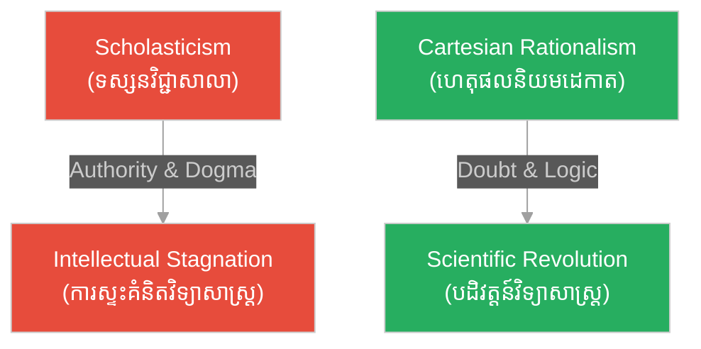

# បរិបទប្រវត្តិសាស្ត្រ និងសេចក្តីផ្តើម៖ Introduction & Historical Context

**Author:** ichamrong  
**Date:** 2026-06-06  
**Tags:** #philosophy #descartes #history #rationalism #scientific-method  
**Category:** Philosophy  
**Read Time:** ~5 min

---

## 📌 មាតិកា (Table of Contents)
- [សង្ខេបជំពូក (Chapter Summary)](#0)
- [១. តើ René Descartes ជានរណា? (Who is René Descartes?)](#1)
- [២. បរិបទសង្គម និងវិទ្យាសាស្ត្រនាឆ្នាំ ១៦៣៧ (The Historical Context of 1637)](#2)
- [៣. ការជ្រើសរើសសរសេរជាភាសាបារាំង (The Choice of Vernacular Language)](#3)
- [សេចក្តីសន្និដ្ឋាន (Conclusion)](#4)
- [ឯកសារយោង (References)](#5)

---

## សង្ខេបជំពូក (Chapter Summary)

ជំពូក​​នេះ​​បង្ហាញ​​ពី​​ប្រវត្តិ​​សង្ខេប​​របស់​​លោក​​ René Descartes​​ និង​​ស្ថានភាព​​ទូទៅ​​នៃ​​ទស្សនវិជ្ជា​​ និង​​វិទ្យាសាស្ត្រ​​នៅ​​អឺរ៉ុប​​នា​​សតវត្ស​​ទី​​ ១៧។​​ យើង​​នឹង​​សិក្សា​​ពី​​មូលហេតុ​​ដែល​​ដេកាត​​ចង់​​កែទម្រង់​​ការ​​ស្វែងរក​​ចំណេះដឹង​​ និង​​ហេតុផល​​នៅ​​ពីក្រោយ​​ការ​​បោះពុម្ព​​សៀវភៅ​​នេះ​​ជា​​ភាសា​​បារាំង​​ធម្មតា​​ ជំនួស​​ឱ្យ​​ភាសា​​ឡាតាំង​​ដែល​​ជា​​ភាសា​​ផ្លូវការ​​របស់​​ពួក​​បញ្ញវន្ត។

This chapter explores the brief biography of René Descartes and the general state of philosophy and science in 17th-century Europe. We will study why Descartes sought to reform the search for knowledge and the reasons behind publishing this book in vernacular French rather than academic Latin.

---

## ១. តើ René Descartes ជានរណា? (Who is René Descartes?)

លោក​​ **René Descartes**​​ (១៥៩៦–១៦៥០)​​ គឺ​​ជា​​ទស្សនវិទូ​​ គណិតវិទូ​​ និង​​ជា​​រូបវិទូ​​ជនជាតិ​​បារាំង​​ដ៏​​លេចធ្លោ​​ម្នាក់។​​ គាត់​​ត្រូវ​​បាន​​គេ​​ទទួល​​ស្គាល់​​ទូទាំង​​ពិភពលោក​​ថា​​ជា​​ **«បិតានៃទស្សនវិជ្ជាទំនើប (Father of Modern Philosophy)»**​​ ព្រោះ​​គាត់​​បាន​​បង្កើត​​មូលដ្ឋាន​​គ្រឹះ​​ថ្មី​​សម្រាប់​​ការ​​ស្វែងយល់​​ពី​​ពិភពលោក​​ដោយ​​ប្រើ​​ហេតុផល​​និយម​​ (Rationalism)។​​ ក្រៅពី​​ផ្នែក​​ទស្សនវិជ្ជា​​ គាត់​​ក៏​​ជា​​អ្នក​​បង្កើត​​ប្រព័ន្ធ​​កូអរដោនេ​​ (Cartesian Coordinate System)​​ ដែល​​តភ្ជាប់​​រវាង​​ធរណីមាត្រ​​ និង​​ពិជគណិត​​ផង​​ដែរ។

René Descartes (1596–1650) was a prominent French philosopher, mathematician, and physicist. He is widely recognized as the "Father of Modern Philosophy" for establishing a new foundation of rationalism. Beyond philosophy, he invented the Cartesian coordinate system, bridging geometry and algebra.

---

## ២. បរិបទសង្គម និងវិទ្យាសាស្ត្រនាឆ្នាំ ១៦៣៧ (The Historical Context of 1637)

នៅ​​សតវត្ស​​ទី​​ ១៧​​ ការ​​អប់រំ​​ និង​​ការ​​គិត​​នៅ​​អឺរ៉ុប​​ត្រូវ​​បាន​​គ្រប់គ្រង​​យ៉ាង​​តឹងរ៉ឹង​​ដោយ​​ **«ទស្សនវិជ្ជាសាលា (Scholasticism)»**​​ ដែល​​ជា​​ការ​​លាយបញ្ចូលគ្នា​​រវាង​​ទ្រឹស្តី​​របស់​​ទស្សនវិទូ​​ក្រិក​​ អារីស្តូត​​ (Aristotle)​​ និង​​គោលលទ្ធិ​​សាសនា​​កាតូលិក។​​ ចំណេះដឹង​​ទាំងអស់​​ត្រូវ​​បាន​​គេ​​ទទួល​​ស្គាល់​​ទៅ​​តាម​​សិទ្ធិ​​អំណាច​​របស់​​ព្រះវិហារ​​ និង​​ក្បួន​​ច្បាប់​​ចាស់ៗ។

ដេកាត​​បាន​​រកឃើញ​​ថា​​ ចំណេះដឹង​​ទាំងនោះ​​មាន​​ភាព​​មិន​​ច្បាស់លាស់​​ និង​​ពោរពេញ​​ទៅ​​ដោយ​​ការ​​សង្ស័យ។​​ គាត់​​ចង់​​បង្កើត​​វិធីសាស្ត្រ​​មួយ​​ដែល​​ផ្តល់​​នូវ​​ការពិត​​ច្បាស់លាស់​​ដូច​​គណិតវិទ្យា​​ ដែល​​មិន​​អាច​​ប្រកែក​​បាន។

---

## ៣. ការជ្រើសរើសសរសេរជាភាសាបារាំង (The Choice of Vernacular Language)

ជា​​ទូទៅ​​ នា​​សម័យ​​នោះ​​ រាល់​​សៀវភៅ​​ទស្សនវិជ្ជា​​ និង​​វិទ្យាសាស្ត្រ​​ត្រូវ​​បាន​​សរសេរ​​ជា​​ **ភាសាឡាតាំង (Latin)**​​ ដើម្បី​​ឱ្យ​​មាន​​តែ​​ពួក​​អាចារ្យ​​ ព្រះវិហារ​​ និង​​អ្នក​​ចេះដឹង​​ជាន់ខ្ពស់​​អាន​​យល់។​​ ប៉ុន្តែ​​ លោក​​ Descartes​​ បាន​​សម្រេចចិត្ត​​សរសេរ​​សៀវភៅ​​ *Discourse on the Method*​​ ជា​​ **ភាសាបារាំង (French)**​​ វិញ។

គោលបំណង​​របស់​​គាត់​​គឺ៖
* **ភាពជាសកលនៃហេតុផល**: គាត់​​ជឿ​​ថា​​ មនុស្ស​​គ្រប់រូប​​កើត​​មក​​មាន​​សមត្ថភាព​​គិត​​ និង​​ពិចារណា​​ដូចគ្នា​​ (Reason is naturally equal in all men)។
* **ការរំដោះខ្លួនពីឥទ្ធិពលចាស់**: គាត់​​ចង់​​ឱ្យ​​មនុស្ស​​ទូទៅ​​ដែល​​ប្រើ​​ហេតុផល​​ធម្មតា​​ អាច​​អាន​​ និង​​យល់​​ដឹង​​ពី​​វិធីសាស្ត្រ​​របស់​​គាត់​​ ដោយ​​មិន​​ចាំបាច់​​រៀន​​តាម​​សាលា​​ព្រះវិហារ​​ឡើយ។

---

## សេចក្តីសន្និដ្ឋាន (Conclusion)

> **«សតិសម្បជញ្ញៈ ឬការចេះពិចារណាស្គាល់ខុសត្រូវ គឺជាវត្ថុដែលត្រូវបានចែករំលែកស្មើៗគ្នាបំផុតក្នុងចំណោមមនុស្សលោក» — René Descartes**  
> *("Good sense is, of all things among men, the most equally distributed")*

ការ​​សម្រេចចិត្ត​​បំបែក​​ខ្លួន​​ចេញ​​ពី​​ទម្លាប់​​ចាស់​​ បាន​​ធ្វើ​​ឱ្យ​​ដេកាត​​ក្លាយ​​ជា​​អ្នក​​ត្រួសត្រាយ​​ផ្លូវ​​ដ៏​​សំខាន់​​ម្នាក់​​ ក្នុង​​ការ​​បង្កើត​​យុគសម័យ​​ត្រាស់ដឹង​​ (Age of Enlightenment)​​ នៅ​​អឺរ៉ុប។

---

## ឯកសារយោង (References)

* **Descartes, R.** (1637). *Discourse on the Method*.
* **Watson, R. A.** (2002). *Cogito, Ergo Sum: The Life of René Descartes*.
