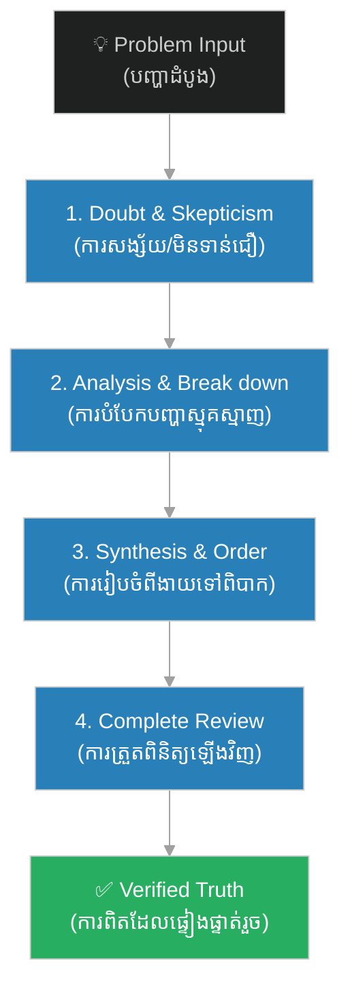

# វិធានទាំង ៤ នៃវិធីសាស្ត្ររបស់ដេកាត៖ The Four Rules of Cartesian Method

**Author:** ichamrong  
**Date:** 2026-06-06  
**Tags:** #philosophy #descartes #methodology #logic #critical-thinking  
**Category:** Philosophy  
**Read Time:** ~6 min

---

## 📌 មាតិកា (Table of Contents)
- [សង្ខេបជំពូក (Chapter Summary)](#0)
- [១. វិធានទី ១ — ការសង្ស័យ និងការស្វែងរកភាពច្បាស់លាស់ (Rule of Doubt)](#1)
- [២. វិធានទី ២ — ការបំបែកបញ្ហាស្មុគស្មាញ (Rule of Analysis)](#2)
- [៣. វិធានទី ៣ — ការរៀបចំលំដាប់លំដោយពីងាយទៅពិបាក (Rule of Synthesis)](#3)
- [៤. វិធានទី ៤ — ការត្រួតពិនិត្យ និងកត់ត្រាឡើងវិញ (Rule of Review)](#4)
- [សេចក្តីសន្និដ្ឋាន (Conclusion)](#5)
- [ឯកសារយោង (References)](#6)

---

## សង្ខេបជំពូក (Chapter Summary)

ដើម្បី​​ធានា​​ថា​​ការ​​ស្វែងរក​​ការពិត​​មាន​​ភាព​​ត្រឹមត្រូវ​​ លោក​​ Descartes​​ បាន​​បង្កើត​​នូវ​​វិធាន​​ (ក្បួន)​​ ចំនួន​​ ៤​​ សម្រាប់ការគិត​​ និង​​ការដោះស្រាយ​​បញ្ហា។​​ វិធាន​​ទាំងនេះ​​បាន​​ក្លាយ​​ជា​​គ្រឹះ​​ដ៏​​សំខាន់​​នៃ​​វិធីសាស្ត្រ​​វិទ្យាសាស្ត្រ​​ទំនើប​​ (Scientific Method)​​ ដែល​​ជួយ​​ឱ្យ​​មនុស្ស​​ជៀសវាង​​ពី​​ការ​​លំអៀង​​ និង​​កំហុស​​ឆ្គង​​ក្នុង​​ការ​​សម្រេចចិត្ត។

To ensure that the search for truth is accurate, Descartes established 4 rules for thinking and problem-solving. These rules became the cornerstone of the modern scientific method, helping individuals avoid biases and cognitive errors in decision-making.

---

## ១. វិធានទី ១ — ការសង្ស័យ និងការស្វែងរកភាពច្បាស់លាស់ (Rule of Doubt)

> *«មិន​​ត្រូវ​​ទទួល​​យក​​អ្វី​​មួយ​​ថា​​ជា​​ការពិត​​ឡើយ​​ លុះត្រាតែ​​យើង​​ដឹង​​យ៉ាង​​ច្បាស់​​ និង​​គ្មាន​​មន្ទិល​​សង្ស័យ​​ថា​​វា​​ជា​​ការពិត​​ប្រាកដ​​មែន»*

*   **ខ្លឹមសារ**: កុំ​​ប្រញាប់​​ជឿ​​លើ​​ជំនឿ​​តៗ​​គ្នា​​ ឬ​​ព័ត៌មាន​​ដែល​​ទទួល​​បាន​​តាម​​រយៈ​​អារម្មណ៍​​ (ព្រោះ​​អារម្មណ៍​​អាច​​បោកប្រាស់​​យើង​​បាន)។​​ ត្រូវ​​រក្សា​​ចិត្ត​​សង្ស័យ​​រហូត​​ដល់​​រក​​ឃើញ​​ភស្តុតាង​​ច្បាស់លាស់។
*   **Rule of Doubt**: Never accept anything as true unless it is presented so clearly and distinctly to the mind that there is no reason to doubt it. This prevents rash judgment and prejudice.

---

## ២. វិធានទី ២ — ការបំបែកបញ្ហាស្មុគស្មាញ (Rule of Analysis)

> *«ត្រូវ​​បំបែក​​បញ្ហា​​ស្មុគស្មាញ​​ និង​​ធំៗ​​ ទៅ​​ជា​​ផ្នែក​​តូចៗ​​ឱ្យ​​បាន​​ច្រើន​​តាម​​ដែល​​អាច​​ធ្វើ​​ទៅ​​បាន​​ ដើម្បី​​ងាយស្រួល​​ក្នុង​​ការ​​សិក្សា​​ និង​​ដោះស្រាយ»*

*   **ខ្លឹមសារ**: នៅ​​ពេល​​ជួប​​ប្រទះ​​នឹង​​បញ្ហា​​ធំ​​ ឬ​​ទ្រឹស្តី​​ស្មុគស្មាញ​​ កុំ​​ព្យាយាម​​ដោះស្រាយ​​វា​​ទាំង​​ដុំ។​​ ត្រូវ​​បំបែក​​វា​​ជា​​ផ្នែក​​តូចៗ​​បំផុត​​ ដើម្បី​​វិភាគ​​ចំណុច​​នីមួយៗ​​ឱ្យ​​បាន​​លម្អិត។
*   **Rule of Analysis**: Divide each difficulty under examination into as many parts as possible, and as many as might be necessary for its adequate solution.

---

## ៣. វិធានទី ៣ — ការរៀបចំលំដាប់លំដោយពីងាយទៅពិបាក (Rule of Synthesis)

> *«ត្រូវ​​គិត​​ឱ្យ​​មាន​​សណ្តាប់ធ្នាប់​​ ដោយ​​ចាប់ផ្តើម​​ដោះស្រាយ​​ពី​​ចំណុច​​ដែល​​សាមញ្ញ​​ និង​​ងាយ​​យល់​​បំផុត​​ រួច​​សឹម​​បន្ត​​ទៅ​​ដោះស្រាយ​​ចំណុច​​ដែល​​ស្មុគស្មាញ​​ជា​​បន្តបន្ទាប់»*

*   **ខ្លឹមសារ**: ត្រូវ​​បង្កើត​​ខ្សែ​​សង្វាក់​​តក្កវិជ្ជា​​មួយ។​​ ចាប់ផ្តើម​​ពី​​ការពិត​​សាមញ្ញ​​បំផុត​​ (Axioms)​​ រួច​​សង់​​ចំណេះដឹង​​ឡើង​​ទៅ​​លើ​​ជា​​ជំហានៗ​​ រហូត​​ដល់​​ដោះស្រាយ​​បញ្ហា​​ស្មុគស្មាញ​​បាន។
*   **Rule of Synthesis**: Conduct thoughts in an orderly way, beginning with objects that are simplest and easiest to know, in order to rise gradually to the knowledge of the most complex.

---

## ៤. វិធានទី ៤ — ការត្រួតពិនិត្យ និងកត់ត្រាឡើងវិញ (Rule of Review)

> *«ត្រូវ​​ត្រួតពិនិត្យ​​ និង​​កត់ត្រា​​ដំណើរការ​​ទាំងអស់​​ឡើងវិញ​​ឱ្យ​​បាន​​ល្អិតល្អន់​​ និង​​ទូលំទូលាយ​​បំផុត​​ ដើម្បី​​ប្រាកដ​​ថា​​គ្មាន​​ចំណុច​​ណាមួយ​​ត្រូវ​​បាន​​មើលរំលង»*

*   **ខ្លឹមសារ**: ធ្វើ​​ការ​​ផ្ទៀងផ្ទាត់​​ឡើងវិញ​​នូវ​​គ្រប់​​ជំហាន​​ដែល​​បាន​​ធ្វើ​​កន្លង​​មក។​​ ការ​​ត្រួតពិនិត្យ​​ឡើងវិញ​​នេះ​​ ធានា​​ថា​​គ្មាន​​កំហុស​​ឆ្គង​​ក្នុង​​ខ្សែ​​សង្វាក់​​តក្កវិជ្ជា​​របស់​​យើង​​ឡើយ។
*   **Rule of Review**: Make enumerations so complete, and reviews so general, that it is certain nothing is omitted.

---

## សេចក្តីសន្និដ្ឋាន (Conclusion)

វិធាន​​ទាំង​​ ៤​​ របស់​​ដេកាត​​មិន​​ត្រឹមតែ​​ត្រូវ​​បាន​​ប្រើ​​ក្នុង​​ទស្សនវិជ្ជា​​ និង​​គណិតវិទ្យា​​ប៉ុណ្ណោះ​​ទេ​​ ប៉ុន្តែ​​វា​​ត្រូវ​​បាន​​យក​​មក​​អនុវត្ត​​យ៉ាង​​ទូលំទូលាយ​​ក្នុង​​វិធីសាស្ត្រ​​វិទ្យាសាស្ត្រ​​ វិស្វកម្ម​​កម្មវិធី​​កុំព្យូទ័រ​​ (Software Engineering)​​ និង​​ការ​​ដោះស្រាយ​​បញ្ហា​​ប្រចាំថ្ងៃ​​របស់​​មនុស្ស​​នា​​ពេល​​បច្ចុប្បន្ន។

---

## ឯកសារយោង (References)

* **Descartes, R.** (1637). *Discourse on the Method* (Part II).
* **Garber, D.** (1992). *Descartes' Metaphysical Physics*.
