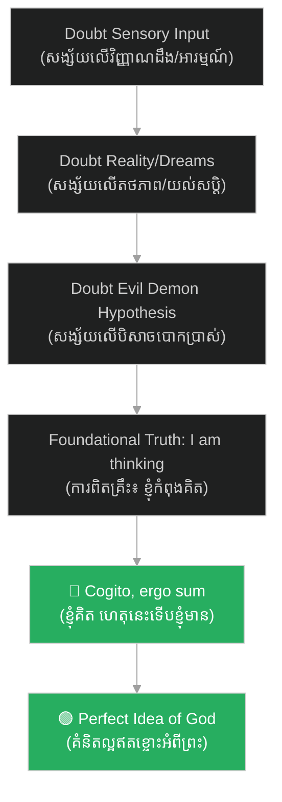

# ខ្ញុំគិត ហេតុនេះទើបខ្ញុំមាន និងអត្ថិភាពនៃព្រះ៖ Cogito, Ergo Sum & God

**Author:** ichamrong  
**Date:** 2026-06-06  
**Tags:** #philosophy #descartes #cogito #epistemology #theology  
**Category:** Philosophy  
**Read Time:** ~6 min

---

## 📌 មាតិកា (Table of Contents)
- [សង្ខេបជំពូក (Chapter Summary)](#0)
- [១. ការសង្ស័យជាប្រព័ន្ធ (Methodological Doubt)](#1)
- [២. ខ្ញុំគិត ហេតុនេះទើបខ្ញុំមាន (Cogito, Ergo Sum)](#2)
- [៣. ការបញ្ជាក់ពីអត្ថិភាពនៃព្រះ (Proof of God's Existence)](#3)
- [សេចក្តីសន្និដ្ឋាន (Conclusion)](#4)
- [ឯកសារយោង (References)](#5)

---

## សង្ខេបជំពូក (Chapter Summary)

ជំពូក​​នេះ​​ពិភាក្សា​​ពី​​ចំណុច​​ស្នូល​​បំផុត​​នៃ​​ទស្សនវិជ្ជា​​របស់​​ដេកាត។​​ យើង​​នឹង​​សិក្សា​​ពី​​របៀប​​ដែល​​គាត់​​ប្រើ​​ **«ការសង្ស័យជាប្រព័ន្ធ (Methodological Doubt)»**​​ ទៅ​​លើ​​អ្វីៗ​​គ្រប់យ៉ាង​​ ដើម្បី​​ស្វែងរក​​គ្រឹះ​​ការពិត​​ដ៏​​រឹងមាំ​​បំផុត​​មួយ​​ដែល​​មិន​​អាច​​សង្ស័យ​​បាន​​ គឺ​​ «Cogito, ergo sum»​​ និង​​របៀប​​ដែល​​គាត់​​ប្រើ​​ហេតុផល​​ដើម្បី​​បញ្ជាក់​​ថា​​ព្រះ​​ពិត​​ជា​​មាន​​មែន។

This chapter discusses the core of Cartesian philosophy. We will examine how Descartes used Methodological Doubt on everything to find the single indubitable truth: "Cogito, ergo sum", and how he used rational arguments to prove the existence of God.

---

## ១. ការសង្ស័យជាប្រព័ន្ធ (Methodological Doubt)

ដេកាត​​ចង់​​បោសសម្អាត​​រាល់​​ជំនឿ​​ចាស់ៗ​​ដែល​​គ្មាន​​មូលដ្ឋាន​​ច្បាស់លាស់។​​ គាត់​​បាន​​ចាប់ផ្តើម​​ដោយ​​ការ​​សង្ស័យ​​លើ​​អ្វីៗ​​គ្រប់យ៉ាង៖
*   **អារម្មណ៍ (Senses)**: គាត់​​យល់​​ថា​​ អារម្មណ៍​​របស់​​យើង​​តែងតែ​​បោកប្រាស់​​យើង​​ (ដូចជា​​ការ​​មើល​​ឃើញ​​វត្ថុ​​ឆ្ងាយ​​ខុស​​ទំហំ​​ពិត)។
*   **សុបិន (Dreams)**: យើង​​មិន​​អាច​​ដឹង​​ច្បាស់​​ថា​​ខ្លួន​​កំពុង​​ដេក​​យល់សប្តិ​​ ឬ​​ភ្ញាក់​​នោះ​​ឡើយ​​ ព្រោះ​​អារម្មណ៍​​ក្នុង​​សុបិន​​ហាក់​​ដូច​​ជា​​ពិត​​ខ្លាំង​​ណាស់។
*   **សម្មតិកម្មបិសាចកំណាច (Evil Demon Hypothesis)**: ចុះ​​បើ​​មាន​​បិសាច​​ដ៏​​មាន​​អំណាច​​មួយ​​កំពុង​​បង្កើត​​រូបភាព​​បោកប្រាស់​​ក្នុង​​ចិត្ត​​យើង​​រហូត​​មក?

---

## ២. ខ្ញុំគិត ហេតុនេះទើបខ្ញុំមាន (Cogito, Ergo Sum)

ទោះបី​​ជា​​ដេកាត​​សង្ស័យ​​លើ​​អ្វីៗ​​គ្រប់យ៉ាង​​ សូម្បី​​តែ​​រូបរាង​​កាយ​​របស់​​ខ្លួន​​ក៏ដោយ​​ ក៏​​គាត់​​បាន​​រកឃើញ​​ការពិត​​មួយ​​ដែល​​មិន​​អាច​​សង្ស័យ​​បាន​​ នោះ​​គឺ៖
> **«ការពិតដែលថាគាត់កំពុងសង្ស័យ ឬកំពុងគិត»**

បើ​​គាត់​​កំពុង​​សង្ស័យ​​ មាន​​ន័យ​​ថា​​គាត់​​កំពុង​​គិត​​។​​ បើ​​គាត់​​កំពុង​​គិត​​ នោះ​​គាត់​​ត្រូវ​​តែ​​មាន​​[អត្ថិភាព](../../../keywords/existence.md)​​ (មាន​​ជីវិត/[អត្ថិភាព](../../../keywords/existence.md))​​ ដើម្បី​​គិត​​។​​ នេះ​​ជា​​ប្រភព​​នៃ​​ឃ្លា​​ដ៏​​ល្បីល្បាញ៖
> **«ខ្ញុំគិត ហេតុនេះទើបខ្ញុំមាន»**  
> *(ភាសាឡាតាំង៖ Cogito, ergo sum / ភាសាអង់គ្លេស៖ I think, therefore I am)*

---

## ៣. ការបញ្ជាក់ពីអត្ថិភាពនៃព្រះ (Proof of God's Existence)

បន្ទាប់​​ពី​​បាន​​រកឃើញ​​[អត្ថិភាព](../../../keywords/existence.md)​​របស់​​ខ្លួន​​ ដេកាត​​បាន​​សង្កេត​​ឃើញ​​ថា​​ ខ្លួន​​គាត់​​ជា​​មនុស្ស​​ដែល​​មិន​​ល្អ​​ឥតខ្ចោះ​​ (ព្រោះ​​គាត់​​មាន​​ការ​​សង្ស័យ)​​។​​ ប៉ុន្តែ​​ គាត់​​បែរ​​ជា​​មាន​​គំនិត​​អំពី​​ **«ភាពល្អឥតខ្ចោះ (Perfection)»**​​ ទៅ​​វិញ។

តើ​​គំនិត​​អំពី​​ភាព​​ល្អ​​ឥតខ្ចោះ​​នេះ​​មក​​ពី​​ណា?
*   វត្ថុ​​ឬ​​មនុស្ស​​ដែល​​មិន​​ល្អ​​ឥតខ្ចោះ​​ មិន​​អាច​​បង្កើត​​គំនិត​​ល្អ​​ឥតខ្ចោះ​​ដោយ​​ខ្លួនឯង​​បាន​​ឡើយ។
*   ដូច្នេះ​​ គំនិត​​នេះ​​ត្រូវ​​តែ​​ត្រូវ​​បាន​​ដាក់​​បញ្ចូល​​មក​​ក្នុង​​គំនិត​​របស់​​គាត់​​ ដោយ​​សភាវៈ​​មួយ​​ដែល​​ល្អ​​ឥតខ្ចោះ​​ពិតប្រាកដ​​ ដែល​​នោះ​​គឺ​​ **ព្រះអម្ចាស់ (God)**។
*   ហេតុនេះ​​ ដេកាត​​សន្និដ្ឋាន​​ថា​​ ព្រះ​​ពិត​​ជា​​មាន​​[អត្ថិភាព](../../../keywords/existence.md)​​ប្រាកដ​​មែន។

---

## សេចក្តីសន្និដ្ឋាន (Conclusion)

ទ្រឹស្តី​​ «Cogito, ergo sum»​​ របស់​​ដេកាត​​បាន​​ផ្លាស់ប្តូរ​​ទិសដៅ​​ទស្សនវិជ្ជា​​ ដោយ​​យក​​ **[«ស្វ័យភាពនៃចិត្តមនុស្ស (Human Subjectivity)»](../../../keywords/human-subjectivity.md)**​​ ធ្វើ​​ជា​​ចំណុច​​ចាប់ផ្តើម​​នៃ​​ចំណេះដឹង​​ ជំនួស​​ឱ្យ​​ពិភព​​ខាងក្រៅ​​ ឬ​​សិទ្ធិ​​អំណាច​​ដែល​​គ្មាន​​ហេតុផល។

---

## ឯកសារយោង (References)

* **Descartes, R.** (1637). *Discourse on the Method* (Part IV).
* **Hatfield, G.** (2003). *Routledge Philosophy Guidebook to Descartes and the Meditations*.
