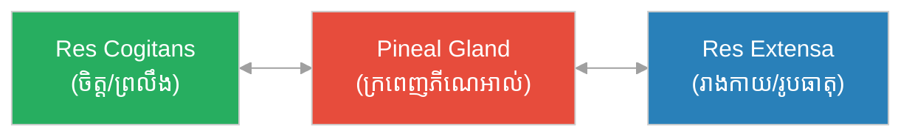

# ទ្វិនិយមរាងកាយនិងព្រលឹង និងក្រមសីលធម៌បណ្តោះអាសន្ន៖ Mind-Body Dualism & Morals

**Author:** ichamrong  
**Date:** 2026-06-06  
**Tags:** #philosophy #descartes #dualism #ethics #morality  
**Category:** Philosophy  
**Read Time:** ~6 min

---

## 📌 មាតិកា (Table of Contents)
- [សង្ខេបជំពូក (Chapter Summary)](#0)
- [១. ទ្វិនិយមរាងកាយ និងព្រលឹង (Mind-Body Dualism)](#1)
- [២. ក្រមសីលធម៌បណ្តោះអាសន្ន (Provisional Moral Code)](#2)
- [សេចក្តីសន្និដ្ឋានរួម (Overall Conclusion)](#3)
- [ឯកសារយោង (References)](#4)

---

## សង្ខេបជំពូក (Chapter Summary)

ជំពូក​​ចុងក្រោយ​​នេះ​​លម្អិត​​ពី​​គំនិត​​របស់​​ដេកាត​​លើ​​ពីរ​​ចំណុច៖​​ ទីមួយ​​គឺ​​ភាព​​ខុសគ្នា​​រវាង​​ចិត្ត​​ (ព្រលឹង)​​ និង​​រូបកាយ​​ (Mind-Body Dualism)​​ និង​​ទីពីរ​​គឺ​​ **«ក្រមសីលធម៌បណ្តោះអាសន្ន (Provisional Moral Code)»**​​ ដែល​​ជា​​វិធាន​​រស់នៅ​​ប្រចាំថ្ងៃ​​ក្នុង​​អំឡុង​​ពេល​​ដែល​​គាត់​​កំពុង​​សង្ស័យ​​លើ​​អ្វីៗ​​ទាំងអស់​​ក្នុង​​លោក។

This final chapter details Descartes' view on two points: first, the distinction between mind and body (Mind-Body Dualism), and second, the Provisional Moral Code which served as his daily life rules while doubting everything in the world.

---

## ១. ទ្វិនិយមរាងកាយ និងព្រលឹង (Mind-Body Dualism)

ដេកាត​​ជឿ​​ថា​​ មនុស្ស​​យើង​​ផ្សំ​​ឡើង​​ពី​​ផ្នែក​​ពីរ​​ដាច់​​ដោយ​​ឡែក​​ពី​​គ្នា៖
1.  **ចិត្ត ឬ ព្រលឹង (Mind / Soul - *Res Cogitans*)**: គឺ​​ជា​​សភាវៈ​​ដែល​​គ្មាន​​រូបរាង​​ គ្មាន​​ទំហំ​​ ប៉ុន្តែ​​មាន​​សមត្ថភាព​​គិត​​ ពិចារណា​​ យល់​​ដឹង​​ និង​​បញ្ជា​​ (Thinking substance)។
2.  **រាងកាយ (Body - *Res Extensa*)**: គឺ​​ជា​​សភាវៈ​​រូបធាតុ​​ដែល​​មាន​​រូបរាង​​ មាន​​ទំហំ​​ អាច​​វាស់វែង​​បាន​​ ប៉ុន្តែ​​គ្មាន​​សមត្ថភាព​​គិត​​ឡើយ​​ (Extended substance)។

ទោះបី​​ជា​​ផ្នែក​​ទាំងពីរ​​នេះ​​ខុសគ្នា​​ក៏ដោយ​​ ក៏​​វា​​មាន​​ទំនាក់ទំនង​​គ្នា​​យ៉ាង​​ជិតស្និទ្ធ​​តាម​​រយៈ​​ «ក្រពេញភីណេអាល់ (Pineal Gland)»​​ នៅ​​ក្នុង​​ខួរក្បាល​​ ដែល​​ដេកាត​​ជឿ​​ថា​​ជា​​កន្លែង​​ជួបគ្នា​​រវាង​​ព្រលឹង​​ និង​​រាងកាយ។

---

## ២. ក្រមសីលធម៌បណ្តោះអាសន្ន (Provisional Moral Code)

ក្នុង​​អំឡុង​​ពេល​​ដែល​​ដេកាត​​កំពុង​​សង្ស័យ​​លើ​​អ្វីៗ​​គ្រប់យ៉ាង​​ គាត់​​មិន​​អាច​​ឈប់​​រស់នៅ​​ ឬ​​ឈប់​​ធ្វើ​​សកម្មភាព​​បាន​​ឡើយ។​​ ដូច្នេះ​​ គាត់​​បាន​​បង្កើត​​ក្រមសីលធម៌​​បណ្តោះអាសន្ន​​ចំនួន​​ ៤​​ យ៉ាង​​ដើម្បី​​ណែនាំ​​ជីវិត​​របស់​​គាត់៖

1.  **គោរពច្បាប់ និងទំនៀមទម្លាប់ (Obey laws and customs)**: គោរព​​ច្បាប់​​ និង​​ប្រពៃណី​​នៃ​​ប្រទេស​​ជាតិ​​របស់​​ខ្លួន​​ ព្រមទាំង​​ប្រកាន់​​ខ្ជាប់​​ជំនឿ​​សាសនា​​ដែល​​បាន​​អប់រំ​​តាំង​​ពី​​ក្មេង។
2.  **មានភាពម៉ឺងម៉ាត់ក្នុងការសម្រេចចិត្ត (Be firm and resolute)**: នៅ​​ពេល​​សម្រេចចិត្ត​​ធ្វើ​​អ្វី​​មួយ​​ហើយ​​ ត្រូវ​​ធ្វើ​​វា​​ដោយ​​ទំនុកចិត្ត​​ និង​​ម៉ឺងម៉ាត់​​បំផុត​​ ដូច​​អ្នក​​ធ្វើ​​ដំណើរ​​ដែល​​វង្វេង​​ក្នុង​​ព្រៃ​​ ត្រូវ​​ដើរ​​ត្រង់​​ទៅ​​មុខ​​ជា​​ជាង​​ដើរ​​វិលវល់។
3.  **ឈ្នះខ្លួនឯងជាជាងចង់ឈ្នះព្រហ្មលិខិត (Conquer oneself rather than fortune)**: ព្យាយាម​​ផ្លាស់ប្តូរ​​បំណង​​ប្រាថ្នា​​ និង​​គំនិត​​របស់​​ខ្លួនឯង​​ ជាជាង​​ព្យាយាម​​ផ្លាស់ប្តូរ​​សណ្តាប់ធ្នាប់​​ពិភពលោក​​ ឬ​​ព្រហ្មលិខិត​​ ព្រោះ​​មាន​​តែ​​គំនិត​​ខ្លួនឯង​​ប៉ុណ្ណោះ​​ដែល​​យើង​​អាច​​គ្រប់គ្រង​​បាន​​ទាំងស្រុង។
4.  **អភិវឌ្ឍហេតុផល និងស្វែងរកការពិត (Cultivate reason and search for truth)**: បន្ត​​ឧទ្ទិស​​ជីវិត​​ក្នុង​​ការ​​អភិវឌ្ឍ​​បញ្ញា​​ និង​​ប្រើ​​វិធីសាស្ត្រ​​គិត​​ត្រឹមត្រូវ​​ដើម្បី​​ស្វែងរក​​ការពិត​​ជា​​រៀង​​រហូត។

---

## សេចក្តីសន្និដ្ឋានរួម (Overall Conclusion)

សៀវភៅ​​ **«Discourse on the Method»**​​ គឺ​​ជា​​ការ​​ប្រកាស​​ឯករាជ្យ​​នៃការគិត​​របស់​​មនុស្ស។​​ វា​​បង្រៀន​​យើង​​កុំ​​ឱ្យ​​ជឿ​​លើ​​អ្វី​​មួយ​​ដោយ​​ងងឹតងងុល​​ ឬ​​ជឿ​​ព្រោះ​​តែ​​មាន​​គេ​​ប្រាប់​​ ប៉ុន្តែ​​ត្រូវ​​ប្រើប្រាស់​​ហេតុផល​​ តក្កវិជ្ជា​​ និង​​វិធីសាស្ត្រ​​ច្បាស់លាស់​​ដើម្បី​​ស្វែងរក​​ការពិត​​ដោយ​​ខ្លួនឯង។

---

## ឯកសារយោង (References)

* **Descartes, R.** (1637). *Discourse on the Method* (Parts III & V).
* **Cottingham, J.** (1986). *Descartes*.
