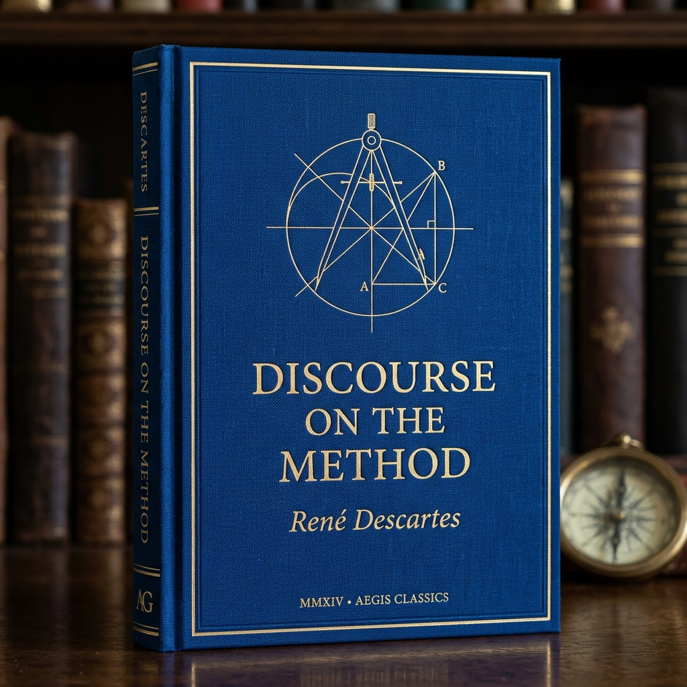
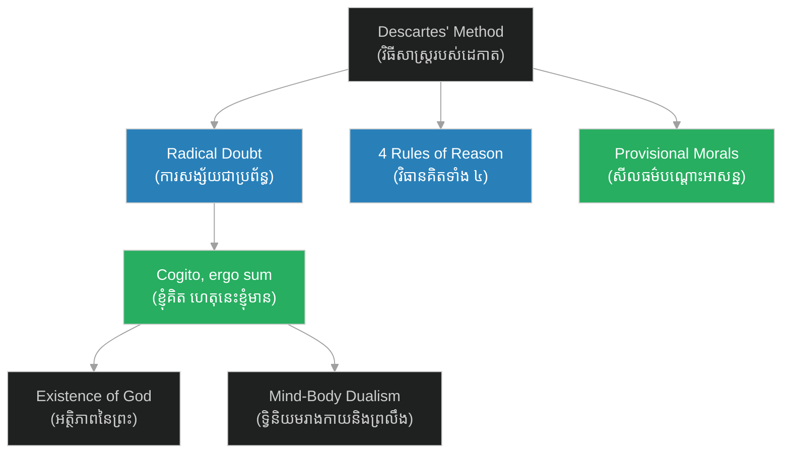

# Discourse on the Method (សេចក្តីសង្ខេបសៀវភៅ វិធីសាស្ត្រដើម្បីដឹកនាំហេតុផលត្រឹមត្រូវ)

**Author:** ichamrong  
**Date:** 2026-06-06  
**Tags:** #philosophy #descartes #rationalism #epistemology #scientific-method  
**Category:** Philosophy  
**Read Time:** ~3 min

 

 

---

## 📌 មាតិកា (Table of Contents)
- [សេចក្តីផ្តើម (Introduction)](#0)
- [រចនាសម្ព័ន្ធជំពូក (Chapter Structure)](#1)
- [គោលគំនិតសំខាន់ៗ (Core Themes)](#2)
- [ឯកសារយោង (References)](#3)

---

## សេចក្តីផ្តើម (Introduction)

សៀវភៅ​​ **«Discourse on the Method»**​​ (មាន​​ឈ្មោះ​​ពេញ​​ថា​​ *Discourse on the Method of Rightly Conducting One's Reason and of Seeking Truth in the Sciences*)​​ គឺ​​ជា​​ស្នាដៃ​​ទស្សនវិជ្ជា​​ និង​​វិទ្យាសាស្ត្រ​​ដ៏​​មាន​​ឥទ្ធិពល​​បំផុត​​របស់​​ទស្សនវិទូ​​ និង​​គណិតវិទូ​​ជនជាតិ​​បារាំង​​ លោក​​ **René Descartes**​​ (រេណេ ដេកាត)​​ ដែល​​បាន​​បោះពុម្ពផ្សាយ​​នៅ​​ឆ្នាំ​​ ១៦៣៧។

សៀវភៅ​​នេះ​​ត្រូវ​​បាន​​ចាត់ទុក​​ថា​​ជា​​អត្ថបទ​​ប្រវត្តិសាស្ត្រ​​ដែល​​បើក​​ទំព័រ​​សករាជ​​ថ្មី​​សម្រាប់​​ **«ទស្សនវិជ្ជាទំនើប (Modern Philosophy)»**​​ និង​​ការ​​ចាប់ផ្តើម​​នៃ​​វិធីសាស្ត្រ​​វិទ្យាសាស្ត្រ​​បែប​​ហេតុផល​​និយម​​ ដោយ​​ងាក​​ចេញ​​ពី​​ការ​​ជឿ​​ស៊ប់​​តាម​​ប្រពៃណី​​ ឬ​​សាសនា​​មជ្ឈិមសម័យ​​ (Scholasticism)។

---

## រចនាសម្ព័ន្ធជំពូក (Chapter Structure)

ដើម្បី​​ងាយស្រួល​​ក្នុង​​ការ​​សិក្សា​​ និង​​ស្វែងយល់​​ឱ្យ​​បាន​​ស៊ីជម្រៅ​​ ខ្លឹមសារ​​សំខាន់ៗ​​នៃ​​សៀវភៅ​​នេះ​​ត្រូវ​​បាន​​បែងចែក​​ជា​​ ៤​​ ផ្នែក​​ដូច​​ខាងក្រោម៖

* 🚀 **[ជំពូកទី ១ ➔ បរិបទប្រវត្តិសាស្ត្រ និងសេចក្តីផ្តើម (Introduction & Historical Context)](01-introduction-and-context.md)**  
  ស្វែងយល់​​ពី​​ការ​​ចាប់ផ្តើម​​គំនិត​​របស់​​ដេកាត​​ ស្ថានភាព​​វិទ្យាសាស្ត្រ​​នា​​សតវត្ស​​ទី​​ ១៧​​ និង​​មូលហេតុ​​ដែល​​គាត់​​សម្រេចចិត្ត​​សរសេរ​​សៀវភៅ​​នេះ​​ជា​​ភាសា​​បារាំង​​ជំនួស​​ឱ្យ​​ភាសា​​ឡាតាំង។

* 🧭 **[ជំពូកទី ២ ➔ វិធានទាំង ៤ នៃវិធីសាស្ត្រដេកាត (The Four Rules of Cartesian Method)](02-four-rules-of-method.md)**  
  ពិនិត្យ​​មើល​​ក្បួន​​គិត​​ និង​​ដោះស្រាយ​​បញ្ហា​​ទាំង​​ ៤​​ យ៉ាង​​ដែល​​ជា​​គ្រឹះ​​នៃ​​វិធីសាស្ត្រ​​វិទ្យាសាស្ត្រ​​ទំនើប។

* 🧠 **[ជំពូកទី ៣ ➔ ការសង្ស័យជាប្រព័ន្ធ គំនិត "Cogito" និងព្រះ (Cartesian Doubt, Cogito, and God)](03-cogito-ergo-sum-and-god.md)**  
  ស្វែងយល់​​ពី​​ការ​​សង្ស័យ​​ជា​​សកល​​ ឃ្លា​​ដ៏​​ល្បីល្បាញ​​ «ខ្ញុំគិត ហេតុនេះទើបខ្ញុំមាន»​​ និង​​ការ​​ប្រើ​​ហេតុផល​​ដើម្បី​​បញ្ជាក់​​ពី​​[អត្ថិភាព](../../../keywords/existence.md)​​នៃ​​ព្រះ។

* ⚖️ **[ជំពូកទី ៤ ➔ ទ្វិនិយមរាងកាយនិងព្រលឹង និងក្រមសីលធម៌បណ្តោះអាសន្ន (Mind-Body Dualism & Provisional Morals)](04-dualism-and-provisional-morals.md)**  
  សិក្សា​​ពី​​ទំនាក់ទំនង​​រវាង​​រាងកាយ​​ (Res Extensa)​​ និង​​ចិត្ត​​ (Res Cogitans)​​ ព្រមទាំង​​ក្រមសីលធម៌​​បណ្តោះអាសន្ន​​ដែល​​ដេកាត​​ប្រើ​​ប្រចាំថ្ងៃ។

---

## គោលគំនិតសំខាន់ៗ (Core Themes)

---

## ឯកសារយោង (References)

* **René Descartes** — *Discourse on the Method of Rightly Conducting One's Reason and of Seeking Truth in the Sciences* (1637).
* **Stanford Encyclopedia of Philosophy** — *Descartes' Epistemology & Method*.
