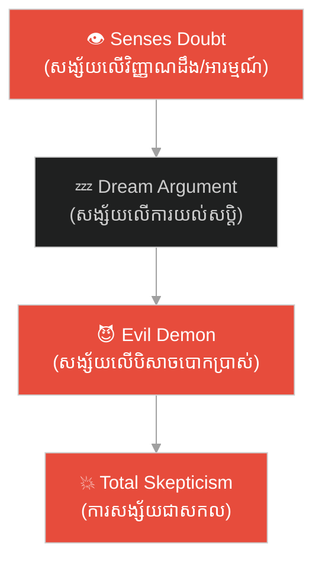

# ការសញ្ជឹងគិតទី ១ និងទី ២៖ Meditations I & II

**Author:** ichamrong  
**Date:** 2026-06-06  
**Tags:** #philosophy #descartes #meditations #doubt #cogito #wax-analogy  
**Category:** Philosophy  
**Read Time:** ~6 min

---

## 📌 មាតិកា (Table of Contents)
- [សង្ខេបជំពូក (Chapter Summary)](#0)
- [១. ការសញ្ជឹងគិតទី ១ — ការសង្ស័យជាសកល (Meditation I: Radical Doubt)](#1)
- [២. ការសញ្ជឹងគិតទី ២ — ខ្ញុំមានអត្ថិភាព និងឧបមាទកថាដុំក្រមួន (Meditation II: The Cogito & Wax Analogy)](#2)
  - [ឧបមាទកថាដុំក្រមួន (The Wax Analogy)](#2-1)
- [សេចក្តីសន្និដ្ឋាន (Conclusion)](#3)
- [ឯកសារយោង (References)](#4)

---

## សង្ខេបជំពូក (Chapter Summary)

នៅ​​ក្នុង​​ការសញ្ជឹងគិត​​ពីរ​​ថ្ងៃ​​ដំបូង​​ លោក​​ Descartes​​ បាន​​ចាប់ផ្ដើម​​ដំណើរ​​រុករក​​របស់​​គាត់​​ ដោយ​​វាយកម្ទេច​​ចោល​​នូវ​​រាល់​​ជំនឿ​​ទាំងឡាយ​​ដែល​​គាត់​​ធ្លាប់​​មាន​​ (ការសង្ស័យជាប្រព័ន្ធ)​​ ដើម្បី​​ស្វែងរក​​នូវ​​ការពិត​​ដែល​​មិន​​អាច​​សង្ស័យ​​បាន។​​ បន្ទាប់​​មក​​ គាត់​​បាន​​រកឃើញ​​ថា​​ ទោះ​​បី​​ជា​​សង្ស័យ​​ដល់​​កម្រិត​​ណា​​ក៏​​ដោយ​​ ក៏​​គាត់​​មិន​​អាច​​សង្ស័យ​​លើ​​ [អត្ថិភាព](../../../keywords/existence.md)​​ របស់​​ខ្លួនឯង​​ដែល​​កំពុង​​គិត​​បាន​​ឡើយ​​ ព្រម​​ទាំង​​បង្ហាញ​​ថា​​ ចិត្ត​​របស់​​មនុស្ស​​គឺ​​ងាយ​​ស្គាល់​​ជាង​​រាងកាយ​​ តាម​​រយៈ​​ «ឧបមាទកថា​​ដុំក្រមួន»។

In the first two Meditations, Descartes begins his journey by demolishing all his former beliefs (radical doubt) to find an indubitable truth. He discovers that no matter how much he doubts, he cannot doubt his own [existence](../../../keywords/existence.md) as a thinking thing. He then demonstrates that the mind is better known than the body through the famous "Wax Analogy".

---

## ១. ការសញ្ជឹងគិតទី ១ — ការសង្ស័យជាសកល (Meditation I: Radical Doubt)

ដេកាត​​បាន​​ដឹង​​ថា​​ គាត់​​បាន​​ទទួល​​យក​​ជំនឿ​​មិន​​ពិត​​ជា​​ច្រើន​​តាំង​​ពី​​ក្មេង។​​ ដើម្បី​​កសាង​​វិទ្យាសាស្ត្រ​​ឡើង​​វិញ​​ គាត់​​ត្រូវ​​វាយចោល​​គ្រឹះ​​ចាស់ៗ​​ចោល​​ទាំង​​អស់។​​ គាត់​​បាន​​ប្រើ​​អំណះអំណាង​​ ៣​​ យ៉ាង​​ដើម្បី​​សង្ស័យ៖

1.  **អំណះអំណាងញាណដឹង (The Senses Argument)**: អារម្មណ៍​​របស់​​យើង​​ (ការ​​មើល​​ឃើញ​​ ឮ​​ ធំក្លិន)​​ តែងតែ​​បោកប្រាស់​​យើង​​ក្នុង​​ស្ថានភាព​​ខ្លះ​​ ដូច្នេះ​​វាមិន​​គួរ​​ឱ្យ​​ទុកចិត្ត​​ទាំងស្រុង​​ឡើយ។
2.  **អំណះអំណាងយល់សប្តិ (The Dream Argument)**: នៅ​​ពេល​​យល់សប្តិ​​ យើង​​មាន​​អារម្មណ៍​​ដូច​​ការពិត​​បេះបិទ។​​ គ្មាន​​សញ្ញា​​ណាមួយ​​អាច​​ញែក​​ដាច់​​រវាង​​ការ​​ភ្ញាក់​​ និង​​ការ​​យល់សប្តិ​​បាន​​ឡើយ។
3.  **សម្មតិកម្មបិសាចកំណាច (The Evil Demon Hypothesis)**: គាត់​​សន្មត​​ថា​​ មាន​​បិសាច​​ដ៏​​មាន​​អំណាច​​ និង​​ល្បិចកល​​ខ្ពស់​​ កំពុង​​ប្រើ​​រាល់​​ថាមពល​​របស់​​វា​​ដើម្បី​​បោកប្រាស់​​គាត់​​ ធ្វើ​​ឱ្យ​​គាត់​​គិត​​ខុស​​សូម្បី​​តែ​​លើ​​តក្កវិជ្ជា​​ និង​​គណិតវិទ្យា​​ (ដូចជា​​ ២+៣=៥)។

---

## ២. ការសញ្ជឹងគិតទី ២ — ខ្ញុំមានអត្ថិភាព និងឧបមាទកថាដុំក្រមួន (Meditation II: The Cogito & Wax Analogy)

ទោះ​​ជា​​មាន​​បិសាច​​បោកប្រាស់​​គាត់​​លើ​​គ្រប់​​យ៉ាង​​ក៏ដោយ​​ ដេកាត​​រក​​ឃើញ​​ថា​​ បិសាច​​នោះ​​មិន​​អាច​​ធ្វើ​​ឱ្យ​​គាត់​​ក្លាយ​​ជា​​ «សូន្យ»​​ បាន​​ឡើយ​​ ដរាប​​ណា​​គាត់​​នៅ​​តែ​​កំពុង​​គិត។
> **«ខ្ញុំគិត ខ្ញុំមានអត្ថិភាព»**​​ (*Ego sum, ego existo*)

ដេកាត​​សន្និដ្ឋាន​​ថា​​ ខ្លួន​​គាត់​​គឺ​​ជា​​ **« Res Cogitans »**​​ (Chose pensante / Thinking thing)​​ ពោល​​គឺ​​ជា​​ចិត្ត​​ដែល​​កំពុង​​សង្ស័យ​​ យល់​​ដឹង​​ អះអាង​​ បដិសេធ​​ ប្រាថ្នា​​ និង​​ស្រមៃ។

### ឧបមាទកថាដុំក្រមួន (The Wax Analogy)

ដើម្បី​​បញ្ជាក់​​ថា​​ ចិត្ត​​របស់​​មនុស្ស​​គឺ​​ងាយ​​ស្គាល់​​ និង​​យល់​​ដឹង​​ជាង​​រាងកាយ​​ (ឬ​​រូបធាតុ)​​ ដេកាត​​បាន​​លើក​​យក​​ឧទាហរណ៍​​អំពី​​ **ដុំក្រមួនឃ្មុំ (A piece of wax)**៖
*   នៅ​​ពេល​​យក​​ចេញ​​ពី​​សំបុកឃ្មុំ:​​ វានៅ​​មាន​​ក្លិន​​ទឹកឃ្មុំ​​ មាន​​ពណ៌​​លឿង​​ រឹង​​ ត្រជាក់​​ និង​​បង្ក​​ជា​​សំឡេង​​នៅ​​ពេល​​យើង​​គោះវា។​​ អារម្មណ៍​​ខាងក្រៅ​​ប្រាប់​​យើង​​នូវ​​លក្ខណៈ​​ទាំង​​នេះ។
*   នៅ​​ពេល​​យក​​ទៅ​​ជិត​​ភ្លើង:​​ ក្រមួន​​នោះ​​ក៏​​រលាយ​​ ក្លិន​​ក៏​​បាត់​​ ពណ៌​​ប្រែប្រួល​​ ទំហំ​​រីក​​ វាក្លាយ​​ជា​​ទឹក​​ក្តៅ​​ និង​​លែង​​មាន​​សំឡេង។
*   **សំនួរ**: តើ​​វា​​នៅ​​តែ​​ជា​​ដុំក្រមួន​​ដដែល​​ដែរ​​ឬ​​ទេ?​​ ចម្លើយ​​គឺ​​ «បាទ​​ វា​​នៅ​​តែ​​ជា​​ក្រមួន​​ដដែល»។

ដេកាត​​បាន​​ចង្អុល​​បង្ហាញ​​ថា​​ ការ​​ដឹង​​ថា​​វា​​នៅ​​តែ​​ជា​​ក្រមួន​​ដដែល​​ មិន​​មែន​​បាន​​មក​​ពី​​អារម្មណ៍​​ (Senses)​​ ឡើយ​​ ព្រោះ​​លក្ខណៈ​​ខាងក្រៅ​​របស់​​វា​​បាន​​ប្រែប្រួល​​អស់​​ទៅ​​ហើយ។​​ ការ​​យល់​​ដឹង​​នេះ​​ គឺ​​កើត​​ឡើង​​តាម​​រយៈ​​ **«ការពិចារណានៃចិត្ត (Intellect / Mind's perception)»**​​ តែ​​ម៉្យាង​​គត់។

---

## សេចក្តីសន្និដ្ឋាន (Conclusion)

ការសញ្ជឹងគិត​​ទី​​ ២​​ បញ្ជាក់​​ថា​​ ចិត្ត​​របស់​​មនុស្ស​​ (Mind)​​ មាន​​ [អត្ថិភាព](../../../keywords/existence.md)​​ មុន​​ និង​​ច្បាស់លាស់​​ជាង​​រូបធាតុ​​ (Matter)​​ ទាំងឡាយ​​ក្នុង​​លោក។​​ យើង​​ស្គាល់​​ចិត្ត​​ខ្លួនឯង​​ តាម​​រយៈ​​ការ​​គិត​​ ច្បាស់​​ជាង​​យើង​​ស្គាល់​​ពិភពលោក​​ខាងក្រៅ​​តាម​​រយៈ​​អារម្មណ៍។

---

## ឯកសារយោង (References)

* **Descartes, R.** (1641). *Meditations on First Philosophy* (Meditations I & II).
* **Broughton, J.** (2002). *Descartes's Method of Doubt*.
