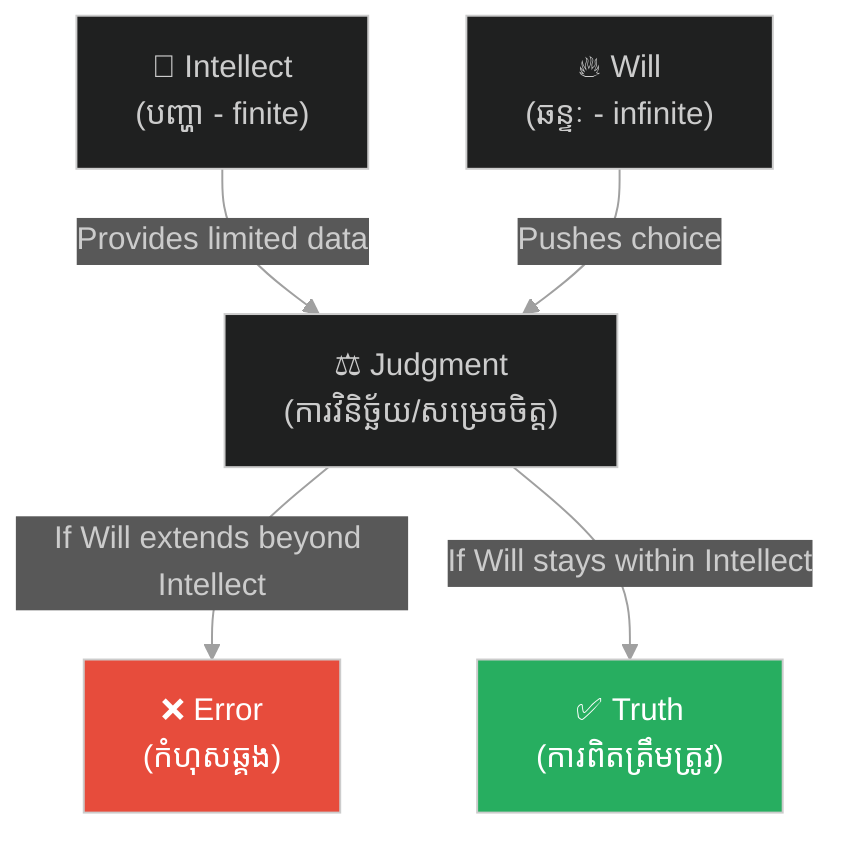

# អត្ថិភាពនៃព្រះ និងហេតុផលនៃកំហុស៖ Meditations III & IV

**Author:** ichamrong  
**Date:** 2026-06-06  
**Tags:** #philosophy #descartes #meditations #god #will #intellect #error  
**Category:** Philosophy  
**Read Time:** ~6 min

---

## 📌 មាតិកា (Table of Contents)
- [សង្ខេបជំពូក (Chapter Summary)](#0)
- [១. ការសញ្ជឹងគិតទី ៣ — ព្រះជាម្ចាស់ពិតជាមានអត្ថិភាព (Meditation III: The Existence of God)](#1)
- [២. ការសញ្ជឹងគិតទី ៤ — ការពិត និងការភូតកុហក៖ ហេតុអ្វីបានជាមនុស្សធ្វើខុស? (Meditation IV: Truth & Error)](#2)
- [សេចក្តីសន្និដ្ឋាន (Conclusion)](#3)
- [ឯកសារយោង (References)](#4)

---

## សង្ខេបជំពូក (Chapter Summary)

បន្ទាប់​​ពី​​បាន​​រកឃើញ​​ការពិត​​អំពី​​ខ្លួនឯង​​ ដេកាត​​បាន​​បន្ត​​សញ្ជឹងគិត​​ទៅ​​លើ​​ **«អត្ថិភាពនៃព្រះ»**​​ ព្រោះ​​ដរាប​​ណា​​គាត់​​មិន​​ទាន់​​ប្រាកដ​​ថា​​ព្រះ​​មាន​​ពិត​​ និង​​មិន​​មែន​​ជា​​អ្នក​​បោកប្រាស់​​ទេ​​នោះ​​ គាត់​​ក៏​​មិន​​អាច​​ប្រាកដ​​លើ​​ចំណេះដឹង​​អ្វី​​ផ្សេង​​ទៀត​​បាន​​ឡើយ។​​ បន្ទាប់​​មក​​ គាត់​​បាន​​វិភាគ​​លើ​​ប្រភព​​នៃ​​កំហុស​​ឆ្គង​​របស់​​មនុស្ស​​ ដោយ​​ពន្យល់​​ពី​​តុល្យភាព​​រវាង​​ «បញ្ញា»​​ និង​​ «ឆន្ទៈ»។

After establishing self-existence, Descartes turns to the **[existence](../../../keywords/existence.md) of God**. Without knowing if a non-deceiving God exists, he cannot be certain of anything else. He then analyzes the source of human error, explaining it through the relationship between the finite intellect and the infinite will.

---

## ១. ការសញ្ជឹងគិតទី ៣ — ព្រះជាម្ចាស់ពិតជាមានអត្ថិភាព (Meditation III: The Existence of God)

ដេកាត​​បាន​​សង្កេត​​មើល​​គំនិត​​នៅ​​ក្នុង​​ចិត្ត​​របស់​​គាត់​​ ហើយ​​បែងចែក​​វា​​ជា​​ ៣​​ ប្រភេទ៖
1.  **គំនិតកើតមកជាមួយ (Innate Ideas)**: ដូចជា​​ គំនិត​​អំពី​​អត្តសញ្ញាណ​​ គណិតវិទ្យា​​ និង​​ព្រះ។
2.  **គំនិតបានមកពីក្រៅ (Adventitious Ideas)**: ដូចជា​​ គំនិត​​អំពី​​កំដៅ​​ ព្រះអាទិត្យ​​ ឬ​​សំឡេង​​ (បាន​​មក​​ពី​​អារម្មណ៍)។
3.  **គំនិតបង្កើតឡើងដោយខ្លួនឯង (Factitious Ideas)**: ដូចជា​​ គំនិត​​អំពី​​សត្វ​​សេះ​​មាន​​ស្លាប​​ (Pegasus)​​ ឬ​​បិសាច​​ (បង្កើត​​ឡើង​​ដោយ​​ការ​​ស្រមៃ)។

ដេកាត​​បាន​​ប្រើ​​ **«អំណះអំណាងទ្រស្ដីបុព្វហេតុ (Trademark Argument)»**​​ ដើម្បី​​បញ្ជាក់​​ពី​​ [អត្ថិភាព](../../../keywords/existence.md)​​ របស់​​ព្រះ៖
*   **ច្បាប់បុព្វហេតុ**: អ្វី​​ដែល​​ជា​​ «ផល»​​ មិន​​អាច​​មាន​​ភាព​​ល្អ​​ឥតខ្ចោះ​​ ឬ​​ការពិត​​ លើស​​ «ហេតុ»​​ ដែល​​បង្កើត​​វា​​ឡើង​​បាន​​ឡើយ​​ (A cause must have at least as much reality as its effect)។
*   ខ្លួន​​គាត់​​គឺ​​ជា​​មនុស្ស​​ដែល​​មាន​​កម្រិត​​ និង​​មិន​​ល្អ​​ឥតខ្ចោះ​​ (ព្រោះ​​គាត់​​មាន​​មន្ទិល​​សង្ស័យ)។
*   ប៉ុន្តែ​​ គាត់​​បែរ​​ជា​​មាន​​គំនិត​​អំពី​​ **«សភាវៈល្អឥតខ្ចោះ និងគ្មានដែនកំណត់ (Infinite & Perfect Being)»**​​ ទៅ​​វិញ។
*   គាត់​​មិន​​អាច​​ជា​​អ្នក​​បង្កើត​​គំនិត​​នេះ​​បាន​​ឡើយ​​ ព្រោះ​​គាត់​​មិន​​ល្អ​​ឥតខ្ចោះ។
*   ដូច្នេះ​​ គំនិត​​នេះ​​ត្រូវ​​តែ​​ត្រូវ​​បាន​​ដក់​​ជាប់​​ក្នុង​​ចិត្ត​​របស់​​គាត់​​ ដោយ​​សភាវៈ​​មួយ​​ដែល​​ល្អ​​ឥតខ្ចោះ​​ពិតប្រាកដ​​ ដែល​​នោះ​​គឺ​​ **ព្រះជាម្ចាស់ (God)**​​ (ប្រៀប​​ដូច​​ជា​​និមិត្តសញ្ញា​​ពាណិជ្ជកម្ម​​ដែល​​ជាង​​សូន​​ដក់​​លើ​​ស្នាដៃ​​របស់​​ខ្លួន)។

---

## ២. ការសញ្ជឹងគិតទី ៤ — ការពិត និងការភូតកុហក៖ ហេតុអ្វីបានជាមនុស្សធ្វើខុស? (Meditation IV: Truth & Error)

ប្រសិនបើ​​ព្រះ​​ជា​​ម្ចាស់​​ល្អ​​ឥតខ្ចោះ​​ ហើយ​​មិន​​មែន​​ជា​​អ្នក​​បោកប្រាស់​​ (ព្រោះ​​ការ​​បោកប្រាស់​​ជា​​សញ្ញា​​នៃ​​ភាព​​ទន់ខ្សោយ)​​ ហេតុអ្វី​​បាន​​ជា​​ទ្រង់​​បង្កើត​​ឱ្យ​​មនុស្ស​​មាន​​លទ្ធភាព​​ធ្វើ​​ខុស​​ ឬ​​យល់​​ខុស?

ដេកាត​​បាន​​រកឃើញ​​ថា​​ កំហុស​​របស់​​មនុស្ស​​មិន​​មែន​​មក​​ពី​​កំហុស​​របស់​​ព្រះ​​ឡើយ​​ ប៉ុន្តែ​​វា​​កើត​​ឡើង​​ដោយសារ​​ដំណើរការ​​នៃ​​សមត្ថភាព​​ពីរ​​របស់​​មនុស្ស៖
1.  **បញ្ញា (Intellect)**: ជា​​សមត្ថភាព​​យល់​​ដឹង​​ និង​​ពិចារណា​​ ដែល​​ព្រះ​​ប្រទាន​​ឱ្យ​​មាន​​កំណត់​​ (Finite)។
2.  **ឆន្ទៈ (Will)**: ជា​​សមត្ថភាព​​សម្រេចចិត្ត​​ និង​​ជ្រើសរើស​​ ដែល​​ព្រះ​​ប្រទាន​​ឱ្យ​​គ្មាន​​ដែន​​កំណត់​​ (Infinite)។

**ឫសគល់នៃកំហុស (Source of Error)**:
កំហុស​​កើត​​ឡើង​​នៅ​​ពេល​​ដែល​​យើង​​ប្រើ​​ **«ឆន្ទៈ»**​​ (ដែល​​គ្មាន​​ដែន​​កំណត់)​​ ទៅ​​ធ្វើ​​ការ​​សម្រេចចិត្ត​​ ឬ​​វិនិច្ឆ័យ​​លើ​​រឿង​​ទាំងឡាយ​​ណា​​ដែល​​ **«បញ្ញា»**​​ (ដែល​​មាន​​ដែន​​កំណត់)​​ របស់​​យើង​​មិន​​ទាន់​​យល់​​ដឹង​​បាន​​ច្បាស់លាស់​​ និង​​ជាក់លាក់​​នៅ​​ឡើយ។

---

## សេចក្តីសន្និដ្ឋាន (Conclusion)

ដើម្បី​​ជៀសវាង​​កំហុស​​ឆ្គង​​ ដេកាត​​ណែនាំ​​ឱ្យ​​យើង​​ទប់​​ «ឆន្ទៈ»​​ របស់​​យើង​​កុំ​​ឱ្យ​​ប្រញាប់​​វិនិច្ឆ័យ​​ ឬ​​សម្រេចចិត្ត​​លើ​​រឿង​​ណា​​ដែល​​យើង​​មិន​​ទាន់​​បាន​​យល់​​ដឹង​​ច្បាស់លាស់​​ និង​​គ្មាន​​មន្ទិល​​សង្ស័យ​​ (ស្រប​​តាម​​វិធាន​​ទី​​ ១​​ នៃ​​វិធីសាស្ត្រ​​របស់​​គាត់)។

---

## ឯកសារយោង (References)

* **Descartes, R.** (1641). *Meditations on First Philosophy* (Meditations III & IV).
* **Curley, E. M.** (1978). *Descartes against the Skeptics*.
