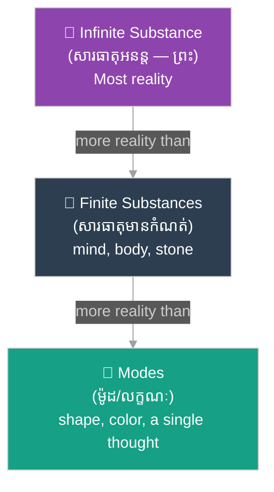
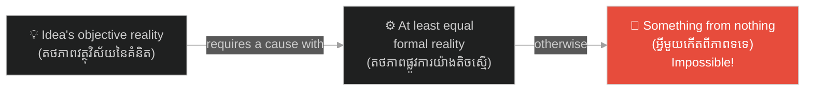

# គំនិត និងកម្រិតនៃតថភាព៖ Ideas and Degrees of Reality

**Author:** ichamrong  
**Date:** 2026-06-11  
**Tags:** #philosophy #descartes #meditation-3 #ideas #reality #epistemology  
**Category:** Philosophy  
**Read Time:** ~8 min

---

## 📌 មាតិកា (Table of Contents)
- [សង្ខេបជំពូក (Chapter Summary)](#0)
- [១. ចំណុចចាប់ផ្តើមនៃការសញ្ជឹងគិតទី ៣ (Where Descartes Stands at the Start of Meditation III)](#1)
- [២. គំនិតបីប្រភេទ (The Three Kinds of Ideas)](#2)
- [៣. តថភាពផ្លូវការ និងតថភាពវត្ថុវិស័យ (Formal Reality vs Objective Reality)](#3)
- [៤. គោលការណ៍ភាពគ្រប់គ្រាន់នៃបុព្វហេតុ (The Causal Adequacy Principle)](#4)
- [សេចក្តីសន្និដ្ឋាន (Conclusion)](#5)
- [ឯកសារយោង (References)](#6)

---

## សង្ខេបជំពូក (Chapter Summary)

ជំពូក​​នេះ​​ជា​​ផ្នែក​​ទី​​ ១​​ នៃ​​ការ​​សិក្សា​​ស៊ីជម្រៅ​​ចំនួន​​ ៣​​ ជំពូក​​ ទៅ​​លើ​​ការសញ្ជឹងគិត​​ទី​​ ៣​​ («អំពីព្រះ ថាទ្រង់មានអត្ថិភាព»)។​​ មុន​​នឹង​​យើង​​អាច​​យល់​​ពី​​អំណះអំណាង​​បញ្ជាក់​​អត្ថិភាព​​នៃ​​ព្រះ​​របស់​​ដេកាត​​ យើង​​ត្រូវ​​យល់​​ជា​​មុន​​សិន​​ នូវ​​ឧបករណ៍​​ទស្សនវិជ្ជា​​ដែល​​គាត់​​បាន​​រៀបចំ​​ទុក៖​​ ការ​​បែងចែក​​គំនិត​​ជា​​ ៣​​ ប្រភេទ​​ ការ​​បែងចែក​​រវាង​​តថភាព​​ពីរ​​បែប​​នៃ​​គំនិត​​ និង​​គោលការណ៍​​បុព្វហេតុ​​ដ៏​​សំខាន់​​មួយ​​ ដែល​​ថា​​ «ហេតុ​​ត្រូវ​​តែ​​មាន​​តថភាព​​យ៉ាង​​តិច​​ស្មើ​​នឹង​​ផល»។​​ ឧបករណ៍​​ទាំង​​នេះ​​ហើយ​​ ដែល​​ជា​​គ្រឹះ​​នៃ​​អំណះអំណាង​​ទាំង​​មូល​​ ដែល​​យើង​​នឹង​​វិភាគ​​ក្នុង​​ជំពូក​​បន្ទាប់។

> *This chapter is part 1 of a 3-chapter deep dive into Meditation III ("Of God, that He exists"). Before we can understand Descartes' proof of God's existence, we must first understand the philosophical tools he sets up: the division of ideas into 3 kinds, the distinction between two sorts of reality an idea can have, and a crucial causal principle — "there must be at least as much reality in the cause as in the effect." These tools form the foundation of the entire argument, which we will analyze in the next chapter.*

---

## ១. ចំណុចចាប់ផ្តើមនៃការសញ្ជឹងគិតទី ៣ (Where Descartes Stands at the Start of Meditation III)

នៅ​​ដើម​​ការសញ្ជឹងគិត​​ទី​​ ៣​​ ដេកាត​​បិទភ្នែក​​ បិទត្រចៀក​​ និង​​បង្វែរ​​ចិត្ត​​ចេញ​​ពី​​វិញ្ញាណ​​ទាំងអស់​​ ដើម្បី​​ពិនិត្យ​​មើល​​ថា​​ តើ​​គាត់​​នៅ​​សល់​​ចំណេះដឹង​​អ្វី​​ខ្លះ​​ដែល​​ប្រាកដ​​ពិត។​​ ចម្លើយ​​គឺ​​មាន​​តែ​​មួយ​​គត់៖​​ «ខ្ញុំ​​ជា​​សភាវៈ​​ដែល​​គិត»​​ — សភាវៈ​​ដែល​​សង្ស័យ​​ បញ្ជាក់​​ បដិសេធ​​ ចង់បាន​​ ស្រមើស្រមៃ​​ និង​​មាន​​អារម្មណ៍។​​ ក្រៅ​​ពី​​ **«កូហ្គីតូ (Cogito)»**​​ នេះ​​ អ្វីៗ​​ទាំងអស់​​ — ផ្ទៃមេឃ​​ ផែនដី​​ រាងកាយ​​ សូម្បី​​តែ​​គណិតវិទ្យា​​ — នៅ​​តែ​​ស្ថិត​​ក្រោម​​ស្រមោល​​នៃ​​មន្ទិលសង្ស័យ​​ដដែល។

> *At the start of Meditation III, Descartes closes his eyes, stops his ears, and withdraws his mind from all the senses, taking stock of what certain knowledge remains. The answer is exactly one item: "I am a thinking thing" — a thing that doubts, affirms, denies, wills, imagines, and senses. Beyond this **Cogito**, everything — sky, earth, his own body, even mathematics — still lies under the shadow of doubt.*

បន្ទាប់​​មក​​ គាត់​​សួរ​​ខ្លួនឯង​​នូវ​​សំណួរ​​ដ៏​​ឆ្លាតវៃ​​មួយ៖​​ «តើ​​អ្វី​​ទៅ​​ដែល​​ធ្វើ​​ឱ្យ​​ខ្ញុំ​​ប្រាកដ​​ចិត្ត​​យ៉ាង​​នេះ​​ ចំពោះ​​ការពិត​​នៃ​​កូហ្គីតូ?»​​ ចម្លើយ​​គឺ​​ ដោយសារ​​គាត់​​យល់ឃើញ​​វា​​យ៉ាង​​ច្បាស់លាស់​​បំផុត។​​ ពី​​ការ​​សង្កេត​​នេះ​​ គាត់​​បាន​​ស្នើ​​វិធាន​​ទូទៅ​​មួយ​​សម្រាប់​​ការពិត៖​​ អ្វី​​ក៏​​ដោយ​​ដែល​​ខ្ញុំ​​យល់ឃើញ​​ដោយ​​ **«ការយល់ឃើញច្បាស់លាស់ និងជាក់លាក់ (Clear and Distinct Perception)»**​​ គឺ​​ជា​​ការពិត។​​ ប៉ុន្តែ​​ វិធាន​​នេះ​​នៅ​​មិន​​ទាន់​​រឹងមាំ​​នៅ​​ឡើយ​​ទេ​​ ព្រោះ​​សម្មតិកម្ម​​អំពី​​ព្រះ​​ដែល​​អាច​​បោកប្រាស់​​ នៅ​​តែ​​អាច​​ធ្វើ​​ឱ្យ​​គាត់​​សង្ស័យ​​ សូម្បី​​តែ​​លើ​​សមីការ​​សាមញ្ញ​​ដូចជា​​ ២ + ៣ = ៥​​ ក៏​​ដោយ។​​ ហេតុ​​នេះ​​ កិច្ចការ​​ចម្បង​​នៃ​​ការសញ្ជឹងគិត​​ទី​​ ៣​​ គឺ​​ត្រូវ​​ពិនិត្យ​​ថា​​ តើ​​ព្រះ​​មាន​​អត្ថិភាព​​ឬ​​ទេ​​ ហើយ​​បើ​​មាន​​ តើ​​ទ្រង់​​អាច​​ជា​​អ្នក​​បោកប្រាស់​​ឬ​​ទេ។

> *He then asks himself a brilliant question: "What is it that makes me so certain of the Cogito?" The answer: he perceives it with maximum clarity. From this observation he proposes a general rule of truth: whatever I perceive with **clear and distinct perception** is true. But the rule is not yet secure, because the hypothesis of a deceiving God could still make him doubt even simple equations like 2 + 3 = 5. The central task of Meditation III is therefore to examine whether God exists, and if so, whether He can be a deceiver.*

ចូរ​​កត់សម្គាល់​​ពី​​ស្ថានភាព​​ដ៏​​តឹងតែង​​របស់​​ដេកាត​​នៅ​​ទីនេះ៖​​ គាត់​​ត្រូវ​​សាងសង់​​ស្ពាន​​ពី​​ចិត្ត​​ខ្លួនឯង​​ ទៅ​​កាន់​​អ្វី​​ដែល​​នៅ​​ខាងក្រៅ​​ចិត្ត​​ ដោយ​​មិន​​អាច​​ប្រើ​​វិញ្ញាណ​​ទាំង​​ ៥​​ បាន​​ឡើយ​​ (ព្រោះ​​វា​​ត្រូវ​​បាន​​សង្ស័យ​​រួច​​ហើយ)។​​ សម្ភារៈ​​សាងសង់​​តែ​​មួយ​​គត់​​ដែល​​គាត់​​មាន​​ គឺ​​ខ្លឹមសារ​​នៅ​​ក្នុង​​ចិត្ត​​របស់​​គាត់​​ផ្ទាល់​​ — ពោល​​គឺ​​ **«គំនិត (Ideas)»**។​​ នេះ​​ហើយ​​ជា​​មូលហេតុ​​ដែល​​គាត់​​ត្រូវ​​ចាប់ផ្តើម​​ដោយ​​ការ​​ធ្វើ​​ចំណាត់ថ្នាក់​​គំនិត​​ឱ្យ​​បាន​​ម៉ត់ចត់​​ជា​​មុន​​សិន។

> *Notice Descartes' severe predicament here: he must build a bridge from his own mind to something outside it, without using the 5 senses (already discredited by doubt). The only building material he has is the content of his own mind — namely, **ideas**. This is why he must begin with a careful classification of ideas.*

---

## ២. គំនិតបីប្រភេទ (The Three Kinds of Ideas)

ដេកាត​​ឱ្យ​​និយមន័យ​​ «គំនិត»​​ ថា​​ជា​​ការគិត​​ដែល​​ប្រៀប​​បាន​​នឹង​​ «រូបភាព​​នៃ​​វត្ថុ»​​ — ដូចជា​​ គំនិត​​អំពី​​មនុស្ស​​ អំពី​​មេឃ​​ ឬ​​អំពី​​ព្រះ។​​ គាត់​​សង្កេត​​ឃើញ​​ចំណុច​​សំខាន់​​មួយ៖​​ គំនិត​​ដោយ​​ខ្លួន​​វា​​ មិន​​អាច​​ខុស​​បាន​​ទេ។​​ បើ​​ខ្ញុំ​​ស្រមៃ​​ឃើញ​​សត្វ​​នាគ​​ វា​​ជា​​ការពិត​​ដែល​​ខ្ញុំ​​កំពុង​​ស្រមៃ​​ឃើញ​​សត្វ​​នាគ​​ មិន​​ថា​​សត្វ​​នាគ​​មាន​​ពិត​​ឬ​​អត់​​ឡើយ។​​ កំហុស​​កើត​​ឡើង​​តែ​​នៅ​​ពេល​​ដែល​​យើង​​ **វិនិច្ឆ័យ (Judge)**​​ — ជា​​ពិសេស​​ ពេល​​យើង​​វិនិច្ឆ័យ​​ថា​​ គំនិត​​ក្នុង​​ចិត្ត​​យើង​​ «ដូច»​​ ឬ​​ «តំណាង​​ឱ្យ»​​ វត្ថុ​​ដែល​​មាន​​ពិត​​នៅ​​ខាងក្រៅ។

> *Descartes defines an "idea" as a thought that is, as it were, an "image of a thing" — the idea of a man, of the sky, of God. He notes a crucial point: ideas, taken by themselves, cannot be false. If I imagine a dragon, it is true that I am imagining a dragon, whether or not dragons exist. Error arises only when we **judge** — especially when we judge that the ideas in our minds "resemble" or "represent" things really existing outside us.*

ដោយ​​ផ្អែក​​លើ​​ប្រភពដើម​​ដែល​​អាច​​មាន​​ ដេកាត​​បែងចែក​​គំនិត​​ជា​​ ៣​​ ប្រភេទ៖

> *Based on their apparent origin, Descartes divides ideas into 3 kinds:*

1. **«គំនិតពីកំណើត (Innate Ideas)»** — គំនិត​​ដែល​​ហាក់​​ដូចជា​​មាន​​ស្រាប់​​ក្នុង​​ធម្មជាតិ​​នៃ​​ចិត្ត​​ខ្ញុំ៖​​ គំនិត​​អំពី​​ «អ្វី​​ជា​​វត្ថុ»​​ «អ្វី​​ជា​​ការពិត»​​ «អ្វី​​ជា​​ការគិត»​​ ព្រម​​ទាំង​​គំនិត​​គណិតវិទ្យា​​ ដូចជា​​ ត្រីកោណ​​ និង​​ចំនួន។  
   *Ideas that seem to come with the very nature of my mind: the ideas of "what a thing is," "what truth is," "what thought is," plus mathematical ideas like triangle and number.*
2. **«គំនិតមកពីខាងក្រៅ (Adventitious Ideas)»** — គំនិត​​ដែល​​ហាក់​​ដូចជា​​មក​​ដល់​​ខ្ញុំ​​ពី​​ខាងក្រៅ​​ ដោយ​​មិន​​អាស្រ័យ​​លើ​​ឆន្ទៈ​​ខ្ញុំ៖​​ ពេល​​ខ្ញុំ​​អង្គុយ​​ក្បែរ​​ភ្លើង​​ ខ្ញុំ​​មាន​​អារម្មណ៍​​ក្តៅ​​ ទោះ​​ខ្ញុំ​​ចង់​​ឬ​​មិន​​ចង់​​ក៏​​ដោយ​​ — ដូចគ្នា​​នឹង​​សំឡេង​​ ឬ​​ពន្លឺ​​ព្រះអាទិត្យ​​ដែរ។  
   *Ideas that seem to arrive from outside, independently of my will: sitting near a fire, I feel heat whether I want to or not — likewise sounds, or the light of the sun.*
3. **«គំនិតប្រឌិត (Factitious Ideas)»** — គំនិត​​ដែល​​ខ្ញុំ​​ផ្សំ​​បង្កើត​​ដោយ​​ខ្លួនឯង​​ ពី​​បំណែក​​នៃ​​គំនិត​​ផ្សេងៗ៖​​ ដូចជា​​ សត្វ​​ទេពអប្សរសមុទ្រ​​ (Siren)​​ ឬ​​សត្វ​​ហ៊ីប៉ូហ្គ្រីហ្វ​​ (Hippogriff)​​ ដែល​​ខ្ញុំ​​ផ្សំ​​ពី​​រូប​​មនុស្ស​​ ត្រី​​ សេះ​​ និង​​សត្វ​​ឥន្ទ្រី។  
   *Ideas I compose myself from pieces of other ideas: sirens or hippogriffs, assembled from images of humans, fish, horses, and eagles.*

ប៉ុន្តែ​​ ដេកាត​​ព្រមាន​​ភ្លាមៗ​​ថា​​ ចំណាត់ថ្នាក់​​នេះ​​គ្រាន់​​តែ​​ជា​​ «រូបរាង​​ខាងក្រៅ»​​ ប៉ុណ្ណោះ​​ — គាត់​​មិន​​ទាន់​​ដឹង​​ច្បាស់​​ថា​​ គំនិត​​ណា​​ពិត​​ជា​​មក​​ពី​​ណា​​ឡើយ។​​ ឧទាហរណ៍​​ដ៏​​ល្បី​​របស់​​គាត់​​គឺ​​ ព្រះអាទិត្យ៖​​ តាម​​វិញ្ញាណ​​ភ្នែក​​ ខ្ញុំ​​មាន​​គំនិត​​អំពី​​ព្រះអាទិត្យ​​តូច​​ល្មម​​មួយ​​ ប៉ុន្តែ​​តាម​​ការ​​គណនា​​តារាសាស្ត្រ​​ ខ្ញុំ​​មាន​​គំនិត​​អំពី​​ព្រះអាទិត្យ​​ធំ​​ជាង​​ផែនដី​​ច្រើន​​ដង។​​ គំនិត​​ទាំង​​ពីរ​​មិន​​អាច​​ដូច​​ព្រះអាទិត្យ​​ពិត​​ទាំង​​ពីរ​​បាន​​ទេ​​ — ហើយ​​ច្បាស់​​ណាស់​​ គំនិត​​ដែល​​ «មក​​ពី​​វិញ្ញាណ​​ផ្ទាល់»​​ នោះ​​ បែរ​​ជា​​ខុស​​ពី​​ការពិត​​ជាង​​គេ​​ទៅ​​វិញ។​​ ដូច្នេះ​​ ភាព​​ដែល​​គំនិត​​ «ហាក់​​ដូចជា​​មក​​ពី​​ខាងក្រៅ»​​ មិន​​អាច​​ធានា​​ថា​​ វា​​តំណាង​​ឱ្យ​​វត្ថុ​​ខាងក្រៅ​​បាន​​ត្រឹមត្រូវ​​ឡើយ។

> *But Descartes immediately warns that this classification is only provisional — he does not yet know where any idea truly comes from. His famous example is the sun: through the eyes, I have the idea of a rather small sun; through astronomical reasoning, the idea of a sun many times larger than the earth. Both ideas cannot resemble the one real sun — and notably, the idea that "comes directly from the senses" is the one that is most unlike the truth. So the mere fact that an idea "seems to come from outside" cannot guarantee that it accurately represents an external thing.*

---

## ៣. តថភាពផ្លូវការ និងតថភាពវត្ថុវិស័យ (Formal Reality vs Objective Reality)

ដើម្បី​​បន្ត​​ទៅ​​មុខ​​ ដេកាត​​បាន​​ខ្ចី​​ការ​​បែងចែក​​បច្ចេកទេស​​មួយ​​ ពី​​ទស្សនវិជ្ជា​​សកលវិទ្យាល័យ​​យុគសម័យកណ្តាល​​ (Scholasticism)។​​ គំនិត​​នីមួយៗ​​អាច​​ត្រូវ​​បាន​​មើល​​ពី​​ពីរ​​ជ្រុង​​ខុស​​គ្នា៖​​ ទី​​មួយ​​ ជា​​ «ព្រឹត្តិការណ៍​​ក្នុង​​ចិត្ត»​​ ដែល​​មាន​​អត្ថិភាព​​ពិត​​ — នេះ​​ហៅ​​ថា​​ **«តថភាពផ្លូវការ (Formal Reality)»**​​ របស់​​វា។​​ ទី​​ពីរ​​ ជា​​ «រូបភាព​​តំណាង»​​ ដែល​​បង្ហាញ​​ពី​​អ្វី​​មួយ​​ — តថភាព​​នៃ​​វត្ថុ​​ដែល​​វា​​តំណាង​​ តាម​​បែប​​ដែល​​វា​​ស្ថិត​​នៅ​​ក្នុង​​គំនិត​​ — នេះ​​ហៅ​​ថា​​ **«តថភាពវត្ថុវិស័យ (Objective Reality)»**​​ របស់​​វា។​​ (ប្រយ័ត្ន៖​​ ពាក្យ​​ «objective»​​ នៅ​​ទីនេះ​​ មាន​​ន័យ​​ផ្ទុយ​​ពី​​ការ​​ប្រើប្រាស់​​សម័យ​​ទំនើប​​ — វា​​សំដៅ​​លើ​​ខ្លឹមសារ​​តំណាង​​ក្នុង​​ចិត្ត​​ មិន​​មែន​​ការពិត​​ឯករាជ្យ​​ពី​​ចិត្ត​​ឡើយ។)

> *To move forward, Descartes borrows a technical distinction from medieval Scholastic philosophy. Every idea can be viewed from two angles. First, as a "mental event" that really exists — this is its **formal reality**. Second, as a "representation" that depicts something — the reality of the thing it represents, as contained in the idea — this is its **objective reality**. (Careful: "objective" here means almost the opposite of its modern usage — it refers to representational content in the mind, not mind-independent fact.)*

ឧទាហរណ៍​​ជាក់ស្តែង​​ ៣​​ ករណី​​ នឹង​​ធ្វើ​​ឱ្យ​​ច្បាស់៖

> *Three concrete cases make this clear:*

* **ដុំថ្មពិតមួយដុំ**៖​​ មាន​​តថភាពផ្លូវការ​​ក្នុង​​ឋានៈ​​ជា​​ **«សារធាតុមានកំណត់ (Finite Substance)»**​​ — វត្ថុ​​ដែល​​មាន​​អត្ថិភាព​​ដោយ​​ខ្លួនឯង​​ ក្នុង​​ពិភពលោក។​​ វា​​មិន​​តំណាង​​ឱ្យ​​អ្វី​​ទាំងអស់​​ ដូច្នេះ​​វា​​គ្មាន​​តថភាពវត្ថុវិស័យ​​ឡើយ។  
  *A real stone: has formal reality as a **finite substance** — a thing existing on its own in the world. It represents nothing, so it has no objective reality at all.*
* **គំនិតអំពីដុំថ្ម**៖​​ ក្នុង​​ឋានៈ​​ជា​​ព្រឹត្តិការណ៍​​ក្នុង​​ចិត្ត​​ វា​​មាន​​តថភាពផ្លូវការ​​ត្រឹម​​កម្រិត​​ **«ម៉ូដ ឬលក្ខណៈនៃសារធាតុ (Mode)»**​​ ប៉ុណ្ណោះ​​ (ជា​​គ្រាន់​​តែ​​សភាព​​មួយ​​នៃ​​ចិត្ត​​ខ្ញុំ)។​​ ប៉ុន្តែ​​ ក្នុង​​ឋានៈ​​ជា​​តំណាង​​ វា​​មាន​​តថភាពវត្ថុវិស័យ​​កម្រិត​​ «សារធាតុមានកំណត់»​​ ព្រោះ​​អ្វី​​ដែល​​វា​​បង្ហាញ​​ គឺ​​សារធាតុ​​មួយ។  
  *The idea of a stone: as a mental event, its formal reality is only that of a **mode** (a mere state of my mind). But as a representation, its objective reality is at the level of a finite substance, because what it depicts is a substance.*
* **គំនិតអំពីព្រះ**៖​​ ក្នុង​​ឋានៈ​​ជា​​ព្រឹត្តិការណ៍​​ក្នុង​​ចិត្ត​​ វា​​ក៏​​គ្រាន់​​តែ​​ជា​​ម៉ូដ​​មួយ​​ដូច​​គំនិត​​ឯ​​ទៀតៗ​​ដែរ។​​ ប៉ុន្តែ​​ អ្វី​​ដែល​​វា​​តំណាង​​ គឺ​​ **«សារធាតុអនន្ត (Infinite Substance)»**​​ — សភាវៈ​​អនន្ត​​ ឯករាជ្យ​​ ចេះដឹង​​គ្រប់​​បែបយ៉ាង​​ មាន​​ឫទ្ធានុភាព​​គ្រប់​​បែបយ៉ាង។​​ ដូច្នេះ​​ វា​​មាន​​តថភាពវត្ថុវិស័យ​​ខ្ពស់​​បំផុត​​ លើស​​គំនិត​​ទាំងអស់​​ក្នុង​​ចិត្ត​​ខ្ញុំ។  
  *The idea of God: as a mental event, it too is just one mode among others. But what it represents is an **infinite substance** — infinite, independent, all-knowing, all-powerful. Its objective reality is therefore the highest of any idea in my mind.*

នេះ​​នាំ​​ឱ្យ​​ឃើញ​​ឋានានុក្រម​​នៃ​​តថភាព​​របស់​​ដេកាត​​ ដែល​​មាន​​ ៣​​ ថ្នាក់៖​​ ម៉ូដ​​ (លក្ខណៈ​​ដែល​​អាស្រ័យ​​លើ​​សារធាតុ​​ ដូចជា​​ រាង​​ ពណ៌​​ ឬ​​ការគិត​​មួយៗ)​​ < សារធាតុមានកំណត់​​ (ចិត្ត​​ រាងកាយ​​ ដុំថ្ម)​​ < សារធាតុអនន្ត​​ (ព្រះ​​ តែ​​មួយ​​គត់)។

> *This reveals Descartes' hierarchy of reality, with 3 levels: modes (features that depend on a substance — a shape, a color, a particular thought) < finite substances (minds, bodies, stones) < infinite substance (God alone).*

---

## ៤. គោលការណ៍ភាពគ្រប់គ្រាន់នៃបុព្វហេតុ (The Causal Adequacy Principle)

ឥឡូវ​​នេះ​​ ដេកាត​​ដាក់​​ចេញ​​នូវ​​គោលការណ៍​​ដែល​​ជា​​ឆ្អឹងខ្នង​​នៃ​​អំណះអំណាង​​ទាំង​​មូល​​ — **«គោលការណ៍ភាពគ្រប់គ្រាន់នៃបុព្វហេតុ (Causal Adequacy Principle)»**៖​​ «ត្រូវ​​តែ​​មាន​​តថភាព​​នៅ​​ក្នុង​​បុព្វហេតុ​​ ដែល​​មាន​​ប្រសិទ្ធភាព​​ និង​​ពេញលេញ​​ យ៉ាង​​តិច​​ស្មើ​​នឹង​​តថភាព​​នៅ​​ក្នុង​​ផល​​នៃ​​បុព្វហេតុ​​នោះ»។​​ និយាយ​​ឱ្យ​​ងាយ​​ស្តាប់៖​​ អ្វី​​ដែល​​តូច​​ មិន​​អាច​​បង្កើត​​អ្វី​​ដែល​​ធំ​​ជាង​​ខ្លួន​​បាន​​ទេ​​ ហើយ​​អ្វី​​ដែល​​មិន​​ល្អឥតខ្ចោះ​​ មិន​​អាច​​បង្កើត​​អ្វី​​ដែល​​ល្អឥតខ្ចោះ​​ជាង​​ខ្លួន​​បាន​​ឡើយ។

> *Now Descartes lays down the principle that is the backbone of the entire argument — the **Causal Adequacy Principle**: "there must be at least as much reality in the efficient and total cause as in the effect of that cause." Put simply: what is lesser cannot produce what is greater than itself, and what is imperfect cannot produce what is more perfect than itself.*

ហេតុអ្វី​​ដេកាត​​គិត​​ថា​​ គោលការណ៍​​នេះ​​ច្បាស់​​ដោយ​​ខ្លួនឯង?​​ គាត់​​អះអាង​​ថា​​ វា​​ត្រូវ​​បាន​​បង្ហាញ​​ដោយ​​ **«ពន្លឺនៃធម្មជាតិ (Natural Light)»**​​ — សមត្ថភាព​​យល់ដឹង​​ផ្ទាល់​​ដែល​​មិន​​អាច​​ប្រកែក​​បាន​​ ដូចគ្នា​​នឹង​​ការ​​យល់​​ឃើញ​​កូហ្គីតូ​​ដែរ។​​ មូលដ្ឋាន​​របស់​​វា​​គឺ​​ពាក្យ​​បុរាណ​​ឡាតាំង៖​​ **«គ្មានអ្វីកើតចេញពីភាពទទេឡើយ (Ex nihilo nihil fit)»**។​​ បើ​​ផល​​មាន​​តថភាព​​ច្រើន​​ជាង​​ហេតុ​​ នោះ​​តថភាព​​លើស​​នោះ​​ ត្រូវ​​តែ​​កើត​​ចេញ​​ពី​​ «ភាពទទេ»​​ — ដែល​​មិន​​អាច​​ទៅ​​រួច។​​ ឧទាហរណ៍​​របស់​​គាត់៖​​ ដុំថ្ម​​មួយ​​ដែល​​មិន​​ធ្លាប់​​មាន​​ពី​​មុន​​ អាច​​កើត​​ឡើង​​បាន​​ តែ​​ដោយសារ​​អ្វី​​មួយ​​ដែល​​មាន​​ក្នុង​​ខ្លួន​​ នូវ​​អ្វីៗ​​ទាំងអស់​​ដែល​​មាន​​ក្នុង​​ដុំថ្ម​​ — ទាំង​​ដោយ​​ផ្ទាល់​​ ឬ​​ក្នុង​​ទម្រង់​​ខ្ពស់​​ជាង​​ (ដេកាត​​ហៅ​​ថា​​ «formally or eminently»)។​​ ដូចគ្នា​​ដែរ​​ កំដៅ​​មិន​​អាច​​ចូល​​ទៅ​​ក្នុង​​វត្ថុ​​ដែល​​ត្រជាក់​​ បាន​​ឡើយ​​ បើ​​គ្មាន​​អ្វី​​មួយ​​ដែល​​មាន​​លំដាប់​​តថភាព​​យ៉ាង​​តិច​​ស្មើ​​នឹង​​កំដៅ​​នោះ​​ជា​​អ្នក​​បញ្ចូល។

> *Why does Descartes think this principle is self-evident? He claims it is manifest by the **natural light** — the same immediate, undeniable rational insight by which the Cogito itself is grasped. Its foundation is the ancient Latin maxim: **"nothing comes from nothing (ex nihilo nihil fit)."** If an effect had more reality than its cause, the surplus reality would have to come from nothing — which is impossible. His examples: a stone that did not previously exist can only be produced by something that contains everything found in the stone — either straightforwardly or in some higher form (Descartes says "formally or eminently"). Likewise, heat cannot be introduced into a previously cold object except by something of at least the same order of reality as heat.*

ជំហាន​​ដ៏​​ក្លាហាន​​បំផុត​​របស់​​ដេកាត​​ គឺ​​ការ​​ពង្រីក​​គោលការណ៍​​នេះ​​ ឱ្យ​​គ្រប​​ដណ្តប់​​លើ​​ **តថភាពវត្ថុវិស័យ​​នៃ​​គំនិត**​​ ផង​​ដែរ៖​​ បុព្វហេតុ​​នៃ​​គំនិត​​មួយ​​ ត្រូវ​​តែ​​មាន​​តថភាពផ្លូវការ​​ យ៉ាង​​តិច​​ស្មើ​​នឹង​​តថភាពវត្ថុវិស័យ​​ដែល​​គំនិត​​នោះ​​មាន។​​ ខ្លឹមសារ​​តំណាង​​ក៏​​ត្រូវការ​​ប្រភព​​ដែរ​​ — រូបភាព​​នៃ​​ម៉ាស៊ីន​​ដ៏​​ស្មុគស្មាញ​​មួយ​​ក្នុង​​ចិត្ត​​វិស្វករ​​ ត្រូវ​​តែ​​មាន​​ប្រភព​​មក​​ពី​​កន្លែង​​ណា​​មួយ​​ ដែល​​មាន​​តថភាព​​គ្រប់គ្រាន់​​ — ពី​​ចំណេះដឹង​​របស់​​វិស្វករ​​ ពី​​ម៉ាស៊ីន​​ពិត​​ដែល​​គាត់​​ធ្លាប់​​ឃើញ​​ ឬ​​ពី​​អ្នក​​ផ្សេង​​ដែល​​បង្រៀន​​គាត់។​​ វា​​មិន​​អាច​​លេចចេញ​​ពី​​ភាពទទេ​​បាន​​ឡើយ។

> *Descartes' boldest move is to extend this principle to cover the **objective reality of ideas**: the cause of an idea must have at least as much formal reality as the idea has objective reality. Representational content needs a source too — the image of an intricate machine in an engineer's mind must come from somewhere with sufficient reality: from the engineer's own knowledge, from a real machine he has seen, or from someone who taught him. It cannot pop out of nothing.*

ឧបករណ៍​​ទាំងអស់​​ត្រៀម​​រួចរាល់​​ហើយ។​​ សំណួរ​​ដែល​​នៅ​​សល់​​គឺ៖​​ ក្នុង​​ចំណោម​​គំនិត​​ទាំងអស់​​របស់​​ខ្ញុំ​​ តើ​​មាន​​គំនិត​​ណា​​មួយ​​ ដែល​​មាន​​តថភាពវត្ថុវិស័យ​​ខ្ពស់​​ហួស​​ពី​​សមត្ថភាព​​របស់​​ខ្ញុំ​​ — ជា​​សារធាតុ​​មានកំណត់​​ — ក្នុង​​ការ​​បង្កើត​​វា​​ដោយ​​ខ្លួនឯង​​ឬ​​ទេ?​​ បើ​​មាន​​ នោះ​​ខ្ញុំ​​មិន​​មែន​​នៅ​​ម្នាក់ឯង​​ក្នុង​​សកលលោក​​ទេ។​​ ចម្លើយ​​របស់​​ដេកាត​​ — គំនិត​​អំពី​​ព្រះ​​ — គឺ​​ជា​​ប្រធានបទ​​នៃ​​ជំពូក​​បន្ទាប់។

> *All the tools are now in place. The remaining question is: among all my ideas, is there even one whose objective reality exceeds my own capacity — as a finite substance — to produce it myself? If there is, then I am not alone in the universe. Descartes' answer — the idea of God — is the subject of the next chapter.*

---

## សេចក្តីសន្និដ្ឋាន (Conclusion)

ការសញ្ជឹងគិត​​ទី​​ ៣​​ ចាប់ផ្តើម​​ពី​​ចំណុច​​តូចចង្អៀត​​បំផុត​​ — កូហ្គីតូ​​តែ​​មួយ​​គត់​​ — ហើយ​​ដេកាត​​បាន​​រៀបចំ​​ឧបករណ៍​​ ៣​​ យ៉ាង​​ ដើម្បី​​វាស់​​ផ្លូវ​​ចេញ​​ពី​​ចិត្ត​​ខ្លួនឯង៖​​ ចំណាត់ថ្នាក់​​គំនិត​​ ៣​​ ប្រភេទ​​ (ពីកំណើត​​ មកពីខាងក្រៅ​​ ប្រឌិត)​​ ការ​​បែងចែក​​រវាង​​តថភាពផ្លូវការ​​ និង​​តថភាពវត្ថុវិស័យ​​ និង​​គោលការណ៍​​ភាពគ្រប់គ្រាន់​​នៃ​​បុព្វហេតុ។​​ ភាព​​រឹងមាំ​​ ឬ​​ភាព​​ផុយស្រួយ​​ នៃ​​អំណះអំណាង​​បញ្ជាក់​​អត្ថិភាព​​នៃ​​ព្រះ​​ អាស្រ័យ​​ទាំងស្រុង​​លើ​​ឧបករណ៍​​ទាំង​​ ៣​​ នេះ​​ — ជា​​ពិសេស​​ លើ​​សំណួរ​​ថា​​ តើ​​គោលការណ៍​​បុព្វហេតុ​​នេះ​​ ពិត​​ជា​​ «ច្បាស់​​ដោយ​​ខ្លួនឯង»​​ ដូច​​ដេកាត​​អះអាង​​ឬ​​ទេ​​ — ដែល​​ជា​​ចំណុច​​ដែល​​អ្នក​​រិះគន់​​ជា​​ច្រើន​​បាន​​វាយប្រហារ​​ ហើយ​​យើង​​នឹង​​ពិនិត្យ​​ក្នុង​​ជំពូក​​ទី​​ ៦។​​ ជំពូក​​ទី​​ ៥​​ បន្ទាប់​​ នឹង​​បង្ហាញ​​ពី​​របៀប​​ដែល​​ដេកាត​​ប្រើ​​ឧបករណ៍​​ទាំង​​នេះ​​ ដើម្បី​​សាងសង់​​អំណះអំណាង​​ស្លាកសញ្ញា​​ ជា​​ជំហានៗ។

> *Meditation III begins from the narrowest possible point — the Cogito alone — and Descartes assembles 3 tools to measure a path out of his own mind: the threefold classification of ideas (innate, adventitious, factitious), the distinction between formal and objective reality, and the causal adequacy principle. The strength or fragility of the proof of God's existence rests entirely on these 3 tools — above all on whether the causal principle really is "self-evident" as Descartes claims, a point many critics have attacked, which we will examine in chapter 6. Chapter 5, next, shows how Descartes uses these tools to build the trademark argument step by step.*

---

## ឯកសារយោង (References)

* **Descartes, R.** (1641). *Meditations on First Philosophy*, Meditation III ("Of God, that He exists").
* **Cottingham, J., Stoothoff, R., & Murdoch, D.** (trans., 1984). *The Philosophical Writings of Descartes*, Vol. II.
* [ទិដ្ឋភាពទូទៅនៃការសញ្ជឹងគិតទី ៣ និងទី ៤ (Meditations 3 & 4 overview)](02-meditations-3-and-4.md)
* [បន្ទាប់៖ អំណះអំណាងស្លាកសញ្ញា (Next: The Trademark Argument)](05-meditation-3-trademark-argument.md)
* [បន្តបន្ទាប់៖ រង្វង់ដេកាត និងការរិះគន់ (Then: The Cartesian Circle & Critiques)](06-meditation-3-circle-and-critiques.md)
