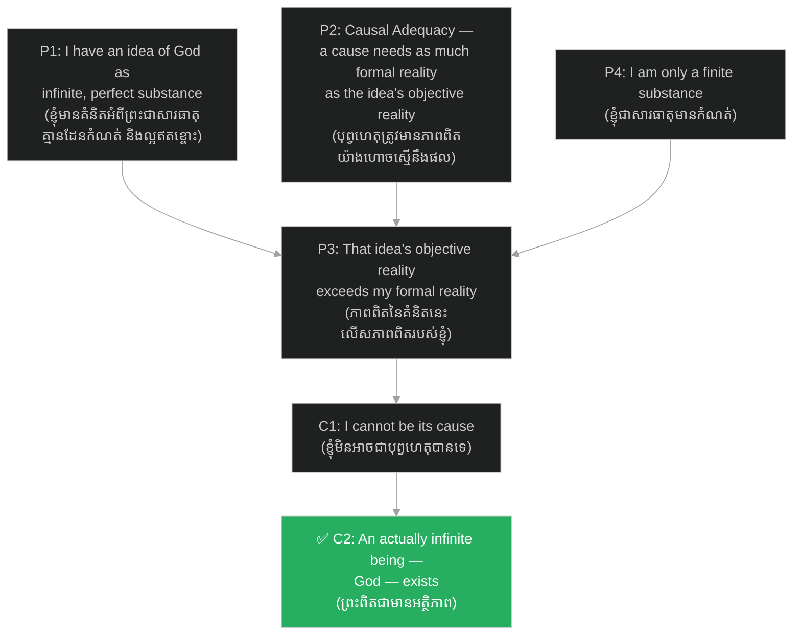

# អំណះអំណាងស្លាកសញ្ញា៖ The Trademark Argument

**Author:** ichamrong  
**Date:** 2026-06-11  
**Tags:** #philosophy #descartes #meditation-3 #trademark-argument #god #rationalism  
**Category:** Philosophy  
**Read Time:** ~6 min

---

## 📌 មាតិកា (Table of Contents)
- [សង្ខេបជំពូក (Chapter Summary)](#0)
- [១. អំណះអំណាងមួយជំហានម្ដងៗ (The Argument Step by Step)](#1)
- [២. ហេតុអ្វីខ្ញុំមិនអាចជាបុព្វហេតុបាន? (Why I Cannot Be the Cause)](#2)
- [៣. ស្លាកសញ្ញារបស់ជាងសិប្បករ (The Craftsman's Mark)](#3)
- [៤. អ្វីដែលអំណះអំណាងនេះផ្ដល់ឱ្យដេកាត (What the Argument Buys Descartes)](#4)
- [សេចក្តីសន្និដ្ឋាន (Conclusion)](#5)
- [ឯកសារយោង (References)](#6)

---

<a id="0"></a>
## សង្ខេបជំពូក (Chapter Summary)

នៅ​​ក្នុង​​ជំពូក​​មុន​​ យើង​​បាន​​រៀន​​ពី​​ឧបករណ៍​​ទាំង​​បី​​ដែល​​ដេកាត​​បាន​​រៀបចំ​​ទុក​​ គឺ​​ប្រភេទ​​គំនិត​​ទាំង​​បី​​ តថភាពផ្លូវការ​​ និង​​តថភាពវត្ថុវិស័យ​​ ព្រមទាំង​​គោលការណ៍​​ភាពគ្រប់គ្រាន់​​នៃ​​បុព្វហេតុ។​​ ឥឡូវ​​នេះ​​ ដេកាត​​យក​​ឧបករណ៍​​ទាំង​​នោះ​​មក​​ប្រើ​​ជា​​លើក​​ដំបូង​​ ដើម្បី​​សាងសង់​​ **«អំណះអំណាងស្លាកសញ្ញា (Trademark Argument)»**​​ — អំណះអំណាង​​ដ៏​​ល្បីល្បាញ​​នៅ​​ក្នុង​​ការ​​សញ្ជឹងគិត​​ទី​​ ៣​​ ដែល​​អះអាង​​ថា​​ គ្រាន់តែ​​ខ្ញុំ​​មាន​​គំនិត​​អំពី​​ព្រះ​​ដ៏​​គ្មាន​​ដែន​​កំណត់​​នៅ​​ក្នុង​​ចិត្ត​​ ក៏​​គ្រប់គ្រាន់​​នឹង​​បញ្ជាក់​​ថា​​ព្រះ​​ពិត​​ជា​​មាន​​អត្ថិភាព​​មែន​​ ព្រោះ​​មាន​​តែ​​សភាវៈ​​គ្មាន​​ដែន​​កំណត់​​ពិតប្រាកដ​​ប៉ុណ្ណោះ​​ ដែល​​អាច​​ជា​​ប្រភព​​នៃ​​គំនិត​​បែប​​នេះ​​បាន។

> *In the previous chapter we assembled Descartes' three tools: the three kinds of ideas, formal versus objective reality, and the causal adequacy principle. Now Descartes puts them to work for the first time, building the famous **Trademark Argument** of Meditation 3: the mere fact that I carry an idea of an infinite God in my mind is enough to prove that God actually exists — because only an actually infinite being could be the source of such an idea.*

---

<a id="1"></a>
## ១. អំណះអំណាងមួយជំហានម្ដងៗ (The Argument Step by Step)

ដេកាត​​ចាប់ផ្ដើម​​ដោយ​​ពិនិត្យ​​មើល​​គំនិត​​មួយ​​ដ៏​​ពិសេស​​នៅ​​ក្នុង​​ចិត្ត​​របស់​​គាត់​​ គឺ​​គំនិត​​អំពី​​ព្រះ​​ ដែល​​គាត់​​កំណត់​​និយមន័យ​​ថា​​ជា​​ **«សារធាតុអនន្ត (Infinite Substance)»**​​ ដែល​​អស់កល្ប​​ មិន​​ប្រែប្រួល​​ ឯករាជ្យ​​ ដឹង​​គ្រប់​​ មាន​​អំណាច​​គ្រប់​​ និង​​ជា​​អ្នក​​បង្កើត​​អ្វីៗ​​ទាំងអស់។​​ បើ​​យោង​​តាម​​មាត្រដ្ឋាន​​នៃ​​ភាពពិត​​ដែល​​យើង​​បាន​​ឃើញ​​ក្នុង​​ជំពូក​​មុន​​ គំនិត​​នេះ​​មាន​​ **«តថភាពវត្ថុវិស័យ (Objective Reality)»**​​ ខ្ពស់​​បំផុត​​ ព្រោះ​​វា​​តំណាង​​ឱ្យ​​សារធាតុ​​គ្មាន​​ដែន​​កំណត់​​ — មិន​​មែន​​គ្រាន់តែ​​សារធាតុ​​មាន​​កំណត់​​ ឬ​​លក្ខណៈ​​សាមញ្ញ​​ណាមួយ​​ឡើយ។

> *Descartes begins by examining one extraordinary idea in his mind: the idea of God, which he defines as an **infinite substance** — eternal, immutable, independent, omniscient, omnipotent, and the creator of all things. On the scale of reality introduced in the previous chapter, this idea carries the highest possible degree of **objective reality**, because what it represents is an infinite substance — not merely a finite substance or a mode.*

ជំហាន​​បន្ទាប់​​គឺ​​ការ​​ប្រៀបធៀប៖​​ ខ្ញុំ​​ខ្លួនឯង​​គ្រាន់តែ​​ជា​​ **«សារធាតុមានកំណត់ (Finite Substance)»**​​ ប៉ុណ្ណោះ​​ — ខ្ញុំ​​សង្ស័យ​​ ខ្ញុំ​​ប្រាថ្នា​​ ខ្ញុំ​​ខ្វះខាត​​ — ដូច្នេះ​​តថភាពផ្លូវការ​​របស់​​ខ្ញុំ​​ទាប​​ជាង​​តថភាពវត្ថុវិស័យ​​នៃ​​គំនិត​​អំពី​​ព្រះ។​​ ប៉ុន្តែ​​យោង​​តាម​​ **«គោលការណ៍ភាពគ្រប់គ្រាន់នៃបុព្វហេតុ (Causal Adequacy Principle)»**​​ បុព្វហេតុ​​នៃ​​គំនិត​​ណាមួយ​​ ត្រូវ​​តែ​​មាន​​តថភាពផ្លូវការ​​យ៉ាង​​ហោច​​ណាស់​​ស្មើ​​នឹង​​តថភាពវត្ថុវិស័យ​​នៃ​​គំនិត​​នោះ។​​ ហេតុ​​នេះ​​ មាន​​តែ​​សភាវៈ​​មួយ​​ដែល​​គ្មាន​​ដែន​​កំណត់​​ពិតប្រាកដ​​ប៉ុណ្ណោះ​​ ទើប​​អាច​​ជា​​បុព្វហេតុ​​នៃ​​គំនិត​​នេះ​​បាន​​ — ដូច្នេះ​​ ព្រះ​​ពិត​​ជា​​មាន​​អត្ថិភាព​​មែន។

> *The next step is a comparison: I myself am only a **finite substance** — I doubt, I desire, I lack — so my formal reality falls short of the objective reality of my idea of God. Yet by the **causal adequacy principle**, the cause of any idea must possess at least as much formal reality as the idea contains objective reality. Therefore only an actually infinite being could have caused this idea — and so God exists.*



---

<a id="2"></a>
## ២. ហេតុអ្វីខ្ញុំមិនអាចជាបុព្វហេតុបាន? (Why I Cannot Be the Cause)

អ្នក​​អាន​​ប្រាកដ​​ជា​​ឆ្ងល់​​ថា៖​​ តើ​​ខ្ញុំ​​មិន​​អាច​​បង្កើត​​គំនិត​​អំពី​​ភាព​​គ្មាន​​ដែន​​កំណត់​​ ដោយ​​គ្រាន់តែ​​យក​​ភាព​​មាន​​ដែន​​កំណត់​​របស់​​ខ្លួន​​មក​​បដិសេធ​​ចោល​​ទេ​​ឬ?​​ ដូច​​ជា​​យើង​​យល់​​ពី​​ភាព​​ងងឹត​​ ដោយ​​បដិសេធ​​ពន្លឺ​​ដែរ?​​ ដេកាត​​ឆ្លើយ​​បដិសេធ​​យ៉ាង​​ម៉ឺងម៉ាត់៖​​ ការ​​យល់​​ឃើញ​​អំពី​​ **«ភាពគ្មានដែនកំណត់ (The Infinite)»**​​ គឺ​​មាន​​មុន​​ការ​​យល់​​ឃើញ​​អំពី​​ភាព​​មាន​​ដែន​​កំណត់​​ទៅ​​ទៀត។​​ តើ​​ខ្ញុំ​​អាច​​ដឹង​​ថា​​ខ្លួន​​សង្ស័យ​​ និង​​ខ្វះខាត​​ដោយ​​របៀប​​ណា​​ បើ​​ខ្ញុំ​​គ្មាន​​គំនិត​​អំពី​​សភាវៈ​​ល្អ​​ឥតខ្ចោះ​​ជាង​​ខ្លួន​​ មក​​ធ្វើ​​ជា​​ខ្នាត​​ប្រៀបធៀប​​ជា​​មុន?​​ ដូច្នេះ​​ គំនិត​​អំពី​​ភាព​​គ្មាន​​ដែន​​កំណត់​​មិន​​មែន​​ជា​​ការ​​បដិសេធ​​ (Negation)​​ ទេ​​ ប៉ុន្តែ​​ជា​​គំនិត​​វិជ្ជមាន​​បំផុត​​ និង​​ច្បាស់លាស់​​បំផុត​​ដែល​​ខ្ញុំ​​មាន។

> *The reader may object: can't I manufacture the idea of the infinite simply by negating my own finitude, the way we grasp darkness by negating light? Descartes firmly says no: my perception of the **infinite** is prior to my perception of the finite. How could I even know that I doubt and that I lack, unless I already possessed an idea of a more perfect being as a standard of comparison? The idea of the infinite is therefore not a negation but the most positive — and most clear and distinct — idea I have.*

ដេកាត​​បិទ​​ផ្លូវ​​គេច​​មួយ​​ទៀត​​ផង​​ដែរ៖​​ ប្រហែល​​ជា​​ខ្ញុំ​​មាន​​សក្ដានុពល​​រីក​​ចម្រើន​​បន្តិច​​ម្ដងៗ​​ រហូត​​ទៅ​​ដល់​​ភាព​​ល្អ​​ឥតខ្ចោះ​​ក៏​​ថា​​បាន?​​ គាត់​​ឆ្លើយ​​ថា​​ ភាព​​គ្មាន​​ដែន​​កំណត់​​បែប​​សក្ដានុពល​​ (Potential)​​ មិន​​អាច​​ជំនួស​​ភាព​​គ្មាន​​ដែន​​កំណត់​​ពិតប្រាកដ​​ (Actual)​​ បាន​​ឡើយ​​ — ចំណេះដឹង​​ដែល​​កើន​​ឡើង​​បន្តិច​​ម្ដងៗ​​ មិន​​ដែល​​ទៅ​​ដល់​​ភាព​​គ្មាន​​ដែន​​កំណត់​​ពិត​​ទេ​​ ហើយ​​បុព្វហេតុ​​នៃ​​គំនិត​​នេះ​​ត្រូវ​​តែ​​មាន​​ភាពពិត​​នោះ​​ជា​​ស្រេច​​រួច​​ទៅ​​ហើយ។

> *Descartes also closes another escape route: perhaps I am potentially perfect, gradually growing toward perfection? He replies that *potential* infinity cannot stand in for *actual* infinity — knowledge that increases step by step never actually reaches the infinite, and the cause of this idea must already possess that reality in full.*

---

<a id="3"></a>
## ៣. ស្លាកសញ្ញារបស់ជាងសិប្បករ (The Craftsman's Mark)

ប្រសិន​​បើ​​ព្រះ​​ជា​​អ្នក​​បង្កើត​​ខ្ញុំ​​ ហើយ​​ដាក់​​គំនិត​​អំពី​​អង្គ​​ទ្រង់​​នៅ​​ក្នុង​​ចិត្ត​​ខ្ញុំ​​តាំង​​ពី​​កំណើត​​ នោះ​​គំនិត​​នេះ​​ប្រៀប​​បាន​​នឹង​​ **«ស្លាកសញ្ញារបស់ជាងសិប្បករ (The Craftsman's Mark)»**​​ ដែល​​ជាង​​បាន​​ដក់​​លើ​​ស្នាដៃ​​របស់​​ខ្លួន​​ — ដេកាត​​សរសេរ​​ថា​​ វា​​ដូច​​ជា​​ «ស្លាកសញ្ញា​​របស់​​ជាង​​ដែល​​បាន​​ផ្ដិត​​លើ​​ស្នាដៃ​​របស់​​គាត់»​​ (the mark of the craftsman impressed on his work)។​​ នេះ​​ហើយ​​ជា​​ប្រភព​​នៃ​​ឈ្មោះ​​ «អំណះអំណាងស្លាកសញ្ញា»៖​​ គំនិត​​អំពី​​ព្រះ​​គឺ​​ជា​​**«គំនិតពីកំណើត (Innate Idea)»**​​ ដែល​​ព្រះ​​បាន​​បន្សល់​​ទុក​​ក្នុង​​ខ្លួន​​យើង​​ ដូច​​ម៉ាក​​ពាណិជ្ជកម្ម​​នៅ​​លើ​​ផលិតផល​​ បញ្ជាក់​​ពី​​អ្នក​​ផលិត​​របស់​​វា។

> *If God created me and implanted the idea of Himself in my mind from birth, then this idea is like the **craftsman's mark** that an artisan stamps on his creation — Descartes writes that it is like "the mark of the craftsman impressed on his work." This is where the argument gets its name: the idea of God is an innate idea God left in us, like a trademark on a product identifying its maker.*

ចំណុច​​ដ៏​​ស៊ីជម្រៅ​​មួយ​​ទៀត​​នោះ​​ ដេកាត​​បន្ថែម​​ថា​​ ស្លាកសញ្ញា​​នេះ​​មិន​​ចាំបាច់​​ជា​​អ្វី​​ដែល​​ដាច់​​ដោយឡែក​​ពី​​ស្នាដៃ​​នោះ​​ទេ​​ — ខ្ញុំ​​ខ្លួនឯង​​ត្រូវ​​បាន​​បង្កើត​​ឡើង​​ «តាម​​រូបភាព​​និង​​លក្ខណៈ​​នៃ​​ព្រះ»។​​ នៅ​​ពេល​​ខ្ញុំ​​ងាក​​មក​​ពិនិត្យ​​ខ្លួនឯង​​ ខ្ញុំ​​យល់​​ឃើញ​​ក្នុង​​ពេល​​តែ​​មួយ​​ ទាំង​​ភាព​​ខ្វះខាត​​របស់​​ខ្លួន​​ និង​​ខ្នាត​​នៃ​​ភាព​​ល្អ​​ឥតខ្ចោះ​​ដែល​​ខ្ញុំ​​ប្រៀបធៀប​​ជាមួយ។​​ ការ​​ស្គាល់​​ខ្លួនឯង​​ និង​​ការ​​ស្គាល់​​ព្រះ​​ កើត​​ឡើង​​ដោយ​​សមត្ថភាព​​តែ​​មួយ​​ដូច​​គ្នា។

> *A deeper point follows: Descartes adds that this mark need not be something separate from the work itself — I myself was made "in the image and likeness of God." When I turn inward and examine myself, I perceive at the same moment both my own deficiency and the standard of perfection against which I measure it. Knowing myself and knowing God arise through one and the same faculty.*

---

<a id="4"></a>
## ៤. អ្វីដែលអំណះអំណាងនេះផ្ដល់ឱ្យដេកាត (What the Argument Buys Descartes)

មុន​​ការ​​សញ្ជឹងគិត​​ទី​​ ៣​​ ដេកាត​​នៅ​​ជាប់​​ក្នុង​​ស្ថានភាព​​ដ៏​​ឯកោ​​មួយ​​ ដែល​​ទស្សនវិទូ​​ហៅ​​ថា​​ **«អត្តាឯកនិយម (Solipsism)»**​​ — គាត់​​ប្រាកដ​​តែ​​លើ​​អត្ថិភាព​​នៃ​​ចិត្ត​​របស់​​ខ្លួន​​មួយ​​ប៉ុណ្ណោះ​​ («ខ្ញុំ​​គិត​​ ដូច្នេះ​​ខ្ញុំ​​មាន»)។​​ អំណះអំណាងស្លាកសញ្ញា​​គឺ​​ជា​​ស្ពាន​​ដំបូង​​បង្អស់​​ឆ្លង​​ចេញ​​ពី​​ភាព​​ឯកោ​​នោះ៖​​ ជា​​លើក​​ដំបូង​​ មាន​​អ្វី​​មួយ​​ក្រៅ​​ពី​​ខ្លួន​​គាត់​​ ត្រូវ​​បាន​​បញ្ជាក់​​ថា​​មាន​​អត្ថិភាព​​ពិត​​ — គឺ​​ព្រះ។

> *Before Meditation 3, Descartes is trapped in the lonely position philosophers call **solipsism** — certain only of his own mind's existence ("I think, therefore I am"). The Trademark Argument is the first bridge out of that isolation: for the first time, something beyond himself — God — is proven to exist.*

ហើយ​​មិន​​ត្រឹម​​តែ​​ប៉ុណ្ណោះ​​ទេ៖​​ ដោយ​​ព្រះ​​ល្អ​​ឥតខ្ចោះ​​គ្រប់​​ប្រការ​​ ហើយ​​ការ​​បោកប្រាស់​​ជា​​សញ្ញា​​នៃ​​ភាព​​ខ្វះខាត​​ និង​​ភាព​​ទន់ខ្សោយ​​ នោះ​​ **«ព្រះមិនមែនជាអ្នកបោកប្រាស់ (God Is No Deceiver)»**​​ ឡើយ។​​ សេចក្ដី​​សន្និដ្ឋាន​​នេះ​​បំបាត់​​ការ​​សន្មត​​អំពី​​បិសាច​​បោកប្រាស់​​ពី​​ការ​​សញ្ជឹងគិត​​ទី​​ ១​​ ហើយ​​ក្លាយ​​ជា​​គ្រឹះ​​សម្រាប់​​ទុកចិត្ត​​លើ​​ **«ការយល់ឃើញច្បាស់លាស់ និងជាក់លាក់ (Clear and Distinct Perceptions)»**​​ — បើ​​អ្វី​​ដែល​​ខ្ញុំ​​យល់​​ឃើញ​​ច្បាស់​​បំផុត​​នៅ​​តែ​​អាច​​ខុស​​ នោះ​​ព្រះ​​នឹង​​ក្លាយ​​ជា​​អ្នក​​បោកប្រាស់​​ ដែល​​មិន​​អាច​​ទៅ​​រួច។​​ គ្រឹះ​​នេះ​​ហើយ​​ ដែល​​នឹង​​ទ្រទ្រង់​​ការ​​សញ្ជឹងគិត​​ទី​​ ៤​​ ដល់​​ទី​​ ៦​​ ទាំងមូល​​ រួម​​ទាំង​​ការ​​សង​​ពិភពលោក​​ខាង​​ក្រៅ​​មក​​វិញ​​ផង​​ដែរ។​​ (តើ​​គ្រឹះ​​នេះ​​រឹងមាំ​​មែន​​ឬ​​អត់​​ — ជា​​សំណួរ​​សម្រាប់​​ជំពូក​​បន្ទាប់​​ ស្ដី​​ពី​​រង្វង់​​ដេកាត។)

> *And more: since God is supremely perfect, and deception is a sign of lack and weakness, **God is no deceiver**. This conclusion dissolves the evil demon hypothesis of Meditation 1 and becomes the foundation for trusting **clear and distinct perceptions** — if even my clearest perceptions could be false, God would be a deceiver, which is impossible. This foundation supports the whole of Meditations 4 through 6, including the recovery of the external world. (Whether the foundation truly holds — that is the question for the next chapter, on the Cartesian Circle.)*

```mermaid
%%{init: { "theme": "dark", "themeVariables": { "background": "#1e1e1e", "primaryTextColor": "#ffffff", "lineColor": "#a0a0a0", "actorBkg": "#2c3e50", "actorBorder": "#34495e", "actorTextColor": "#ffffff" }, "themeCSS": "svg { background-color: #1e1e1e !important; padding: 1rem !important; border-radius: 8px !important; } .edgeLabel rect { fill: #1e1e1e !important; } text, tspan { fill: #ffffff !important; }" } }%%
graph LR
    A["🧍 Cogito only —<br/>Solipsism<br/>(មានតែខ្លួនឯង)"] -->|Trademark Argument<br/>(អំណះអំណាងស្លាកសញ្ញា)| B["✝️ God exists<br/>(ព្រះមានអត្ថិភាព)"]
    B --> C["🤝 God is no deceiver<br/>(ព្រះមិនបោកប្រាស់)"]
    C --> D["💡 Clear & distinct<br/>perceptions are true<br/>(ការយល់ឃើញច្បាស់លាស់<br/>គឺពិត)"]
    D --> E["🌍 Path to regaining<br/>the external world<br/>(ផ្លូវទៅរកពិភពលោកខាងក្រៅ)"]

    style B fill:#27ae60,color:#fff
```

---

<a id="5"></a>
## សេចក្តីសន្និដ្ឋាន (Conclusion)

អំណះអំណាងស្លាកសញ្ញា​​គឺ​​ជា​​ចំណុច​​របត់​​នៃ​​សៀវភៅ​​ទាំងមូល៖​​ វា​​ប្រើ​​តែ​​ធនធាន​​ដែល​​អ្នក​​សង្ស័យ​​មិន​​អាច​​បដិសេធ​​បាន​​ — គំនិត​​នៅ​​ក្នុង​​ចិត្ត​​ខ្លួនឯង​​ និង​​គោលការណ៍​​បុព្វហេតុ​​ — ដើម្បី​​ឆ្លង​​ពី​​ «ខ្ញុំ​​មាន»​​ ទៅ​​ «ព្រះ​​មាន»។​​ ខ្លឹមសារ​​សំខាន់​​គឺ​​ថា​​ គំនិត​​អំពី​​ភាព​​គ្មាន​​ដែន​​កំណត់​​មិន​​អាច​​កើត​​ចេញ​​ពី​​សភាវៈ​​មាន​​ដែន​​កំណត់​​បាន​​ឡើយ​​ — វា​​ជា​​ស្នាម​​ផ្ដិត​​ដែល​​អ្នក​​បង្កើត​​បាន​​បន្សល់​​ទុក​​លើ​​ស្នាដៃ​​របស់​​ខ្លួន។​​ ប៉ុន្តែ​​ភាព​​រឹងមាំ​​នៃ​​អំណះអំណាង​​នេះ​​ អាស្រ័យ​​ទាំងស្រុង​​លើ​​គោលការណ៍​​ភាពគ្រប់គ្រាន់​​នៃ​​បុព្វហេតុ​​ — ហើយ​​ការ​​រិះគន់​​ដ៏​​សំខាន់ៗ​​ រួម​​ទាំង​​បញ្ហា​​រង្វង់​​ដេកាត​​ នឹង​​ត្រូវ​​លើក​​មក​​ពិភាក្សា​​នៅ​​ជំពូក​​បន្ទាប់។

> *The Trademark Argument is the turning point of the whole book: using only resources the skeptic cannot deny — an idea within his own mind and a causal principle — it crosses from "I exist" to "God exists." Its core insight is that the idea of the infinite could not arise from a finite being; it is the imprint the maker left on his work. But the argument's strength rests entirely on the causal adequacy principle — and the major critiques, including the Cartesian Circle, await in the next chapter.*

---

<a id="6"></a>
## ឯកសារយោង (References)

* **Descartes, R.** (1641). *Meditations on First Philosophy* (Meditation III). Trans. J. Cottingham, in *The Philosophical Writings of Descartes*, Vol. II (Cambridge University Press, 1984).
* [ជំពូកមុន៖ គំនិត និងកម្រិតនៃតថភាព (prev: Ideas and Degrees of Reality)](04-meditation-3-ideas-and-reality.md)
* [ជំពូកបន្ទាប់៖ រង្វង់ដេកាត និងការរិះគន់ (next: The Cartesian Circle & Critiques)](06-meditation-3-circle-and-critiques.md)
* [ទិដ្ឋភាពទូទៅនៃការសញ្ជឹងគិតទី ៣ និងទី ៤ (Meditations 3 & 4 overview)](02-meditations-3-and-4.md)
