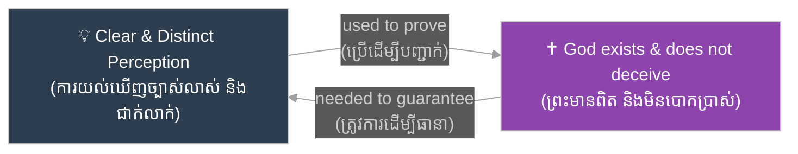
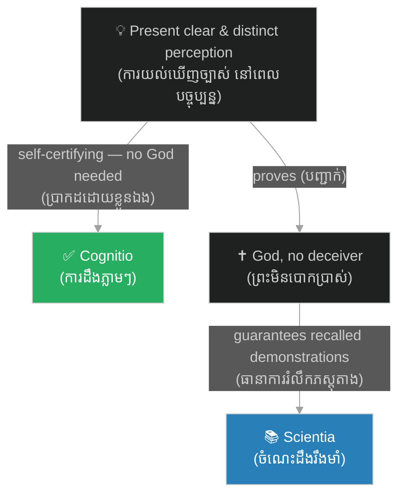

# រង្វង់ដេកាត និងការរិះគន់៖ The Cartesian Circle & Critiques

**Author:** ichamrong  
**Date:** 2026-06-11  
**Tags:** #philosophy #descartes #meditation-3 #cartesian-circle #critiques #epistemology  
**Category:** Philosophy  
**Read Time:** ~7 min

---

## 📌 មាតិកា (Table of Contents)
- [សង្ខេបជំពូក (Chapter Summary)](#0)
- [១. រង្វង់ដេកាត — ការជំទាស់របស់ Arnauld (The Cartesian Circle: Arnauld's Objection)](#1)
- [២. ចម្លើយរបស់ដេកាត — ការការពារដោយការចងចាំ (Descartes' Reply: The Memory Defense)](#2)
- [៣. ការរិះគន់ពីសំណាក់ពិសោធន៍និយម (The Empiricist Critiques)](#3)
- [៤. កេរ្តិ៍ដំណែលក្នុងញាណវិទ្យា (The Legacy in Epistemology)](#4)
- [សេចក្តីសន្និដ្ឋាន (Conclusion)](#5)
- [ឯកសារយោង (References)](#6)

---

## សង្ខេបជំពូក (Chapter Summary)

នៅ​​ក្នុង​​ផ្នែក​​ទី​​ ១​​ និង​​ទី​​ ២​​ នៃ​​ការ​​សិក្សា​​ស៊ីជម្រៅ​​នេះ​​ យើង​​បាន​​ឃើញ​​ពី​​របៀប​​ដែល​​ដេកាត​​បែងចែក​​ប្រភេទ​​គំនិត​​ កសាង​​គោលការណ៍​​ភាពគ្រប់គ្រាន់នៃបុព្វហេតុ​​ ហើយ​​ប្រើ​​វា​​ដើម្បី​​បញ្ជាក់​​អត្ថិភាព​​ព្រះ​​តាម​​រយៈ​​អំណះអំណាង​​ស្លាកសញ្ញា (Trademark)។​​ ជំពូក​​បញ្ចប់​​នេះ​​សួរ​​សំណួរ​​ដ៏​​ពិបាក​​បំផុត៖​​ តើ​​អំណះអំណាង​​ទាំង​​មូល​​នេះ​​ឈរ​​លើ​​ **«ការវែកញែកជារង្វង់ (Circular Reasoning)»**​​ ឬ​​ទេ?​​ យើង​​នឹង​​ពិនិត្យ​​មើល​​ «រង្វង់ដេកាត»​​ ដែល​​លើក​​ឡើង​​ដោយ​​ Antoine Arnauld​​ ចម្លើយ​​របស់​​ដេកាត​​ ការ​​រិះគន់​​ពី​​ទស្សនវិទូ​​ពិសោធន៍និយម​​ (Hobbes,​​ Gassendi,​​ Locke,​​ Hume)​​ និង​​មូលហេតុ​​ដែល​​បញ្ហា​​នេះ​​នៅ​​តែ​​រស់រវើក​​ក្នុង​​ញាណវិទ្យា​​សម័យ​​ទំនើប។

> *In parts 1 and 2 of this deep dive we saw how Descartes classified ideas, built his causal principle, and used it to prove God's existence via the trademark argument. This concluding chapter asks the hardest question: does the whole project rest on **circular reasoning**? We examine the "Cartesian Circle" raised by Antoine Arnauld, Descartes' reply, the empiricist critiques (Hobbes, Gassendi, Locke, Hume), and why the problem remains alive in modern epistemology.*

---

## ១. រង្វង់ដេកាត — ការជំទាស់របស់ Arnauld (The Cartesian Circle: Arnauld's Objection)

មុន​​នឹង​​បោះពុម្ព​​សៀវភៅ​​ *Meditations*​​ ដេកាត​​បាន​​ផ្ញើ​​សាត្រាស្លឹករឹត​​ទៅ​​ឱ្យ​​អ្នក​​ប្រាជ្ញ​​សម័យ​​នោះ​​អាន​​ និង​​ជំទាស់​​ជា​​មុន​​ ហើយ​​បាន​​បោះពុម្ព​​ការ​​ជំទាស់​​ទាំង​​នោះ​​រួម​​ជាមួយ​​ចម្លើយ​​របស់​​គាត់​​ក្នុង​​ផ្នែក​​ **«ការជំទាស់ និងចម្លើយតប (Objections and Replies)»**។​​ ក្នុង​​ការ​​ជំទាស់​​ឈុត​​ទី​​ ៤​​ ទស្សនវិទូ​​ និង​​ទេវវិទូ​​បារាំង​​ Antoine Arnauld​​ បាន​​ចង្អុល​​បង្ហាញ​​បញ្ហា​​មួយ​​ដែល​​ក្លាយ​​ជា​​ការ​​រិះគន់​​ដ៏​​ល្បី​​បំផុត​​លើ​​ស្នាដៃ​​នេះ៖​​ **«រង្វង់ដេកាត (Cartesian Circle)»**។

> *Before publishing the *Meditations*, Descartes circulated the manuscript to leading scholars and printed their objections together with his replies as the **Objections and Replies**. In the Fourth Set of Objections, the French philosopher-theologian Antoine Arnauld identified what became the single most famous criticism of the work: the **Cartesian Circle**.*

ការ​​ជំទាស់​​របស់​​ Arnauld​​ មាន​​ខ្លឹមសារ​​សាមញ្ញ​​ ប៉ុន្តែ​​មុតស្រួច៖​​ ដេកាត​​និយាយ​​ថា​​ យើង​​អាច​​ទុកចិត្ត​​លើ​​ **«ការយល់ឃើញច្បាស់លាស់ និងជាក់លាក់ (Clear and Distinct Perception)»**​​ បាន​​ លុះត្រា​​តែ​​យើង​​ដឹង​​ថា​​ព្រះ​​មាន​​ពិត​​ ហើយ​​មិន​​មែន​​ជា​​អ្នក​​បោកប្រាស់។​​ ប៉ុន្តែ​​ ភស្តុតាង​​ដែល​​បញ្ជាក់​​ថា​​ព្រះ​​មាន​​ពិត​​ (អំណះអំណាង​​ស្លាកសញ្ញា)​​ ខ្លួន​​វា​​ផ្ទាល់​​ក៏​​ពឹង​​លើ​​ការ​​យល់​​ឃើញ​​ច្បាស់លាស់​​ និង​​ជាក់លាក់​​ដែរ។​​ ដូច្នេះ​​ យើង​​ប្រើ​​ A​​ ដើម្បី​​បញ្ជាក់​​ B​​ ហើយ​​ប្រើ​​ B​​ ដើម្បី​​ធានា​​ A​​ វិញ​​ — ជា​​រង្វង់​​ដែល​​គ្មាន​​ច្រក​​ចេញ។

> *Arnauld's point is simple but sharp: Descartes says we may trust **clear and distinct perception** only once we know that a non-deceiving God exists; yet the proof that God exists (the trademark argument) itself relies on clear and distinct perception. We use A to prove B, then use B to guarantee A — a circle with no exit.*

---

## ២. ចម្លើយរបស់ដេកាត — ការការពារដោយការចងចាំ (Descartes' Reply: The Memory Defense)

ដេកាត​​មិន​​បាន​​ទទួល​​ស្គាល់​​ថា​​ខ្លួន​​ជាប់​​ក្នុង​​រង្វង់​​ឡើយ។​​ ក្នុង​​ចម្លើយ​​តប​​នឹង​​ការ​​ជំទាស់​​ឈុត​​ទី​​ ២​​ និង​​ទី​​ ៤​​ គាត់​​បាន​​បែងចែក​​ស្ថានភាព​​ពីរ​​ផ្សេង​​គ្នា៖​​ (១)​​ នៅ​​ពេល​​ដែល​​យើង​​កំពុង​​ផ្ចង់​​ស្មារតី​​យល់​​ឃើញ​​អ្វី​​មួយ​​យ៉ាង​​ច្បាស់លាស់​​ និង​​ជាក់លាក់​​ **«នៅពេលបច្ចុប្បន្ន»**​​ យើង​​មិន​​អាច​​សង្ស័យ​​វា​​បាន​​ទេ​​ ហើយ​​វា​​មិន​​ត្រូវការ​​ការ​​ធានា​​ពី​​ព្រះ​​ឡើយ​​ (ដូចជា​​ Cogito​​ ឬ​​ ២ + ៣ = ៥​​ ខណៈ​​កំពុង​​គិត)។​​ (២)​​ ប៉ុន្តែ​​ នៅ​​ពេល​​ដែល​​យើង​​ **«រំលឹកឡើងវិញ»**​​ នូវ​​សេចក្តី​​សន្និដ្ឋាន​​ដែល​​បាន​​បញ្ជាក់​​ពី​​មុន​​ ដោយ​​មិន​​នៅ​​ផ្ចង់​​ស្មារតី​​លើ​​ភស្តុតាង​​ទៀត​​ទេ​​ នោះ​​ហើយ​​ជា​​កន្លែង​​ដែល​​ព្រះ​​ចាំបាច់​​ — ទ្រង់​​ធានា​​ថា​​អ្វី​​ដែល​​យើង​​បាន​​យល់​​ឃើញ​​ច្បាស់​​កាល​​ពី​​មុន​​នៅ​​តែ​​ពិត។​​ នេះ​​ហើយ​​ដែល​​អ្នក​​សិក្សា​​ហៅ​​ថា​​ **«ការការពារដោយការចងចាំ (Memory Defense)»**។

> *Descartes never conceded the circle. In his Replies to the Second and Fourth Objections, he distinguished two situations: (1) while we are *presently attending* to a clear and distinct perception, doubt is impossible and no divine guarantee is needed (the Cogito, or 2 + 3 = 5 while we think it); (2) but when we merely *recall* a conclusion demonstrated earlier, without re-attending to its proof, that is where God is required — He guarantees that what we once perceived clearly remains true. Scholars call this the **memory defense**.*

ការ​​អាន​​បែប​​ទំនើប​​បាន​​ធ្វើ​​ឱ្យ​​ចម្លើយ​​នេះ​​កាន់​​តែ​​មាន​​ទម្ងន់។​​ James Van Cleve​​ (១៩៧៩)​​ បាន​​បែងចែក​​រវាង​​ការ​​ប្រាកដ​​លើ​​ **សំណើជាក់លាក់នីមួយៗ**​​ (ដែល​​យើង​​អាច​​ទទួល​​បាន​​ដោយ​​ផ្ទាល់​​ ដោយ​​មិន​​ចាំបាច់​​ដឹង​​ច្បាប់​​ទូទៅ​​ជា​​មុន)​​ និង​​ការ​​ប្រាកដ​​លើ​​ **ច្បាប់ទូទៅ**​​ ដែល​​ថា​​ «អ្វី​​ៗ​​ដែល​​ខ្ញុំ​​យល់​​ឃើញ​​ច្បាស់លាស់​​ សុទ្ធ​​តែ​​ពិត»​​ (ដែល​​ត្រូវការ​​ព្រះ​​ជា​​អ្នក​​ធានា)។​​ បើ​​អាន​​បែប​​នេះ​​ រង្វង់​​ត្រូវ​​បាន​​បំបែក៖​​ ភស្តុតាង​​អំពី​​ព្រះ​​ប្រើ​​តែ​​ការ​​យល់​​ឃើញ​​ជាក់លាក់​​ ឯ​​ព្រះ​​ធានា​​តែ​​ច្បាប់​​ទូទៅ​​ប៉ុណ្ណោះ។​​ ដេកាត​​ខ្លួន​​ឯង​​ក៏​​បែងចែក​​រវាង​​ **«ការដឹងភ្លាមៗ (Cognitio)»**​​ និង​​ **«ចំណេះដឹងរឹងមាំ (Scientia)»**​​ ដែរ​​ — ព្រះ​​មិន​​មែន​​ជា​​លក្ខខណ្ឌ​​នៃ​​ការ​​ដឹង​​ភ្លាមៗ​​ទេ​​ ប៉ុន្តែ​​ជា​​លក្ខខណ្ឌ​​នៃ​​ប្រព័ន្ធ​​ចំណេះដឹង​​ដែល​​ឋិតថេរ​​យូរអង្វែង។

> *Modern readings strengthen this reply. James Van Cleve (1979) distinguished certainty about *particular propositions* (available directly, without first knowing any general rule) from certainty about the *general rule* "whatever I clearly and distinctly perceive is true" (which needs the divine guarantee). On this reading the circle breaks: the proof of God uses only particular perceptions, while God underwrites only the general rule. Descartes himself drew a parallel line between *cognitio* (momentary awareness) and *scientia* (stable, lasting knowledge) — God is not a condition of the former, only of the latter.*

ទោះ​​ជា​​យ៉ាង​​ណា​​ ការ​​រិះគន់​​នៅ​​មិន​​ទាន់​​ស្ងប់​​ឡើយ៖​​ បើ​​មារ​​កំណាច​​អាច​​បោក​​យើង​​លើ​​អ្វី​​គ្រប់​​យ៉ាង​​ ហេតុអ្វី​​ការ​​យល់​​ឃើញ​​ «បច្ចុប្បន្ន»​​ ត្រូវ​​បាន​​លើកលែង?​​ ហើយ​​បើ​​វា​​ត្រូវ​​បាន​​លើកលែង​​មែន​​ មន្ទិល​​សង្ស័យ​​ក្នុង​​ការសញ្ជឹងគិត​​ទី​​ ១​​ ហាក់​​មិន​​សូវ​​ជ្រាលជ្រៅ​​ដូច​​ដែល​​ដេកាត​​អះអាង​​ទេ។​​ នេះ​​ជា​​ហេតុ​​ដែល​​អ្នក​​ប្រាជ្ញ​​មួយ​​ចំនួន​​ចាត់​​ទុក​​ចម្លើយ​​នេះ​​ថា​​ឆ្លាតវៃ​​ ប៉ុន្តែ​​មិន​​ទាន់​​បញ្ចប់​​បញ្ហា​​ទាំងស្រុង។

> *Yet the criticism never fully rests: if an evil demon can deceive us about everything, why is *present* perception exempt? And if it is exempt, the doubt of Meditation I seems less radical than Descartes claimed. Many scholars therefore judge the reply ingenious but not fully conclusive.*

---

## ៣. ការរិះគន់ពីសំណាក់ពិសោធន៍និយម (The Empiricist Critiques)

ការ​​រិះគន់​​ជុំ​​ទី​​ពីរ​​មិន​​វាយ​​លើ​​ទម្រង់​​នៃ​​ការ​​វែកញែក​​ទេ​​ ប៉ុន្តែ​​វាយ​​លើ​​ **វត្ថុធាតុដើម**​​ របស់​​អំណះអំណាង​​ — គឺ​​គំនិត​​អំពី​​ភាព​​គ្មាន​​ដែន​​កំណត់​​ខ្លួន​​ឯង។​​ ក្នុង​​ការ​​ជំទាស់​​ឈុត​​ទី​​ ៣​​ Thomas Hobbes​​ អះអាង​​ថា​​ យើង​​គ្មាន​​ «រូបភាព»​​ ឬ​​គំនិត​​ពិតប្រាកដ​​អំពី​​ព្រះ​​ឡើយ​​ — ពាក្យ​​ «ព្រះ»​​ គ្រាន់​​តែ​​ជា​​ឈ្មោះ​​សម្រាប់​​អ្វី​​ដែល​​យើង​​មិន​​អាច​​ស្រមៃ​​ដល់។​​ ក្នុង​​ការ​​ជំទាស់​​ឈុត​​ទី​​ ៥​​ Pierre Gassendi​​ បន្ថែម​​ថា​​ គំនិត​​អំពី​​ភាព​​គ្មាន​​ដែន​​កំណត់​​ គឺ​​គ្រាន់​​តែ​​ជា​​ការ​​ **ពង្រីក**​​ លក្ខណៈ​​ល្អ​​ដែល​​យើង​​ឃើញ​​ក្នុង​​ខ្លួន​​យើង​​ រួច​​ដក​​ដែន​​កំណត់​​ចេញ​​ប៉ុណ្ណោះ​​ — បើ​​ដូច្នេះ​​មែន​​ យើង​​ខ្លួន​​ឯង​​អាច​​ជា​​បុព្វហេតុ​​នៃ​​គំនិត​​នោះ​​បាន​​ ហើយ​​អំណះអំណាង​​ស្លាកសញ្ញា​​ ក៏​​រលំ។

> *A second wave of criticism attacks not the argument's form but its **raw material** — the idea of the infinite itself. In the Third Objections, Thomas Hobbes argued we have no genuine image or idea of God: the word "God" merely names something we cannot conceive. In the Fifth Objections, Pierre Gassendi added that the idea of infinity is just our own finite perfections *amplified* with the limits deleted — in which case we ourselves could be the cause of the idea, and the trademark argument collapses.*

ទស្សនវិទូ​​ **«ពិសោធន៍និយម (Empiricism)»**​​ ជំនាន់​​ក្រោយ​​បាន​​បន្ត​​ផ្លូវ​​នេះ។​​ John Locke​​ (*Essay Concerning Human Understanding*,​​ ១៦៨៩)​​ បាន​​វាយ​​ប្រហារ​​លើ​​ទ្រឹស្តី​​ **«គំនិតពីកំណើត (Innate Ideas)»**​​ ទាំង​​មូល​​ — ចិត្ត​​មនុស្ស​​កើត​​មក​​ដូច​​ក្រដាស​​ស​​ ហើយ​​សូម្បី​​តែ​​គំនិត​​អំពី​​ព្រះ​​ក៏​​ត្រូវ​​បាន​​កសាង​​ឡើង​​ពី​​បទពិសោធន៍​​ និង​​ការ​​ឆ្លុះ​​បញ្ចាំង​​លើ​​សមត្ថភាព​​ខ្លួន​​ឯង​​ដែរ។​​ David Hume​​ (*Enquiry*,​​ ១៧៤៨)​​ បាន​​ធ្វើ​​ឱ្យ​​ចំណុច​​នេះ​​កាន់​​តែ​​មុត៖​​ គំនិត​​ទាំងអស់​​ជា​​ច្បាប់​​ចម្លង​​ពី​​ការ​​ចាប់​​អារម្មណ៍​​ (Impressions)​​ ហើយ​​គំនិត​​អំពី​​ព្រះ​​កើត​​ចេញ​​ពី​​ការ​​ពង្រីក​​គុណសម្បត្តិ​​ល្អ​​ និង​​ប្រាជ្ញា​​ដែល​​យើង​​សង្កេត​​ឃើញ​​ក្នុង​​ចិត្ត​​យើង​​ផ្ទាល់​​ ឥត​​ដែន​​កំណត់។​​ បើ​​ការ​​ពន្យល់​​បែប​​នេះ​​ត្រឹមត្រូវ​​ នោះ​​ «ស្លាកសញ្ញា»​​ ដែល​​ដេកាត​​គិត​​ថា​​ព្រះ​​ដក់​​ក្នុង​​ចិត្ត​​ គឺ​​តាម​​ពិត​​ជា​​ស្នាដៃ​​ដែល​​ចិត្ត​​យើង​​ផលិត​​ដោយ​​ខ្លួន​​ឯង។

> *Later **empiricist** philosophers extended this line. John Locke (*Essay Concerning Human Understanding*, 1689) attacked the whole doctrine of **innate ideas**: the mind begins as blank paper, and even the idea of God is assembled from experience and reflection on our own faculties. David Hume (*Enquiry*, 1748) sharpened the point: all ideas are copies of impressions, and the idea of God arises from augmenting, without limit, the goodness and wisdom we observe in ourselves. If that explanation works, the "trademark" Descartes thought God had stamped on the mind is in fact the mind's own manufacture.*

---

## ៤. កេរ្តិ៍ដំណែលក្នុងញាណវិទ្យា (The Legacy in Epistemology)

ហេតុអ្វី​​បាន​​ជា​​អ្នក​​ទស្សនវិជ្ជា​​នៅ​​តែ​​សិក្សា​​អំណះអំណាង​​ដែល​​ភាគ​​ច្រើន​​យល់​​ថា​​បរាជ័យ?​​ ព្រោះ​​រង្វង់​​ដេកាត​​គឺ​​ជា​​ទម្រង់​​ដ៏​​ច្បាស់​​បំផុត​​នៃ​​បញ្ហា​​បុរាណ​​មួយ​​ហៅ​​ថា​​ **«បញ្ហានៃលក្ខណវិនិច្ឆ័យ (Problem of the Criterion)»**​​ (ដែល​​មាន​​តាំង​​ពី​​សម័យ​​ Sextus Empiricus​​ ហើយ​​ត្រូវ​​បាន​​ Roderick Chisholm​​ លើក​​ឡើង​​វិញ​​ក្នុង​​សតវត្ស​​ទី​​ ២០)៖​​ ដើម្បី​​ដឹង​​ថា​​ជំនឿ​​ណា​​ពិត​​ យើង​​ត្រូវការ​​លក្ខណវិនិច្ឆ័យ​​ ប៉ុន្តែ​​ដើម្បី​​ផ្ទៀងផ្ទាត់​​លក្ខណវិនិច្ឆ័យ​​ យើង​​ត្រូវ​​ដឹង​​ជា​​មុន​​ថា​​ជំនឿ​​ណា​​ខ្លះ​​ពិត។​​ លើស​​ពី​​នេះ​​ ដេកាត​​បាន​​ប៉ះ​​នូវ​​អ្វី​​ដែល​​ញាណវិទូ​​សម័យ​​ទំនើប​​ហៅ​​ថា​​ **«ភាពជារង្វង់នៃញាណ (Epistemic Circularity)»**៖​​ យើង​​មិន​​អាច​​បញ្ជាក់​​ភាព​​គួរ​​ឱ្យ​​ទុកចិត្ត​​នៃ​​សមត្ថភាព​​យល់​​ដឹង​​របស់​​យើង​​ ដោយ​​មិន​​ប្រើ​​សមត្ថភាព​​ទាំង​​នោះ​​ខ្លួន​​ឯង​​បាន​​ឡើយ។​​ បញ្ហា​​នេះ​​មិន​​មែន​​ជា​​បញ្ហា​​របស់​​ដេកាត​​ម្នាក់​​ឯង​​ទេ​​ វា​​ជា​​បញ្ហា​​របស់​​ **«គ្រឹះនិយម (Foundationalism)»**​​ — និង​​របស់​​ប្រព័ន្ធ​​ចំណេះដឹង​​គ្រប់​​បែបយ៉ាង​​ — ទាំងអស់​​គ្នា។

> *Why do philosophers still study an argument most consider a failure? Because the Cartesian Circle is the sharpest form of an ancient puzzle, the **problem of the criterion** (raised by Sextus Empiricus, revived by Roderick Chisholm in the 20th century): to know which beliefs are true we need a criterion, but to validate the criterion we must already know which beliefs are true. Descartes also touched what modern epistemologists call **epistemic circularity**: we cannot certify the reliability of our cognitive faculties without using those very faculties. That is not Descartes' problem alone — it confronts **foundationalism**, and indeed every system of knowledge.*

ក្នុង​​ន័យ​​នេះ​​ អំណះអំណាង​​ស្លាកសញ្ញា​​ មិន​​មែន​​ជា​​អតីតកាល​​ដ៏​​ចម្លែក​​ទេ​​ ប៉ុន្តែ​​ជា​​ការ​​ប៉ុនប៉ង​​ដ៏​​ក្លាហាន​​ដំបូង​​បង្អស់​​ក្នុង​​ទស្សនវិជ្ជា​​ទំនើប​​ ដើម្បី​​ឆ្លើយ​​សំណួរ​​ថា៖​​ «តើ​​ហេតុផល​​អាច​​ធានា​​ខ្លួន​​ឯង​​បាន​​ដែរ​​ឬ​​ទេ?»​​ ចម្លើយ​​ដែល​​ដេកាត​​បាន​​ផ្តល់​​ — ថា​​ត្រូវ​​រក​​គ្រឹះ​​នៅ​​ខាង​​ក្រៅ​​ខ្លួន​​ (ព្រះ)​​ — ប្រហែល​​ជា​​បរាជ័យ​​ ប៉ុន្តែ​​សំណួរ​​នោះ​​នៅ​​តែ​​បើក​​ចំហ​​រហូត​​មក​​ដល់​​សព្វថ្ងៃ។

> *In this light, the trademark argument is not a curious relic but the first bold attempt in modern philosophy to answer the question: "Can reason vouch for itself?" Descartes' answer — anchor it in something outside us (God) — may fail, but the question remains open to this day.*

---

## សេចក្តីសន្និដ្ឋាន (Conclusion)

ដំណើរ​​សិក្សា​​ស៊ីជម្រៅ​​ ៣​​ ផ្នែក​​លើ​​ការសញ្ជឹងគិត​​ទី​​ ៣​​ បាន​​បង្ហាញ​​រូបភាព​​ពេញលេញ​​មួយ៖​​ ដេកាត​​បាន​​កសាង​​ទ្រឹស្តី​​គំនិត​​ និង​​គោលការណ៍​​ភាពគ្រប់គ្រាន់នៃបុព្វហេតុ​​យ៉ាង​​ប្រុង​​ប្រយ័ត្ន​​ (ផ្នែក​​ទី​​ ១)​​ ប្រើ​​វា​​ដើម្បី​​បញ្ជាក់​​ថា​​មាន​​តែ​​ព្រះ​​ទេ​​ដែល​​អាច​​ជា​​ប្រភព​​នៃ​​គំនិត​​អំពី​​ភាព​​គ្មាន​​ដែន​​កំណត់​​ (ផ្នែក​​ទី​​ ២)​​ ប៉ុន្តែ​​ត្រូវ​​ប្រឈម​​នឹង​​ការ​​ចោទ​​ថា​​វែកញែក​​ជា​​រង្វង់​​ និង​​ការ​​បដិសេធ​​ពី​​ពិសោធន៍និយម​​ (ផ្នែក​​ទី​​ ៣​​ នេះ)។​​ មេរៀន​​ដែល​​មាន​​តុល្យភាព​​គឺ៖​​ ទោះ​​បី​​អំណះអំណាង​​នេះ​​ទំនង​​ជា​​មិន​​អាច​​បញ្ចុះបញ្ចូល​​អ្នក​​អាន​​សម័យ​​ទំនើប​​បាន​​ក៏​​ដោយ​​ វា​​បាន​​បន្សល់​​ទុក​​នូវ​​សំណួរ​​ដ៏​​ស៊ីជម្រៅ​​បំផុត​​មួយ​​ក្នុង​​ញាណវិទ្យា​​ — តើ​​ចំណេះដឹង​​អាច​​មាន​​គ្រឹះ​​រឹងមាំ​​ដោយ​​មិន​​ជាប់​​រង្វង់​​បាន​​ឬ​​ទេ?​​ អ្នក​​ដែល​​រិះគន់​​ដេកាត​​ ក៏​​នៅ​​តែ​​ត្រូវ​​ឆ្លើយ​​សំណួរ​​នេះ​​ដោយ​​ខ្លួន​​ឯង​​ដែរ។

> *This three-part deep dive into Meditation 3 gives the full picture: Descartes carefully built a theory of ideas and a causal principle (part 1), used it to argue that only God could be the source of the idea of infinity (part 2), then faced the charge of circularity and the empiricist rejection of his materials (this part). The balanced lesson: even if the argument fails to persuade a modern reader, it bequeathed one of epistemology's deepest questions — can knowledge have a firm foundation without circularity? Those who criticize Descartes must still answer that question themselves.*

---

## ឯកសារយោង (References)

* **Descartes, R.** (1641). *Meditations on First Philosophy* (Meditation III).
* **Descartes, R.** (1641). *Objections and Replies* (Second, Third, Fourth & Fifth Sets; Arnauld, Hobbes, Gassendi).
* **Van Cleve, J.** (1979). "Foundationalism, Epistemic Principles, and the Cartesian Circle." *The Philosophical Review*, 88(1).
* [ជំពូកមុន៖ អំណះអំណាងស្លាកសញ្ញា (prev: The Trademark Argument)](05-deep-dive-med3-trademark-argument.md)
* [ទិដ្ឋភាពទូទៅ៖ Meditations 3 & 4 (Meditations 3 & 4 overview)](02-meditations-3-and-4.md)
