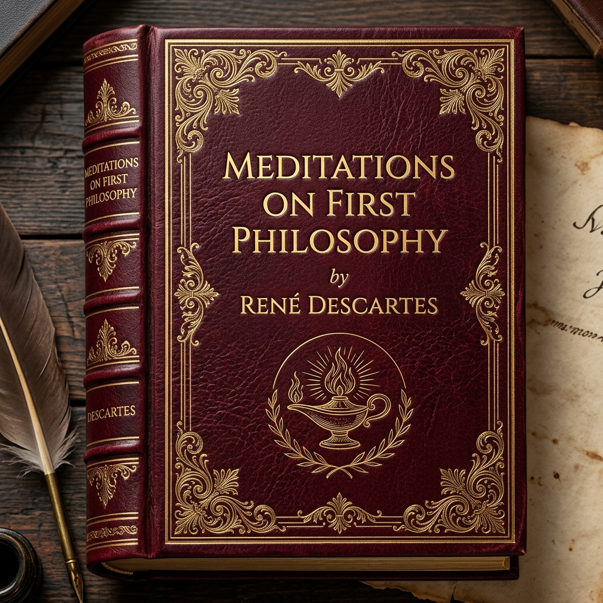
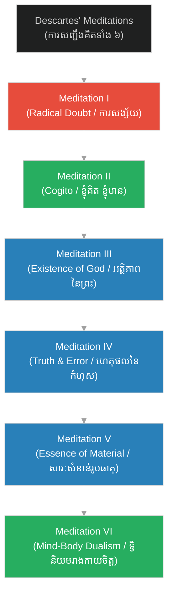

# Meditations on First Philosophy (សេចក្តីសង្ខេបសៀវភៅ ការសញ្ជឹងគិតអំពីទស្សនវិជ្ជាដំបូង)

**Author:** ichamrong  
**Date:** 2026-06-06  
**Tags:** #philosophy #descartes #meditations #rationalism #metaphysics #epistemology  
**Category:** Philosophy  
**Read Time:** ~3 min

 

 

---

## 📌 មាតិកា (Table of Contents)
- [សេចក្តីផ្តើម (Introduction)](#0)
- [រចនាសម្ព័ន្ធជំពូក (Chapter Structure)](#1)
- [ផែនទីគំនិតនៃការសញ្ជឹងគិតទាំង ៦ (Conceptual Map)](#2)
- [ឯកសារយោង (References)](#3)

---

## សេចក្តីផ្តើម (Introduction)

សៀវភៅ​​ **«Meditations on First Philosophy»**​​ (មាន​​ឈ្មោះ​​ពេញ​​ជា​​ភាសា​​ឡាតាំង​​ថា​​ *Meditationes de Prima Philosophia*)​​ គឺ​​ជា​​ស្នាដៃ​​ទស្សនវិជ្ជា​​ដ៏​​ល្បីល្បាញ​​បំផុត​​របស់​​លោក​​ **René Descartes**​​ ដែល​​បាន​​បោះពុម្ពផ្សាយ​​ដំបូង​​នៅ​​ឆ្នាំ​​ ១៦៤១។​​ 

សៀវភៅ​​នេះ​​សរសេរ​​ឡើង​​ជា​​ទម្រង់​​ការ​​សញ្ជឹងគិត​​ប្រចាំថ្ងៃ​​រយៈ​​ពេល​​ ៦​​ ថ្ងៃ​​ (Six Meditations)​​ ដោយ​​ដេកាត​​បាន​​ពង្រីក​​ និង​​ពន្យល់​​យ៉ាង​​ស៊ីជម្រៅ​​នូវ​​គំនិត​​ដែល​​គាត់​​បាន​​លើក​​ឡើង​​ជា​​សង្ខេប​​នៅ​​ក្នុង​​សៀវភៅ​​ *Discourse on the Method*។​​ គាត់​​បាន​​បង្កើត​​ការ​​សង្ស័យ​​ជា​​សកល​​ ដើម្បី​​កម្ទេច​​ជំនឿ​​ចាស់​​ រួច​​កសាង​​ឡើង​​វិញ​​នូវ​​ប្រព័ន្ធ​​ចំណេះដឹង​​ដែល​​រឹងមាំ​​ មិន​​អាច​​រង្គោះរង្គើ​​បាន។

---

## រចនាសម្ព័ន្ធជំពូក (Chapter Structure)

ខ្លឹមសារ​​នៃការសញ្ជឹងគិត​​ទាំង​​ ៦​​ ត្រូវ​​បាន​​បែងចែក​​ជា​​ ៣​​ ផ្នែក​​ដូច​​ខាងក្រោម៖

* 🚪 **[ជំពូកទី ១ ➔ ការសញ្ជឹងគិតទី ១ និងទី ២ (Meditations I & II)](01-meditations-1-and-2.md)**  
  ការ​​សង្ស័យ​​ជា​​សកល​​ (ចាប់​​តាំង​​ពី​​អារម្មណ៍​​រហូត​​ដល់​​សម្មតិកម្ម​​បិសាច​​បោកប្រាស់)​​ និង​​ការ​​រក​​ឃើញ​​គ្រឹះ​​ការពិត​​ដំបូង​​គឺ​​ *Cogito*​​ ព្រម​​ទាំង​​ «ឧបមាទកថា​​ក្រមួន​​ឃ្មុំ​​ (Wax Analogy)»​​ ដើម្បី​​បង្ហាញ​​ថា​​ចិត្ត​​ងាយ​​យល់​​ដឹង​​ជាង​​រាងកាយ។

* 🌟 **[ជំពូកទី ២ ➔ ការសញ្ជឹងគិតទី ៣ និងទី ៤ (Meditations III & IV)](02-meditations-3-and-4.md)**  
  ការ​​បញ្ជាក់​​ពី​​អត្ថិភាព​​របស់​​ព្រះ​​តាម​​រយៈ​​មូលហេតុ​​នៃ​​គំនិត​​ និង​​ការ​​វិភាគ​​រក​​មូលហេតុ​​នៃ​​កំហុស​​ឆ្គង​​របស់​​មនុស្ស​​ (ទោះ​​បី​​ជា​​ព្រះ​​បង្កើត​​មក​​ល្អ​​ឥតខ្ចោះ​​ក៏ដោយ)។

* 🌍 **[ជំពូកទី ៣ ➔ ការសញ្ជឹងគិតទី ៥ និងទី ៦ (Meditations V & VI)](03-meditations-5-and-6.md)**  
  ការ​​បញ្ជាក់​​ពី​​អត្ថិភាព​​របស់​​ព្រះ​​តាម​​រយៈ​​ធរណីមាត្រ​​ (Ontological Argument)​​ ការ​​វិល​​ត្រឡប់​​នៃ​​អត្ថិភាព​​ពិភព​​រូបធាតុ​​ និង​​ការ​​លម្អិត​​ពី​​ទ្វិនិយម​​រាងកាយ​​ និង​​ចិត្ត​​ (Mind-Body Dualism)។

---

## ផែនទីគំនិតនៃការសញ្ជឹងគិតទាំង ៦ (Conceptual Map)

---

## ឯកសារយោង (References)

* **Descartes, R.** (1641). *Meditations on First Philosophy*.
* **Williams, B.** (1978). *Descartes: The Project of Pure Enquiry*.
