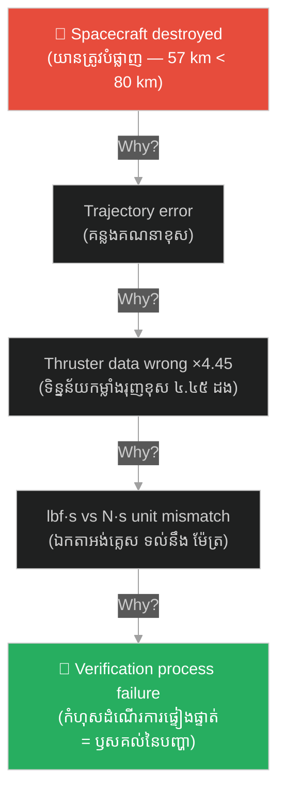

# ការសួរ «ហេតុអ្វី» រហូតដល់បុព្វហេតុគ្រប់គ្រាន់៖ Five Whys and Causal Adequacy in Engineering Failure Analysis

**Author:** ichamrong  
**Date:** 2026-06-12  
**Tags:** #five-whys #causal-adequacy #toyota #nasa #root-cause #real-world-example  
**Category:** Examples  
**Read Time:** ~5 min

---

## 📌 មាតិកា (Table of Contents)
- [សង្ខេបឧទាហរណ៍ (Example Overview)](#0)
- [១. បរិបទ (Background & Context)](#1)
- [២. អ្វីដែលបានកើតឡើង (What Happened)](#2)
  - [២.១ ម៉ាស៊ីនរបស់ Toyota ឈប់ដំណើរការ (Toyota's Machine Stops)](#2-1)
  - [២.២ ការបាត់បង់យាន Mars Climate Orbiter ឆ្នាំ ១៩៩៩ (The 1999 Loss of Mars Climate Orbiter)](#2-2)
- [៣. របៀបដែលគោលគំនិតត្រូវបានអនុវត្ត (How the Concept Applied)](#3)
- [៤. មេរៀនសំខាន់ ៗ (Key Takeaways)](#4)
- [សេចក្តីសន្និដ្ឋាន (Conclusion)](#5)
- [ឯកសារយោង (References)](#6)

---

## សង្ខេបឧទាហរណ៍ (Example Overview)

នៅ​ពេល​វិស្វករ​ស៊ើបអង្កេត​បរាជ័យ​បច្ចេកទេស​ ពួកគេ​មិន​ឈប់​ត្រឹម​ចម្លើយ​ដំបូង​ដែល​ឃើញ​នោះ​ទេ។​ ឧទាហរណ៍​ពិត​ពីរ​ករណី​ — ករណី​ម៉ាស៊ីន​ឈប់​ដំណើរការ​ដ៏​ល្បី​របស់​លោក​ Taiichi Ohno​ នៅ​ Toyota​ និង​ការ​បាត់បង់​យាន​អវកាស​ Mars Climate Orbiter​ របស់​ NASA​ ឆ្នាំ​ ១៩៩៩​ — បង្ហាញ​ថា​ **«វិធានសួរហេតុអ្វី ៥ ដង (Five Whys Technique)»**​ ដំណើរការ​បាន​ ដោយសារ​វា​អនុវត្ត​ដោយ​ប្រយោល​នូវ​ **«គោលការណ៍ភាពគ្រប់គ្រាន់នៃបុព្វហេតុ (Causal Adequacy Principle)»**​ របស់​ដេកាត៖​ បុព្វហេតុ​ត្រូវ​តែ​ «ធំ​គ្រប់គ្រាន់»​ ដើម្បី​បង្កើត​ផល​ដែល​យើង​សង្កេត​ឃើញ​ — បើ​មិន​គ្រប់គ្រាន់​ទេ​ ត្រូវ​បន្ត​សួរ​ «ហេតុអ្វី?»​ ទៀត។

When engineers investigate technical failures, they refuse to stop at the first answer they see. Two real cases — Taiichi Ohno's famous stopped-machine example at Toyota, and NASA's loss of the Mars Climate Orbiter in 1999 — show that the **Five Whys Technique** works because it implicitly applies Descartes' **Causal Adequacy Principle**: a cause must be "big enough" to produce the observed effect — and if it is not, you must keep asking "why?"

---

## ១. បរិបទ (Background & Context)

វិធាន​សួរ​ហេតុអ្វី​ ៥​ ដង​ មាន​ប្រភព​ពី​ក្រុមហ៊ុន​ Toyota​ ប្រទេស​ជប៉ុន។​ លោក​ Taiichi Ohno​ ស្ថាបត្យករ​នៃ​ប្រព័ន្ធ​ផលិតកម្ម​តូយ៉ូតា​ (Toyota Production System)​ បាន​សរសេរ​ក្នុង​សៀវភៅ​របស់​គាត់​ (បោះពុម្ព​ជា​ភាសា​អង់គ្លេស​ឆ្នាំ​ ១៩៨៨)​ ថា​ ការ​សួរ​ «ហេតុអ្វី»​ ៥​ ដង​ គឺ​ជា​ «មូលដ្ឋាន​នៃ​វិធីសាស្ត្រ​វិទ្យាសាស្ត្រ​របស់​ Toyota»​ — ព្រោះ​បើ​សួរ​ ៥​ ដង​ ទាំង​លក្ខណៈ​នៃ​បញ្ហា​ ទាំង​ដំណោះស្រាយ​របស់​វា​ នឹង​លេចចេញ​ឱ្យ​ឃើញ​ច្បាស់។

The Five Whys originated at Toyota in Japan. Taiichi Ohno, architect of the Toyota Production System, wrote in his book (published in English in 1988) that repeating "why" five times is "the basis of Toyota's scientific approach" — because by asking why five times, both the nature of the problem and its solution become clear.

នៅ​ម្ខាង​ទៀត​នៃ​ពិភពលោក​ និង​ជាង​កន្លះ​សតវត្ស​ក្រោយ​មក​ NASA​ បាន​បាញ់​បង្ហោះ​យាន​ Mars Climate Orbiter​ នៅ​ថ្ងៃ​ទី​ ១១​ ខែ​ធ្នូ​ ឆ្នាំ​ ១៩៩៨​ ដើម្បី​សិក្សា​អាកាសធាតុ​ភព​អង្គារ។​ យាន​នេះ​សាងសង់​ដោយ​ក្រុមហ៊ុន​ Lockheed Martin​ ហើយ​បេសកកម្ម​ទាំងមូល​មាន​តម្លៃ​ ៣២៧.៦​ លាន​ដុល្លារ​ (ក្នុង​នោះ​ ១៩៣.១​ លាន​ដុល្លារ​ ជា​ថ្លៃ​អភិវឌ្ឍ​យាន)។

On the other side of the world and half a century later, NASA launched the Mars Climate Orbiter on December 11, 1998, to study the Martian climate. The spacecraft was built by Lockheed Martin, with a total mission cost of $327.6 million (of which $193.1 million was spacecraft development).

---

## ២. អ្វីដែលបានកើតឡើង (What Happened)

### ២.១ ម៉ាស៊ីនរបស់ Toyota ឈប់ដំណើរការ (Toyota's Machine Stops)

ឧទាហរណ៍​ដើម​ដែល​លោក​ Ohno​ បាន​កត់ត្រា​ក្នុង​សៀវភៅ​ *Toyota Production System*​ គឺ​ករណី​ម៉ាស៊ីន​ផលិតកម្ម​មួយ​ឈប់​ដំណើរការ៖

The original example Ohno recorded in *Toyota Production System* is a production machine that stopped:

1. *ហេតុអ្វី​ម៉ាស៊ីន​ឈប់?*​ →​ ដោយសារ​លើស​ចំណុះ​ ហើយ​ហ្វុយស៊ីប​ដាច់។​ (*Why did it stop? Overload — the fuse blew.*)
2. *ហេតុអ្វី​លើស​ចំណុះ?*​ →​ ដោយសារ​ទ្រនាប់​មិន​បាន​រអិល​គ្រប់គ្រាន់។​ (*Why the overload? The bearing was not sufficiently lubricated.*)
3. *ហេតុអ្វី​មិន​រអិល​គ្រប់គ្រាន់?*​ →​ ដោយសារ​បូម​ប្រេង​រំអិល​បូម​មិន​បាន​គ្រប់គ្រាន់。​ (*Why? The lubrication pump was not pumping sufficiently.*)
4. *ហេតុអ្វី​បូម​មិន​បាន​គ្រប់គ្រាន់?*​ →​ ដោយសារ​អ័ក្ស​បូម​សឹករិចរឹល​ និង​រញ័រ។​ (*Why? The pump shaft was worn and rattling.*)
5. *ហេតុអ្វី​អ័ក្ស​សឹក?*​ →​ ដោយសារ​គ្មាន​តម្រង​ភ្ជាប់​ ហើយ​កម្ទេច​ដែក​ចូល​ក្នុង​បូម​ — នេះ​ហើយ​ជា​ **«ឫសគល់នៃបញ្ហា (Root Cause)»**។​ (*Why? No strainer was attached, and metal scrap got in — the root cause.*)

បើ​ឈប់​ត្រឹម​ចម្លើយ​ទី​ ១​ — ប្ដូរ​ហ្វុយស៊ីប​ថ្មី​ — ម៉ាស៊ីន​នឹង​ខូច​ម្ដង​ទៀត​ក្នុង​ពេល​ឆាប់ ៗ។​ មាន​តែ​ការ​ដាក់​តម្រង​ប៉ុណ្ណោះ​ ដែល​បញ្ឈប់​បញ្ហា​ជា​អចិន្ត្រៃយ៍។

If you stop at answer 1 — replace the fuse — the machine will soon fail again. Only fitting a strainer ends the problem permanently.

### ២.២ ការបាត់បង់យាន Mars Climate Orbiter ឆ្នាំ ១៩៩៩ (The 1999 Loss of Mars Climate Orbiter)

នៅ​ថ្ងៃ​ទី​ ២៣​ ខែ​កញ្ញា​ ឆ្នាំ​ ១៩៩៩​ ខណៈ​យាន​ត្រៀម​ចូល​គន្លង​ភព​អង្គារ​ ទំនាក់ទំនង​ត្រូវ​បាន​កាត់ផ្ដាច់​ជា​រៀង​រហូត។​ យាន​ត្រូវ​បាន​គ្រោង​ឱ្យ​ហោះ​កាត់​ក្នុង​កម្ពស់​ ២២៦​ គីឡូម៉ែត្រ​ ពី​ផ្ទៃ​ភព​ ប៉ុន្តែ​តាម​ការ​គណនា​ក្រោយ​ហេតុការណ៍​ វា​បាន​ធ្លាក់​ចូល​ត្រឹម​កម្ពស់​ប្រមាណ​ ៥៧​ គីឡូម៉ែត្រ​ — ទាប​ជាង​កម្ពស់​អប្បបរមា​ ៨០​ គីឡូម៉ែត្រ​ ដែល​យាន​អាច​រស់រាន​បាន​ — ហើយ​ត្រូវ​បំផ្លាញ​ដោយ​បរិយាកាស​ភព​អង្គារ។​ គណៈកម្មការ​ស៊ើបអង្កេត​ (Mishap Investigation Board)​ បាន​ចេញ​របាយការណ៍​ដំណាក់កាល​ទី​ ១​ នៅ​ថ្ងៃ​ទី​ ១០​ ខែ​វិច្ឆិកា​ ឆ្នាំ​ ១៩៩៩​ ដោយ​សួរ​ដេញដោល​ពី​រោគសញ្ញា​ ទៅ​រក​ឫសគល់៖

On September 23, 1999, as the spacecraft began its Mars orbital insertion, communication was lost forever. It was supposed to pass at an altitude of 226 km, but post-event reconstruction showed it descended to about 57 km — below the 80 km minimum survivable altitude — and was destroyed by the Martian atmosphere. The Mishap Investigation Board released its Phase I report on November 10, 1999, interrogating its way from symptom to root:

1. *ហេតុអ្វី​យាន​បាត់បង់?*​ →​ វា​ហោះ​ជិត​ភព​ពេក​ ហើយ​ឆេះ​ក្នុង​បរិយាកាស។​ (*Why was the craft lost? It flew too close and burned up.*)
2. *ហេតុអ្វី​ជិត​ពេក?*​ →​ គន្លង​ហោះហើរ​ដែល​គណនា​ខុស​ពី​ការ​ពិត។​ (*Why too close? The computed trajectory diverged from the real one.*)
3. *ហេតុអ្វី​គណនា​ខុស?*​ →​ ទិន្នន័យ​កម្លាំង​រុញ​តូច ៗ​ (Small Forces)​ ពី​កម្មវិធី​ SM_FORCES​ មាន​តម្លៃ​ខុស​ ៤.៤៥​ ដង。​ (*Why miscalculated? The "Small Forces" thruster data from the SM_FORCES file was off by a factor of 4.45.*)
4. *ហេតុអ្វី​ខុស​ ៤.៤៥​ ដង?*​ →​ កម្មវិធី​ផ្នែក​ដី​បាន​ផ្ដល់​លទ្ធផល​ជា​ឯកតា​ pound-force seconds​ (ប្រព័ន្ធ​អង់គ្លេស)​ ខណៈ​ប្រព័ន្ធ​គន្លង​រំពឹង​ឯកតា​ newton-seconds​ (ប្រព័ន្ធ​ម៉ែត្រ)។​ (*Why off by 4.45? The ground software output pound-force seconds while the trajectory system expected newton-seconds.*)
5. *ហេតុអ្វី​ឯកតា​ខុស​គ្នា​ដោយ​គ្មាន​អ្នក​ចាប់​បាន?*​ →​ ដំណើរការ​ត្រួតពិនិត្យ​ និង​ផ្ទៀងផ្ទាត់​ interface​ រវាង​ក្រុម​ការងារ​ មិន​បាន​អនុវត្ត​តាម​ឯកសារ​បញ្ជាក់​ (Software Interface Specification)​ — នេះ​ជា​កំហុស​ប្រព័ន្ធ​ ដែល​ជា​ឫសគល់​ពិតប្រាកដ。​ (*Why did mismatched units go uncaught? The verification process between teams failed to enforce the Software Interface Specification — a systemic failure, the true root cause.*)

---

## ៣. របៀបដែលគោលគំនិតត្រូវបានអនុវត្ត (How the Concept Applied)

នៅ​ក្នុង​ការសញ្ជឹងគិត​ទី​ ៣​ ដេកាត​បាន​ដាក់​ចេញ​នូវ​ **«គោលការណ៍ភាពគ្រប់គ្រាន់នៃបុព្វហេតុ (Causal Adequacy Principle)»**៖​ «ត្រូវ​តែ​មាន​តថភាព​នៅ​ក្នុង​បុព្វហេតុ​ យ៉ាង​តិច​ស្មើ​នឹង​តថភាព​នៅ​ក្នុង​ផល»​ — អ្វី​ដែល​តូច​ មិន​អាច​បង្កើត​អ្វី​ដែល​ធំ​ជាង​ខ្លួន​បាន​ទេ។​ អ្នក​ស៊ើបអង្កេត​បរាជ័យ​វិស្វកម្ម​ ប្រើ​តក្កៈ​ដូចគ្នា​នេះ​ ដោយ​មិន​ដឹង​ខ្លួន៖​ រាល់​ពេល​ដែល​ចម្លើយ​មួយ​ «តូច​ពេក»​ មិន​អាច​ពន្យល់​ទំហំ​នៃ​ផល​បាន​ ពួកគេ​បដិសេធ​វា​ថា​ជា​ចម្លើយ​ចុងក្រោយ​ ហើយ​បន្ត​សួរ​ «ហេតុអ្វី?»។

In Meditation III, Descartes laid down the **Causal Adequacy Principle**: "there must be at least as much reality in the cause as in the effect" — what is lesser cannot produce what is greater than itself. Engineering failure investigators use the same logic without realizing it: whenever an answer is "too small" to explain the magnitude of the effect, they reject it as a final answer and keep asking "why?"

* **ហ្វុយស៊ីប​ដាច់​ មិន​ «គ្រប់គ្រាន់»​ ទេ**៖​ ហ្វុយស៊ីប​មួយ​ដាច់​ គឺ​ជា​ព្រឹត្តិការណ៍​តូច​មួយ​ — វា​ពន្យល់​បាន​តែ​ការ​ឈប់​ម្ដង​នេះ​ប៉ុណ្ណោះ​ មិន​មែន​ការ​ឈប់​ដដែល ៗ ឡើយ។​ បុព្វហេតុ​ដែល​ «គ្រប់គ្រាន់»​ នឹង​ផល​ គឺ​ភាព​គ្មាន​តម្រង​ — លក្ខខណ្ឌ​អចិន្ត្រៃយ៍​មួយ​ ដែល​ធំ​ល្មម​នឹង​បង្កើត​ខ្សែ​សង្វាក់​បរាជ័យ​ទាំង​មូល​ឡើង​វិញ​ឥត​ឈប់ឈរ。  
  *A blown fuse is not "adequate": it is one small event — it explains this one stop, not repeated stoppages. The cause adequate to the effect is the missing strainer — a standing condition big enough to regenerate the whole failure chain indefinitely.*
* **«ហោះ​ទាប​ពេក»​ ក៏​មិន​គ្រប់គ្រាន់​ដែរ**៖​ NASA​ មិន​បាន​ឈប់​ត្រឹម​ «កំហុស​លេខ​ក្នុង​ឯកសារ​មួយ»​ នោះ​ទេ​ ព្រោះ​កំហុស​បុគ្គល​តូច​មួយ​ មិន​ «ធំ​គ្រប់គ្រាន់»​ នឹង​ពន្យល់​ពី​របៀប​ដែល​ស្ថាប័ន​ទាំង​មូល​ បណ្ដោយ​ឱ្យ​កំហុស​នោះ​ឆ្លងកាត់​ការ​ត្រួតពិនិត្យ​អស់​រយៈពេល​ ៩​ ខែ​នៃ​ការ​ហោះហើរ​ឡើយ។​ បុព្វហេតុ​ដែល​សមាមាត្រ​នឹង​ការ​បាត់បង់​ ៣២៧.៦​ លាន​ដុល្លារ​ គឺ​កំហុស​ដំណើរការ​ផ្ទៀងផ្ទាត់​ទាំង​ប្រព័ន្ធ。  
  *"It flew too low" is not adequate either: NASA did not stop at "a wrong number in one file," because one small individual error is not "big enough" to explain how an entire organization let it pass every check during a 9-month cruise. The cause proportionate to a $327.6 million loss is a system-wide verification process failure.*
* **រូបមន្ត​រួម**៖​ បុព្វហេតុ​លើ​ផ្ទៃ​ (Surface Cause)​ គឺ​ជា​បុព្វហេតុ​ដែល​ពិត​ ប៉ុន្តែ​ «តូច​ជាង​ផល»​ — វា​ជា​តំណ​មួយ​ក្នុង​ខ្សែ​សង្វាក់​ប៉ុណ្ណោះ។​ បុព្វហេតុ​គ្រប់គ្រាន់​ (Sufficient Cause)​ គឺ​ជា​បុព្វហេតុ​ដែល​មាន​ «តថភាព​ស្មើ​នឹង​ផល»​ — ការ​កែ​វា​ លុបបំបាត់​ផល​ទាំង​មូល។​ ការ​សួរ​ «ហេតុអ្វី»​ ម្ដង ៗ គឺ​ជា​ការ​ធ្វើ​តេស្ត​ភាព​គ្រប់គ្រាន់​នៃ​បុព្វហេតុ​ម្ដង ៗ នោះ​ឯង។  
  *The general formula: a surface cause is real but "smaller than the effect" — merely one link in the chain. A sufficient cause has "as much reality as the effect" — fixing it eliminates the whole effect. Each "why?" is precisely one causal adequacy test.*

---

## ៤. មេរៀនសំខាន់ ៗ (Key Takeaways)

* **កុំ​ទទួល​យក​បុព្វហេតុ​ដែល​តូច​ជាង​ផល**៖​ បើ​ការ​ខូចខាត​ធំ​ ប៉ុន្តែ​ការ​ពន្យល់​តូច​ នោះ​អ្នក​មិន​ទាន់​ដល់​ឫសគល់​ទេ。  
  *Never accept a cause smaller than its effect: if the damage is large but the explanation is small, you have not reached the root.*
* **ឫសគល់​ពិត​ គឺ​លក្ខខណ្ឌ​ប្រព័ន្ធ​ មិន​មែន​ព្រឹត្តិការណ៍​តូច**៖​ ទាំង​ Toyota​ ទាំង​ NASA​ ឈប់​សួរ​ នៅ​ពេល​ដល់​កំហុស​ដំណើរការ​ដែល​អាច​កែ​បាន​ — តម្រង​ដែល​បាត់​ និង​ការ​ផ្ទៀងផ្ទាត់​ដែល​ខ្វះ。  
  *The true root is a systemic condition, not a small event: both Toyota and NASA stopped asking when they reached an actionable process failure — a missing strainer, a missing verification step.*
* **ទស្សនវិជ្ជា​សតវត្ស​ទី​ ១៧​ នៅ​រស់​ក្នុង​បន្ទប់​ស៊ើបអង្កេត​សតវត្ស​ទី​ ២១**៖​ គោលការណ៍​ *ex nihilo nihil fit*​ (គ្មាន​អ្វី​កើត​ចេញ​ពី​ភាពទទេ)​ របស់​ដេកាត​ គឺ​ជា​មូលដ្ឋាន​តក្កៈ​ដែល​ធ្វើ​ឱ្យ​ការ​វិភាគ​ឫសគល់​ មាន​ន័យ​តាំង​ពី​ដើម。  
  *Seventeenth-century philosophy lives on in the 21st-century investigation room: Descartes' ex nihilo nihil fit (nothing comes from nothing) is the logical bedrock that makes root cause analysis meaningful at all.*

---

## សេចក្តីសន្និដ្ឋាន (Conclusion)

លោក​ Ohno​ មិន​ដែល​ដក​ស្រង់​ដេកាត​ទេ​ ហើយ​គណៈកម្មការ​ស៊ើបអង្កេត​របស់​ NASA​ ក៏​មិន​ដែល​លើក​ឡើង​ពី​ «តថភាព​ផ្លូវការ»​ ដែរ។​ ប៉ុន្តែ​ភាព​ជោគជ័យ​នៃ​ការ​ស៊ើបអង្កេត​ទាំង​ពីរ​ ផ្អែក​លើ​វិន័យ​តក្កៈ​តែ​មួយ៖​ បដិសេធ​ការ​ពន្យល់​ដែល​ «តូច​ពេក»​ ហើយ​បន្ត​ខួង​ចុះ​ក្រោម​ រហូត​ដល់​បុព្វហេតុ​មាន​ទម្ងន់​ស្មើ​នឹង​ផល។​ នេះ​គឺ​ជា​ភស្តុតាង​ដ៏​ស្អាត​មួយ​ ដែល​បង្ហាញ​ថា​ គោលការណ៍​ទស្សនវិជ្ជា​ដែល​ដេកាត​ប្រើ​ដើម្បី​បញ្ជាក់​អត្ថិភាព​នៃ​ព្រះ​ ក្លាយ​ជា​ឧបករណ៍​ប្រចាំ​ថ្ងៃ​របស់​វិស្វករ​ ក្នុង​ការ​ការពារ​ម៉ាស៊ីន​មួយ​គ្រឿង​ — ឬ​យាន​អវកាស​មួយ​គ្រឿង​ — កុំ​ឱ្យ​បរាជ័យ​ម្ដង​ទៀត។

Ohno never quoted Descartes, and NASA's investigation board never mentioned "formal reality." Yet both investigations succeeded by the same logical discipline: reject explanations that are "too small," and keep digging until the cause carries as much weight as the effect. It is an elegant proof that the philosophical principle Descartes used to argue for God's existence has become the engineer's everyday tool for keeping a machine — or a spacecraft — from failing twice.

---

## ឯកសារយោង (References)

- [ពាក្យគន្លឹះ៖ វិធានសួរហេតុអ្វី ៥ ដង (Keyword: Five Whys)](../keywords/five-whys.md)
- [ជំពូកស៊ីជម្រៅ៖ គំនិត និងកម្រិតនៃតថភាព (Deep dive: Ideas and Degrees of Reality)](../books/philosophy/meditations-on-first-philosophy/04-meditation-3-ideas-and-reality.md)
- **Ohno, T.** (1988). *Toyota Production System: Beyond Large-Scale Production*. Productivity Press.
- **NASA** (1999, November 10). [*Mars Climate Orbiter Mishap Investigation Board Phase I Report*](https://llis.nasa.gov/llis_lib/pdf/1009464main1_0641-mr.pdf).
- [Mars Climate Orbiter — Wikipedia](https://en.wikipedia.org/wiki/Mars_Climate_Orbiter)
- [5 Whys — Lean Enterprise Institute](https://www.lean.org/lexicon-terms/5-whys/)
- **Descartes, R.** (1641). *Meditations on First Philosophy*, Meditation III.
