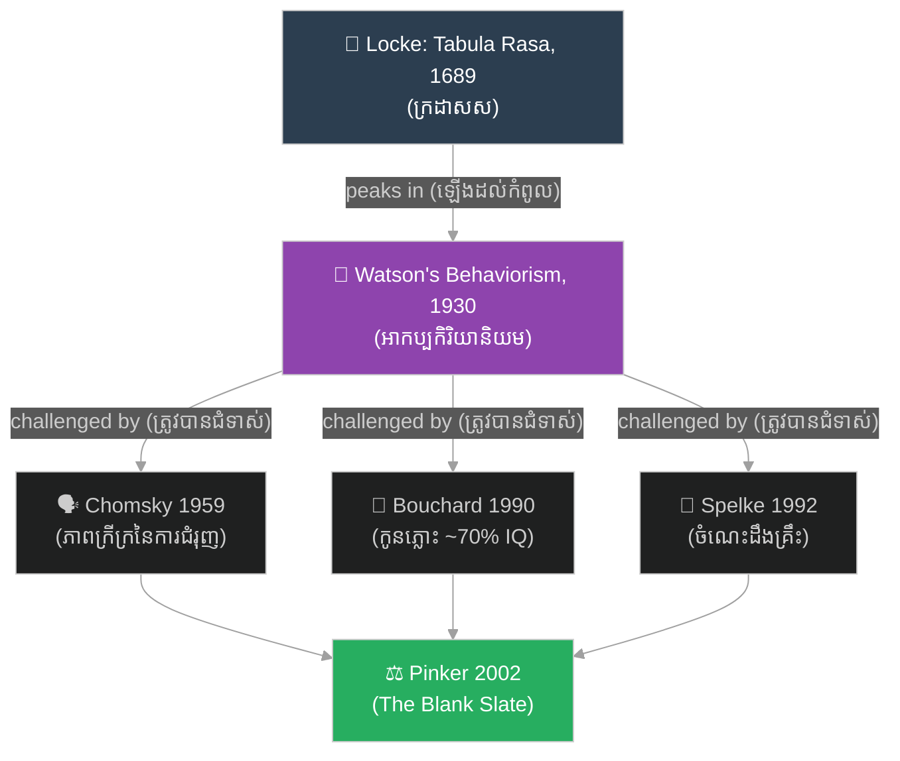

# ក្រដាសសរបស់ Locke ត្រូវបានសាកល្បងដោយចិត្តវិទ្យាសម័យទំនើប៖ Locke's Blank Slate Tested by Modern Psychology

**Author:** ichamrong  
**Date:** 2026-06-12  
**Tags:** #empiricism #locke #blank-slate #behaviorism #nature-vs-nurture #real-world-example  
**Category:** Examples  
**Read Time:** ~5 min

---

## 📌 មាតិកា (Table of Contents)
- [សង្ខេបឧទាហរណ៍ (Example Overview)](#0)
- [១. បរិបទ — ក្រដាសសរបស់ Locke (Background: Locke's Tabula Rasa)](#1)
- [២. អ្វីដែលបានកើតឡើង — ការឡើង និងការធ្លាក់នៃក្រដាសស (What Happened: The Rise and Fall of the Blank Slate)](#2)
- [៣. របៀបដែលគោលគំនិតត្រូវបានអនុវត្ត — ត្រឡប់ទៅរកការសញ្ជឹងគិតទី ៣ (How the Concept Applied: Back to Meditation 3)](#3)
- [៤. មេរៀនសំខាន់ ៗ (Key Takeaways)](#4)
- [សេចក្តីសន្និដ្ឋាន (Conclusion)](#5)
- [ឯកសារយោង (References)](#6)

---

## សង្ខេបឧទាហរណ៍ (Example Overview)

តើ​ចិត្ត​មនុស្ស​កើត​មក​ដូច​ក្រដាស​ស​ ឬ​មាន​អ្វី​សរសេរ​ទុក​រួច​ហើយ?​ សំណួរ​នេះ​មិន​មែន​ជា​ការ​ប្រកួត​ប្រជែង​ទស្សនវិជ្ជា​អរូបី​ទេ​ — វា​ត្រូវ​បាន​យក​ទៅ​សាកល្បង​ក្នុង​មន្ទីរ​ពិសោធន៍​ចិត្តវិទ្យា​អស់​មួយ​សតវត្ស។​ ឧទាហរណ៍​នេះ​តាមដាន​ការ​ធ្វើ​ដំណើរ​នៃ​គោលគំនិត​ **«ពិសោធន៍និយម (Empiricism)»**​ របស់​ John Locke​ — ទ្រឹស្តី​ «ក្រដាស​ស (tabula rasa)»​ — ពី​ការ​ឡើង​ដល់​កំពូល​ក្នុង​ទ្រឹស្តី​អាកប្បកិរិយា​និយម​ ដល់​ការ​ធ្លាក់​ចុះ​ដោយ​ភស្តុតាង​ពី​ភាសាវិទ្យា​ ការ​សិក្សា​កូនភ្លោះ​ និង​ការ​សិក្សា​ទារក។

> *Is the mind born as blank paper, or is something already written on it? This is not an abstract philosophical contest — it has been tested in psychology laboratories for a full century. This example traces the journey of John Locke's **empiricism** — the "blank slate" (tabula rasa) theory — from its peak in behaviorism to its fall under evidence from linguistics, twin studies, and infant research.*

---

## ១. បរិបទ — ក្រដាសសរបស់ Locke (Background: Locke's Tabula Rasa)

នៅ​ឆ្នាំ​ ១៦៨៩​ ទស្សនវិទូ​អង់គ្លេស​ John Locke​ បាន​បោះពុម្ព​ស្នាដៃ​ *An Essay Concerning Human Understanding*​ ដែល​ក្នុង​នោះ​គាត់​បាន​បដិសេធ​ទ្រឹស្តី​ **«គំនិតពីកំណើត (Innate Ideas)»**​ ទាំង​មូល។​ Locke​ អះអាង​ថា​ ចិត្ត​មនុស្ស​នៅ​ពេល​កើត​ គឺ​ដូច​ជា​ «ក្រដាស​ស​ ឥត​អក្សរ​ ឥត​គំនិត»​ (white paper, void of all characters)​ ហើយ​រាល់​ចំណេះដឹង​ទាំង​អស់​ កើត​ចេញ​ពី​បទពិសោធន៍​ — ការ​ចាប់​អារម្មណ៍​ (sensation)​ និង​ការ​ឆ្លុះ​បញ្ចាំង​ (reflection)។

> *In 1689, the English philosopher John Locke published *An Essay Concerning Human Understanding*, in which he rejected the whole doctrine of **innate ideas**. Locke claimed the mind at birth is like "white paper, void of all characters," and that all knowledge comes from experience — sensation and reflection.*

នេះ​ជា​ការ​ប្រឆាំង​ផ្ទាល់​នឹង​ **«ហេតុផលនិយម (Rationalism)»**​ របស់​ René Descartes​ ដែល​អះអាង​ថា​ គំនិត​មួយ​ចំនួន​ (ដូច​ជា​គំនិត​អំពី​ព្រះ​ ឬ​អំពី​ភាព​គ្មាន​ដែន​កំណត់)​ ត្រូវ​បាន​ដក់​ក្នុង​ចិត្ត​តាំង​ពី​កំណើត។​ ការ​ប្រកួត​រវាង​ទស្សនៈ​ទាំង​ពីរ​នេះ​ — «ធម្មជាតិ​ ឬ​ការ​ចិញ្ចឹម​បីបាច់ (nature vs. nurture)»​ — បាន​ក្លាយ​ជា​សំណួរ​កណ្តាល​នៃ​ចិត្តវិទ្យា​សម័យ​ទំនើប។

> *This directly opposed René Descartes' **rationalism**, which held that certain ideas (such as the idea of God or of the infinite) are imprinted on the mind from birth. The contest between these two views — "nature vs. nurture" — became the central question of modern psychology.*

---

## ២. អ្វីដែលបានកើតឡើង — ការឡើង និងការធ្លាក់នៃក្រដាសស (What Happened: The Rise and Fall of the Blank Slate)

ក្នុង​ដើម​សតវត្ស​ទី​ ២០​ ទស្សនៈ​ក្រដាស​ស​បាន​ឡើង​ដល់​កំពូល​ក្នុង​ទ្រឹស្តី​ **«អាកប្បកិរិយានិយម (Behaviorism)»**។​ នៅ​ឆ្នាំ​ ១៩៣០​ ក្នុង​សៀវភៅ​ *Behaviorism*​ លោក​ John B. Watson​ បាន​សរសេរ​ប្រយោគ​ដ៏​ល្បី៖​ «ផ្តល់​ឱ្យ​ខ្ញុំ​នូវ​ទារក​សុខភាព​ល្អ​មួយ​ដប់​ពីរ​នាក់...​ ហើយ​ខ្ញុំ​ធានា​ថា​នឹង​ហ្វឹក​ហាត់​ម្នាក់ ៗ ឱ្យ​ក្លាយ​ជា​អ្នក​ឯកទេស​ប្រភេទ​ណា​ក៏​បាន​ — គ្រូពេទ្យ,​ មេធាវី,​ វិចិត្រករ,​ ឬ​សូម្បី​តែ​អ្នក​សុំ​ទាន​ និង​ចោរ​ — ដោយ​មិន​គិត​ពី​ទេពកោសល្យ,​ ទំនោរ,​ ឬ​ពូជ​ពង្ស​របស់​គេ»។​ នេះ​ជា​ការ​អះអាង​ក្រដាស​ស​ដ៏​ខ្លាំង​បំផុត​ដែល​ធ្លាប់​មាន។

> *In the early 20th century, the blank-slate view reached its peak in **behaviorism**. In 1930, in his book *Behaviorism*, John B. Watson wrote his famous line: "Give me a dozen healthy infants... and I'll guarantee to take any one at random and train him to become any type of specialist I might select — doctor, lawyer, artist, or even beggar-man and thief — regardless of his talents, penchants, tendencies, abilities, vocations, and race of his ancestors." It was the strongest blank-slate claim ever made.*

ប៉ុន្តែ​ភស្តុតាង​បាន​ផ្តួល​រំលំ​ទស្សនៈ​ក្រដាស​ស​សុទ្ធ​នេះ​ ជា​បន្តបន្ទាប់៖

> *But evidence overturned this pure blank-slate view, one wave after another:*

- **ភាសាវិទ្យា (Linguistics):** នៅ​ឆ្នាំ​ ១៩៥៩​ Noam Chomsky​ បាន​បោះពុម្ព​ការ​រិះគន់​សៀវភៅ​ *Verbal Behavior*​ របស់​ B. F. Skinner​ ក្នុង​ទស្សនាវដ្តី​ *Language*​ (35, 26–57)។​ គាត់​បាន​លើក​ឡើង​នូវ​អំណះអំណាង​ **«ភាពក្រីក្រនៃការជំរុញ (Poverty of the Stimulus)»**៖​ កុមារ​អាច​បង្កើត​ប្រយោគ​ថ្មី ៗ ដែល​គេ​មិន​ដែល​ឮ​ពី​មុន​ — ការ​ពង្រឹង​បែប​អាកប្បកិរិយា​មិន​អាច​ពន្យល់​រឿង​នេះ​បាន​ទេ។​ ត្រូវ​តែ​មាន​រចនាសម្ព័ន្ធ​ភាសា​ខ្លះ​ដែល​មាន​ពី​កំណើត។

  > *In 1959, Noam Chomsky published a review of B. F. Skinner's *Verbal Behavior* in the journal *Language* (35, 26–57). He raised the **poverty of the stimulus** argument: children produce novel sentences they have never heard, which behaviorist reinforcement cannot explain. Some language structure must be innate.*

- **ការសិក្សាកូនភ្លោះ (Twin Studies):** នៅ​ឆ្នាំ​ ១៩៩០​ Thomas Bouchard​ និង​សហការី​បាន​បោះពុម្ព​ការ​សិក្សា​ *Minnesota Study of Twins Reared Apart*​ ក្នុង​ទស្សនាវដ្តី​ *Science*។​ កូនភ្លោះ​ដូច​គ្នា​ដែល​ត្រូវ​បាន​ចិញ្ចឹម​ដាច់​ពី​គ្នា​ បែរ​ជា​ស្រដៀង​គ្នា​យ៉ាង​គួរ​ឱ្យ​ភ្ញាក់​ផ្អើល​ — ការ​សិក្សា​បាន​ប៉ាន់​ប្រមាណ​ថា​ ប្រមាណ​ ៧០%​ នៃ​ភាព​ខុស​គ្នា​នៃ​ IQ​ កើត​ចេញ​ពី​ហ្សែន។​ (ការ​សិក្សា​នេះ​ក៏​បាន​ទទួល​ការ​រិះគន់​ផ្នែក​វិធីសាស្ត្រ​នៅ​ពេល​ក្រោយ​ដែរ។)

  > *In 1990, Thomas Bouchard and colleagues published the Minnesota Study of Twins Reared Apart in *Science*. Identical twins raised apart turned out strikingly similar — the study estimated roughly 70% of the variation in IQ traces to genetics. (The study later drew methodological criticism as well.)*

- **ការសិក្សាទារក (Infant Research):** Elizabeth Spelke​ និង​សហការី​ (*Psychological Review*,​ 99, 605–632,​ ១៩៩២)​ បាន​បង្ហាញ​ថា​ ទារក​មាន​ **«ចំណេះដឹងគ្រឹះ (Core Knowledge)»**​ អំពី​លោក​រូបិយ​ — ពួក​គេ​រំពឹង​ថា​វត្ថុ​ផ្លាស់​ទី​ជា​បន្ត​ មិន​ឆ្លង​កាត់​របាំង​រឹង​ និង​នៅ​តែ​មាន​ពេល​ត្រូវ​បាន​បាំង​ — ទាំង​នេះ​មុន​ពេល​ពួក​គេ​ចេះ​និយាយ​ឡើង​ទៅ​ទៀត។

  > *Elizabeth Spelke and colleagues (*Psychological Review*, 99, 605–632, 1992) showed that infants have **core knowledge** about the physical world — they expect objects to move continuously, not pass through solid barriers, and persist when occluded — all before they can speak.*

នៅ​ឆ្នាំ​ ២០០២​ Steven Pinker​ បាន​ផ្គុំ​ភស្តុតាង​ទាំង​នេះ​ក្នុង​សៀវភៅ​ *The Blank Slate: The Modern Denial of Human Nature*​ ដោយ​អះអាង​ថា​ ចិត្ត​មនុស្ស​មិន​មែន​ជា​ក្រដាស​ស​ឡើយ​ ប៉ុន្តែ​មាន​ធម្មជាតិ​ដែល​បាន​វិវត្ត​មក។

> *In 2002, Steven Pinker synthesized this evidence in *The Blank Slate: The Modern Denial of Human Nature*, arguing that the mind is not a blank slate but carries an evolved human nature.*

---

## ៣. របៀបដែលគោលគំនិតត្រូវបានអនុវត្ត — ត្រឡប់ទៅរកការសញ្ជឹងគិតទី ៣ (How the Concept Applied: Back to Meditation 3)

រឿង​នេះ​ផ្គូផ្គង​ដោយ​ផ្ទាល់​ទៅ​នឹង​ការ​ជជែក​ដេញ​ដោល​អំពី​ **«គំនិតពីកំណើត (Innate Ideas)»**​ ដែល​យើង​បាន​ឃើញ​ក្នុង​ការ​សញ្ជឹង​គិត​ទី​ ៣​ របស់​ Descartes។​ នៅ​ទី​នោះ​ ទស្សនវិទូ​ពិសោធន៍និយម​ — Locke​ និង​ Hume​ — បាន​អះអាង​ថា​ គំនិត​ទាំង​អស់​ (សូម្បី​តែ​គំនិត​អំពី​ព្រះ)​ ត្រូវ​បាន​កសាង​ឡើង​ពី​បទពិសោធន៍​ មិន​មែន​ដក់​ក្នុង​ចិត្ត​ពី​កំណើត​ឡើយ។​ ការ​ប្រកួត​នេះ​ — រវាង​ Descartes​ ​(ហេតុផលនិយម)​ និង​ Locke​ (ពិសោធន៍និយម)​ — គឺ​ជា​ការ​ប្រកួត​ដ៏​តែ​មួយ​ដែល​មន្ទីរ​ពិសោធន៍​ចិត្តវិទ្យា​បាន​យក​ទៅ​សាកល្បង​ក្នុង​សតវត្ស​ទី​ ២០។

> *This story maps directly onto the debate over **innate ideas** we saw in Descartes' Meditation 3. There, the empiricist philosophers — Locke and Hume — argued that all ideas (even the idea of God) are built from experience, not imprinted on the mind from birth. That very contest — between Descartes (rationalism) and Locke (empiricism) — is what the 20th-century psychology lab put to the test.*

ហើយ​លទ្ធផល​គឺ​គួរ​ឱ្យ​ចាប់​អារម្មណ៍៖​ គ្មាន​ភាគី​ណា​ឈ្នះ​ទាំង​ស្រុង​ឡើយ។​ Locke​ ខុស​ត្រង់​ថា​ ចិត្ត​ជា​ក្រដាស​ស​ទទេ​ស្អាត​ — Chomsky​ និង​ Spelke​ បាន​បង្ហាញ​ថា​ មាន​រចនាសម្ព័ន្ធ​ខ្លះ​មាន​ពី​កំណើត​មែន។​ ប៉ុន្តែ​ Descartes​ ក៏​មិន​ត្រូវ​ទាំង​ស្រុង​ដែរ៖​ អ្វី​ដែល​មាន​ពី​កំណើត​មិន​មែន​ជា​ «គំនិត​ពេញលេញ​អំពី​ព្រះ»​ ដូច​ដែល​គាត់​ស្រមៃ​ទេ​ ប៉ុន្តែ​ជា​ប្រព័ន្ធ​ចំណេះដឹង​គ្រឹះ​ដ៏​តូច ៗ​ (អំពី​វត្ថុ,​ ចំនួន,​ ភាសា)​ ដែល​បទពិសោធន៍​ត្រូវ​បំពេញ​បន្ថែម​ទៀត។​ ចម្លើយ​ពិត​គឺ​ស្ថិត​នៅ​ចន្លោះ​កណ្តាល​ — អន្តរកម្ម​រវាង​ធម្មជាតិ​ និង​ការ​ចិញ្ចឹម​បីបាច់។

> *And the result is striking: neither side won outright. Locke was wrong that the mind is perfectly blank — Chomsky and Spelke showed some structure really is innate. But Descartes was not fully right either: what is innate is not a "complete idea of God" as he imagined, but small core-knowledge systems (about objects, number, language) that experience then fills in. The real answer lies in the middle — an interaction of nature and nurture.*

---

## ៤. មេរៀនសំខាន់ ៗ (Key Takeaways)

- **ទស្សនវិជ្ជា​អាច​ត្រូវ​បាន​សាកល្បង។**​ សំណួរ​អរូបី​របស់​ Locke​ និង​ Descartes​ ត្រូវ​បាន​បំប្លែង​ទៅ​ជា​ការ​ពិសោធន៍​ពិត​ប្រាកដ​ក្នុង​មន្ទីរ​ពិសោធន៍។

  > *Philosophy can be tested. The abstract questions of Locke and Descartes became concrete laboratory experiments.*

- **ភស្តុតាង​ផ្តួល​ការ​អះអាង​ដាច់​ខាត។**​ ការ​ធានា​ដ៏​ក្លាហាន​របស់​ Watson​ មិន​អាច​ឈរ​ជើង​បាន​ទេ​ នៅ​ពេល​ប្រឈម​នឹង​ភាសាវិទ្យា​ កូនភ្លោះ​ និង​ទារក។

  > *Evidence defeats absolute claims. Watson's bold guarantee could not survive linguistics, twins, and infants.*

- **គ្មាន​ភាគី​ណា​ឈ្នះ​ស្អាត​ឡើយ។**​ មិន​មែន​ Locke​ សុទ្ធ​ ឬ​ Descartes​ សុទ្ធ​ — ការ​ពិត​គឺ​ជា​ការ​លាយ​បញ្ចូល​គ្នា​នៃ​រចនាសម្ព័ន្ធ​ពី​កំណើត​ និង​ការ​រៀន​សូត្រ។

  > *Neither side won cleanly. Not pure Locke nor pure Descartes — the truth is a blend of innate structure and learning.*

---

## សេចក្តីសន្និដ្ឋាន (Conclusion)

ការ​ធ្វើ​ដំណើរ​ពី​ក្រដាស​ស​របស់​ Locke​ ឆ្នាំ​ ១៦៨៩​ ដល់​សៀវភៅ​ *The Blank Slate*​ របស់​ Pinker​ ឆ្នាំ​ ២០០២​ បង្ហាញ​ថា​ ការ​ប្រកួត​ «ហេតុផលនិយម​ ទល់​នឹង​ ពិសោធន៍និយម»​ ដែល​ Descartes​ និង​ Locke​ បាន​ចាប់​ផ្តើម​ មិន​បាន​បញ្ចប់​ដោយ​ជ័យជម្នះ​ខាង​ណា​មួយ​ឡើយ​ — ប៉ុន្តែ​ដោយ​ការ​សំយោគ​មួយ​ដែល​ស៊ីជម្រៅ​ជាង​មុន។​ ចិត្ត​មនុស្ស​មិន​មែន​ជា​ក្រដាស​ស​ទទេ​ ហើយ​ក៏​មិន​មែន​ជា​សៀវភៅ​ដែល​សរសេរ​រួច​ហើយ​ដែរ​ — វា​ប្រហែល​ជា​ក្រដាស​ដែល​មាន​ខ្សែ​បន្ទាត់​ និង​ចំណង​ជើង​ខ្លះ​បោះ​ពុម្ព​ទុក​ស្រាប់​ រង់​ចាំ​បទពិសោធន៍​ឱ្យ​មក​បំពេញ​សាច់​រឿង។

> *The journey from Locke's blank slate in 1689 to Pinker's *The Blank Slate* in 2002 shows that the "rationalism vs. empiricism" contest Descartes and Locke began did not end in victory for either side — but in a deeper synthesis. The mind is neither blank paper nor a pre-written book; it may be paper that comes with some faint ruled lines and chapter headings already printed, waiting for experience to fill in the story.*

---

## ឯកសារយោង (References)

- [ជំពូកស៊ីជម្រៅ៖ រង្វង់ដេកាត និងការរិះគន់ (Deep dive: The Cartesian Circle & Critiques)](../books/philosophy/meditations-on-first-philosophy/06-meditation-3-circle-and-critiques.md)
- [ពាក្យគន្លឹះ៖ គំនិតពីកំណើត (Keyword: Innate Ideas)](../keywords/innate-ideas.md)
- **Locke, J.** (1689). *An Essay Concerning Human Understanding* (Book II — the mind as "white paper").
- **Watson, J. B.** (1930). *Behaviorism* (rev. ed.) — the "dozen healthy infants" passage.
- **Chomsky, N.** (1959). "A Review of B. F. Skinner's *Verbal Behavior*." *Language*, 35(1), 26–57.
- **Bouchard, T. J., Lykken, D. T., McGue, M., Segal, N. L., & Tellegen, A.** (1990). "Sources of Human Psychological Differences: The Minnesota Study of Twins Reared Apart." *Science*, 250(4978), 223–228.
- **Spelke, E. S., Breinlinger, K., Macomber, J., & Jacobson, K.** (1992). "Origins of Knowledge." *Psychological Review*, 99(4), 605–632.
- **Pinker, S.** (2002). *The Blank Slate: The Modern Denial of Human Nature*. Viking.
