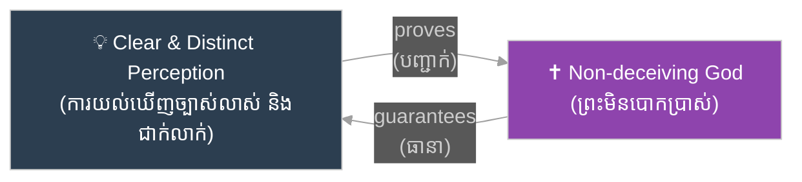
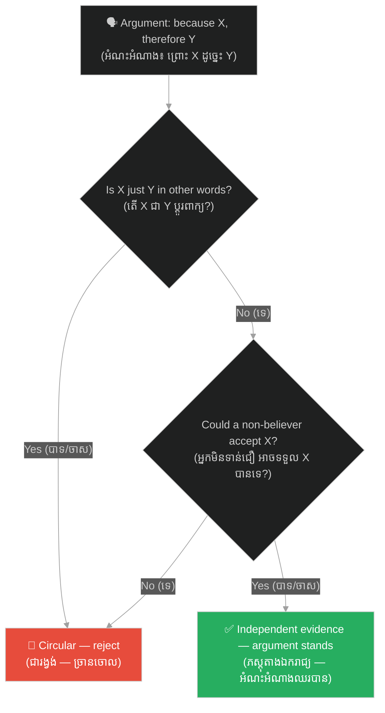

# រង្វង់ដេកាត៖ The Cartesian Circle

**Author:** ichamrong  
**Date:** 2026-06-12  
**Tags:** #epistemology #cartesian-circle #circular-reasoning #descartes #logic #critical-thinking  
**Category:** Keywords  
**Read Time:** ~5 min

---

## 📌 មាតិកា (Table of Contents)
- [សង្ខេបពាក្យគន្លឹះ (Keyword Overview)](#0)
- [១. តើការវែកញែកជារង្វង់ជាអ្វី? (What is Circular Reasoning?)](#1)
- [២. ប្រវត្តិ និងដើមកំណើត — ការជំទាស់របស់ Arnauld (History & Origin: Arnauld's Objection)](#2)
- [៣. ចម្លើយរបស់ដេកាត — ការការពារដោយការចងចាំ (Descartes' Reply: The Memory Defense)](#3)
- [៤. គ្រួសារនៃបញ្ហាដ៏ធំជាង (The Wider Family of Problems)](#4)
- [៥. ការអនុវត្តក្នុងជីវិតប្រចាំថ្ងៃ (Practical Application)](#5)
- [សេចក្តីសន្និដ្ឋាន (Conclusion)](#6)
- [ឯកសារយោង (References)](#7)

---

## សង្ខេបពាក្យគន្លឹះ (Keyword Overview)

**«រង្វង់ដេកាត (Cartesian Circle)»**​ គឺ​ជា​ឈ្មោះ​នៃ​ការ​រិះគន់​ដ៏​ល្បី​បំផុត​លើ​សៀវភៅ​ *Meditations on First Philosophy*​ (១៦៤១)​ របស់​ René Descartes​ ដែល​លើក​ឡើង​ដោយ​ទស្សនវិទូ​បារាំង​ Antoine Arnauld។​ ការ​ចោទ​ប្រកាន់​មាន​ខ្លឹមសារ​ថា​ ដេកាត​បាន​ប្រើ​ **«ការវែកញែកជារង្វង់ (Circular Reasoning)»**៖​ គាត់​ប្រើ​ការ​យល់​ឃើញ​ច្បាស់លាស់​ ដើម្បី​បញ្ជាក់​ថា​ព្រះ​មាន​ពិត​ ហើយ​ប្រើ​ព្រះ​វិញ​ ដើម្បី​ធានា​ថា​ការ​យល់​ឃើញ​ច្បាស់លាស់​គួរ​ឱ្យ​ទុកចិត្ត។​ ពាក្យ​គន្លឹះ​នេះ​សំខាន់​ មិន​មែន​ត្រឹម​តែ​ក្នុង​ប្រវត្តិ​ទស្សនវិជ្ជា​ទេ​ ប៉ុន្តែ​ព្រោះ​វា​ជា​ឧទាហរណ៍​ដ៏​ច្បាស់​បំផុត​នៃ​កំហុស​តក្កវិជ្ជា​មួយ​ ដែល​យើង​ជួប​រាល់​ថ្ងៃ​ — ក្នុង​ការ​ជជែក​ដេញដោល​ ការ​ផ្សាយ​ពាណិជ្ជកម្ម​ និង​សូម្បី​តែ​ក្នុង​ការ​គិត​របស់​យើង​ផ្ទាល់។

The **Cartesian Circle** is the name of the most famous criticism of René Descartes' *Meditations on First Philosophy* (1641), raised by the French philosopher Antoine Arnauld. The charge: Descartes argued in a **circle** — he used clear and distinct perception to prove that God exists, then used God to guarantee that clear and distinct perception is trustworthy. The keyword matters beyond the history of philosophy, because it is the sharpest textbook case of a logical fallacy we meet every day — in debates, in advertising, and even in our own thinking.

---

## ១. តើការវែកញែកជារង្វង់ជាអ្វី? (What is Circular Reasoning?)

**«ការវែកញែកជារង្វង់ (Circular Reasoning)»**​ (ឡាតាំង៖​ *circulus in probando*​ ឬ​ពាក់ព័ន្ធ​នឹង​ *petitio principii*​ —​ «ការសន្មតយកចម្លើយជាមុន»)​ កើត​ឡើង​នៅ​ពេល​ដែល​ **សេចក្តីសន្និដ្ឋាន**​ ដែល​យើង​ចង់​បញ្ជាក់​ ត្រូវ​បាន​លាក់​ខ្លួន​នៅ​ក្នុង​ **ភស្តុតាង**​ រួច​ស្រេច​ទៅ​ហើយ។​ អំណះអំណាង​បែប​នេះ​មិន​ខុស​តាម​ទម្រង់​តក្កវិជ្ជា​ទេ​ (បើ​ A​ ពិត​ នោះ​ A​ ពិត​ —​ ត្រឹមត្រូវ​ឥតខ្ចោះ!)​ ប៉ុន្តែ​វា​ **គ្មានតម្លៃជាភស្តុតាង**​ ព្រោះ​វា​មិន​ផ្តល់​ហេតុផល​ថ្មី​ណា​មួយ​ដល់​អ្នក​ដែល​មិន​ទាន់​ជឿ​ឡើយ។

**Circular reasoning** (Latin: *circulus in probando*, closely related to *petitio principii* — "begging the question") occurs when the **conclusion** you want to prove is already hiding inside the **evidence**. Such an argument is not formally invalid (if A, then A — flawless!), but it is **worthless as proof**, because it gives no new reason to anyone who does not already believe the conclusion.

ឧទាហរណ៍​ប្រចាំ​ថ្ងៃ​ដ៏​សាមញ្ញ​មួយ៖​ «កាសែត​នេះ​គួរ​ឱ្យ​ទុកចិត្ត​ ព្រោះ​វា​ផ្សាយ​តែ​ការពិត។»​ —​ «ចុះ​អ្នក​ដឹង​ដោយ​របៀប​ណា​ថា​វា​ផ្សាយ​តែ​ការពិត?»​ —​ «ព្រោះ​កាសែត​នេះ​ខ្លួន​ឯង​សរសេរ​ថា​ វា​ជា​កាសែត​ដែល​គួរ​ឱ្យ​ទុកចិត្ត​បំផុត!»​ ភស្តុតាង​ (កាសែត​និយាយ​ថា​ខ្លួន​ទុកចិត្ត​បាន)​ មាន​តម្លៃ​ លុះត្រា​តែ​សេចក្តីសន្និដ្ឋាន​ (កាសែត​ទុកចិត្ត​បាន)​ ពិត​ជា​មុន​ —​ រង្វង់​បាន​បិទ​ជិត​ ហើយ​គ្មាន​អ្វី​ត្រូវ​បាន​បញ្ជាក់​ឡើយ។

A simple everyday example: "This newspaper is trustworthy, because it only prints the truth." — "How do you know it only prints the truth?" — "Because the newspaper itself says it is the most trustworthy paper!" The evidence (the paper's claim) only counts if the conclusion (the paper is trustworthy) is already true — the circle closes, and nothing has been proven.

---

## ២. ប្រវត្តិ និងដើមកំណើត — ការជំទាស់របស់ Arnauld (History & Origin: Arnauld's Objection)

មុន​នឹង​បោះពុម្ព​ *Meditations*​ ដេកាត​បាន​ផ្ញើ​សាត្រាស្លឹករឹត​ទៅ​អ្នក​ប្រាជ្ញ​ឈាន​មុខ​សម័យ​នោះ​ ដើម្បី​ប្រមូល​ការ​ជំទាស់​ជា​មុន។​ ក្នុង​ **ការជំទាស់ឈុតទី ៤**​ (Fourth Set of Objections,​ ១៦៤១)​ ទស្សនវិទូ​ និង​ទេវវិទូ​វ័យ​ក្មេង​ Antoine Arnauld​ បាន​ចង្អុល​បង្ហាញ​រង្វង់​មួយ​នៅ​ចំ​បេះដូង​នៃ​ប្រព័ន្ធ​ទាំង​មូល៖​ ដេកាត​អះអាង​ថា​ យើង​អាច​ទុកចិត្ត​លើ​ **«ការយល់ឃើញច្បាស់លាស់ និងជាក់លាក់ (Clear and Distinct Perception)»**​ បាន​ លុះត្រា​តែ​យើង​ដឹង​ថា​ព្រះ​មាន​ពិត​ និង​មិន​បោកប្រាស់។​ ប៉ុន្តែ​ភស្តុតាង​អំពី​ព្រះ​ —​ **«អំណះអំណាងស្លាកសញ្ញា (Trademark Argument)»**​ ក្នុង​ការសញ្ជឹងគិត​ទី​ ៣​ —​ ខ្លួន​វា​ផ្ទាល់​ក៏​ឈរ​លើ​ការ​យល់​ឃើញ​ច្បាស់លាស់​ដែរ។​ A​ បញ្ជាក់​ B​ ហើយ​ B​ ធានា​ A​ វិញ​ —​ ដូច​កាសែត​ដែល​ធានា​ខ្លួន​ឯង​ខាង​លើ​ដែរ​ គ្រាន់​តែ​លើក​នេះ​ វា​កើត​ឡើង​ក្នុង​ស្នាដៃ​ដ៏​ធំ​បំផុត​មួយ​នៃ​ទស្សនវិជ្ជា​ទំនើប។

Before publishing the *Meditations*, Descartes circulated the manuscript to leading scholars to collect objections. In the **Fourth Set of Objections** (1641), the young philosopher-theologian Antoine Arnauld pointed to a circle at the very heart of the system: Descartes claims we may trust **clear and distinct perception** only once we know a non-deceiving God exists; yet the proof of God — the **trademark argument** of Meditation 3 — itself rests on clear and distinct perception. A proves B, and B guarantees A — exactly like the self-certifying newspaper above, except this time inside one of the founding works of modern philosophy.

---

## ៣. ចម្លើយរបស់ដេកាត — ការការពារដោយការចងចាំ (Descartes' Reply: The Memory Defense)

ដេកាត​មិន​ដែល​ទទួល​ស្គាល់​ថា​ខ្លួន​ជាប់​ក្នុង​រង្វង់​ឡើយ។​ ចម្លើយ​របស់​គាត់​ —​ ដែល​អ្នក​សិក្សា​ហៅ​ថា​ **«ការការពារដោយការចងចាំ (Memory Defense)»**​ —​ បែងចែក​ស្ថានភាព​ពីរ៖​ (១)​ ខណៈ​យើង​កំពុង​ **ផ្ចង់ស្មារតី**​ លើ​ការ​យល់​ឃើញ​ច្បាស់លាស់​មួយ​ (ដូចជា​ Cogito​ ឬ​ ២ + ៣ = ៥)​ ការ​សង្ស័យ​មិន​អាច​ចូល​បាន​ទេ​ ហើយ​ព្រះ​មិន​ចាំបាច់​ឡើយ។​ (២)​ ប៉ុន្តែ​ពេល​យើង​គ្រាន់​តែ​ **រំលឹក**​ សេចក្តីសន្និដ្ឋាន​ចាស់​ ដោយ​មិន​នៅ​ផ្ចង់​លើ​ភស្តុតាង​ទៀត​ នោះ​ហើយ​ជា​កន្លែង​ដែល​ព្រះ​ត្រូវ​ការ​ —​ ទ្រង់​ធានា​ថា​អ្វី​ដែល​បាន​យល់​ច្បាស់​ពី​មុន​ នៅ​តែ​ពិត។​ ដេកាត​ខ្លួន​ឯង​បាន​បែងចែក​រវាង​ **«ការដឹងភ្លាម ៗ (Cognitio)»**​ —​ ភាព​ប្រាកដ​នៃ​ពេល​បច្ចុប្បន្ន​ —​ និង​ **«ចំណេះដឹងរឹងមាំ (Scientia)»**​ —​ ប្រព័ន្ធ​ចំណេះដឹង​ឋិតថេរ​យូរអង្វែង។​ ព្រះ​មិន​មែន​ជា​លក្ខខណ្ឌ​នៃ​ Cognitio​ ទេ​ គឺ​ជា​លក្ខខណ្ឌ​នៃ​ Scientia​ ប៉ុណ្ណោះ​ —​ ដូច្នេះ​ តាម​ការ​អាន​នេះ​ រង្វង់​ត្រូវ​បាន​បំបែក។

Descartes never conceded the circle. His reply — what scholars call the **memory defense** — distinguishes two situations: (1) while we are *presently attending* to a clear and distinct perception (the Cogito, or 2 + 3 = 5), doubt cannot enter and no God is needed; (2) but when we merely *recall* an earlier conclusion without re-attending to its proof, that is where God is required — He guarantees that what was once clearly perceived remains true. Descartes himself separated ***cognitio*** (momentary certainty in the present) from ***scientia*** (stable, lasting systematic knowledge): God is a condition only of the latter — so, on this reading, the circle is broken.

តើ​ចម្លើយ​នេះ​ជោគជ័យ​ឬ​ទេ?​ អ្នក​ប្រាជ្ញ​ភាគ​ច្រើន​យល់​ថា​វា​ឆ្លាតវៃ​ ប៉ុន្តែ​មិន​ទាន់​បិទ​បញ្ហា​ទាំងស្រុង​ឡើយ៖​ បើ​មារ​កំណាច​អាច​បោក​យើង​លើ​អ្វី​គ្រប់​យ៉ាង​ ហេតុអ្វី​ការ​យល់​ឃើញ​ «បច្ចុប្បន្ន»​ ត្រូវ​បាន​លើកលែង?​ សម្រាប់​ការ​វិភាគ​ពេញលេញ​ រួម​ទាំង​ការ​អាន​បែប​ទំនើប​របស់​ James Van Cleve​ សូម​អាន​ជំពូក​ស៊ីជម្រៅ​ក្នុង​ឯកសារយោង​ខាង​ក្រោម។

Does the reply succeed? Most scholars find it ingenious but not fully conclusive: if an evil demon can deceive us about everything, why is *present* perception exempt? For the full analysis, including James Van Cleve's modern reading, see the deep-dive chapter linked in the references.

---

## ៤. គ្រួសារនៃបញ្ហាដ៏ធំជាង (The Wider Family of Problems)

រង្វង់​ដេកាត​មិន​មែន​ជា​បញ្ហា​ឯកោ​ទេ​ —​ វា​ជា​សមាជិក​ដ៏​ល្បី​បំផុត​នៃ​គ្រួសារ​បញ្ហា​ទាំង​មូល​មួយ​ក្នុង​ញាណវិទ្យា។​ ទី​មួយ​គឺ​ **«បញ្ហានៃលក្ខណវិនិច្ឆ័យ (Problem of the Criterion)»**​ ដែល​មាន​តាំង​ពី​សម័យ​អ្នក​សង្ស័យនិយម​បុរាណ​ Sextus Empiricus​ ហើយ​ត្រូវ​បាន​ Roderick Chisholm​ លើក​ឡើង​វិញ​ក្នុង​សតវត្ស​ទី​ ២០៖​ ដើម្បី​ដឹង​ថា​ជំនឿ​ណា​ពិត​ យើង​ត្រូវការ​លក្ខណវិនិច្ឆ័យ​ ប៉ុន្តែ​ដើម្បី​ផ្ទៀងផ្ទាត់​លក្ខណវិនិច្ឆ័យ​នោះ​ យើង​ត្រូវ​ដឹង​ជា​មុន​ថា​ជំនឿ​ណា​ខ្លះ​ពិត។​ ទី​ពីរ​គឺ​អ្វី​ដែល​ញាណវិទូ​សម័យ​ទំនើប​ហៅ​ថា​ **«ភាពជារង្វង់នៃញាណ (Epistemic Circularity)»**៖​ យើង​មិន​អាច​បញ្ជាក់​ភាព​គួរ​ឱ្យ​ទុកចិត្ត​នៃ​ហេតុផល​ ការ​ចងចាំ​ ឬ​វិញ្ញាណ​ទាំង​ ៥​ របស់​យើង​ ដោយ​មិន​ប្រើ​សមត្ថភាព​ទាំង​នោះ​ខ្លួន​ឯង​បាន​ឡើយ។​ បញ្ហា​ទាំង​នេះ​ប្រឈម​នឹង​ **«គ្រឹះនិយម (Foundationalism)»**​ —​ និង​ប្រព័ន្ធ​ចំណេះដឹង​គ្រប់​បែបយ៉ាង​ —​ មិន​មែន​តែ​ដេកាត​ម្នាក់​ឯង​ទេ។

The Cartesian Circle is not an isolated puzzle — it is the most famous member of a whole family of problems in epistemology. First, the **problem of the criterion**, raised by the ancient skeptic Sextus Empiricus and revived by Roderick Chisholm in the 20th century: to know which beliefs are true we need a criterion, but to validate the criterion we must already know which beliefs are true. Second, what modern epistemologists call **epistemic circularity**: we cannot certify the reliability of reason, memory, or the five senses without using those very faculties. These problems confront **foundationalism** — and every system of knowledge — not Descartes alone.

---

## ៥. ការអនុវត្តក្នុងជីវិតប្រចាំថ្ងៃ (Practical Application)

តើ​ធ្វើ​ដូចម្តេច​ដើម្បី​ចាប់​បាន​រង្វង់​ក្នុង​ការ​ជជែក​ដេញដោល​ប្រចាំ​ថ្ងៃ?​ សាកល្បង​ជំហាន​ ៣​ នេះ៖

1.  **សរសេរភស្តុតាង និងសេចក្តីសន្និដ្ឋានដាច់ពីគ្នា**៖​ បំបែក​អំណះអំណាង​ជា​ «ព្រោះ X​ ដូច្នេះ Y»។​ បើ​ X​ គ្រាន់​តែ​ជា​ Y​ ដែល​ប្តូរ​ពាក្យ​ (ឧ.​ «គាត់​និយាយ​ការពិត​ ព្រោះ​គាត់​មិន​ដែល​កុហក»)​ នោះ​ជា​រង្វង់។
2.  **សួរ «តេស្តអ្នកមិនទាន់ជឿ»**៖​ តើ​អ្នក​ដែល​មិន​ទាន់​ទទួល​យក​សេចក្តីសន្និដ្ឋាន​ អាច​ទទួល​យក​ភស្តុតាង​នេះ​បាន​ឬ​ទេ?​ បើ​មិន​អាច​ទេ​ ភស្តុតាង​នោះ​បាន​សន្មត​យក​ចម្លើយ​ជា​មុន​រួច​ហើយ។
3.  **ទាមទារភស្តុតាងឯករាជ្យ**៖​ «តើ​មាន​អ្វី​ *ក្រៅ​ពី​ប្រភព​នេះ​ខ្លួន​ឯង*​ ដែល​គាំទ្រ​វា​ទេ?»​ —​ កាសែត​ត្រូវ​ផ្ទៀងផ្ទាត់​ដោយ​ប្រភព​ផ្សេង​ អ្នក​ជំនាញ​ត្រូវ​វិនិច្ឆ័យ​ដោយ​លទ្ធផល​ដែល​អាច​ពិនិត្យ​បាន។

How do you catch circles in everyday reasoning and debate? Try these three steps: (1) **Write the evidence and the conclusion separately** — split the argument into "because X, therefore Y"; if X is just Y in different words ("he tells the truth, because he never lies"), it is a circle. (2) **Apply the non-believer test** — could someone who does not yet accept the conclusion accept this evidence? If not, the evidence already assumes the answer. (3) **Demand independent evidence** — "is there anything *outside this source itself* that supports it?" A newspaper is checked against other sources; an expert is judged by verifiable results.

ប៉ុន្តែ​ មេរៀន​ចុង​ក្រោយ​ពី​ដេកាត​គឺ​ភាព​បន្ទាបខ្លួន៖​ នៅ​កម្រិត​ជ្រៅ​បំផុត​ (ហេតុអ្វី​ទុកចិត្ត​ហេតុផល?​ ហេតុអ្វី​ទុកចិត្ត​វិញ្ញាណ?)​ គ្មាន​នរណា​គេច​ផុត​ពី​រង្វង់​ទាំងស្រុង​ឡើយ។​ ដូច្នេះ​ ក្នុង​ការ​ជជែក​ វាយ​តម្លៃ​រង្វង់​តាម​កម្រិត៖​ រង្វង់​តូច​ និង​ចង្អៀត​ («ខ្ញុំ​ត្រូវ​ ព្រោះ​ខ្ញុំ​ត្រូវ»)​ គឺ​ជា​កំហុស​ដែល​ត្រូវ​ច្រានចោល​ ឯ​រង្វង់​ធំ​ និង​ជៀស​មិន​រួច​ (ប្រើ​ហេតុផល​ដើម្បី​ពិនិត្យ​ហេតុផល)​ គឺ​ជា​លក្ខខណ្ឌ​រួម​របស់​មនុស្ស​គ្រប់​គ្នា​ —​ សូម្បី​អ្នក​ដែល​កំពុង​រិះគន់​យើង​ក៏​ជាប់​ដែរ។

The final lesson from Descartes, though, is humility: at the deepest level (why trust reason? why trust the senses?), no one escapes circularity entirely. So in debate, judge circles by their size: a small, tight circle ("I'm right because I'm right") is a fallacy to reject, while a wide, unavoidable circle (using reason to examine reason) is the shared condition of everyone — including whoever is criticizing you.

---

## សេចក្តីសន្និដ្ឋាន (Conclusion)

រង្វង់​ដេកាត​ចាប់ផ្តើម​ជា​ការ​ជំទាស់​មួយ​ទំព័រ​របស់​ Arnauld​ ក្នុង​ឆ្នាំ​ ១៦៤១​ ប៉ុន្តែ​បាន​ក្លាយ​ជា​មេរៀន​អមតៈ​អំពី​ដែន​កំណត់​នៃ​ការ​បញ្ជាក់​ខ្លួន​ឯង៖​ គ្មាន​ប្រភព​ណា​ —​ ទោះ​ជា​កាសែត​ អ្នក​ជំនាញ​ ឬ​ហេតុផល​របស់​ទស្សនវិទូ​ដ៏​អស្ចារ្យ​ —​ អាច​ធានា​ខ្លួន​ឯង​ដោយ​ខ្លួន​ឯង​បាន​ឡើយ។​ ការ​ស្គាល់​រង្វង់​ បាន​ន័យ​ថា​ ចេះ​ទាមទារ​ភស្តុតាង​ឯករាជ្យ​ពី​អ្នក​ដទៃ​ ចេះ​ពិនិត្យ​អំណះអំណាង​ខ្លួន​ឯង​ មុន​នឹង​គេ​ចាប់​បាន​ និង​ចេះ​បន្ទាបខ្លួន​ចំពោះ​សំណួរ​ដែល​នៅ​បើក​ចំហ​ជាង​ ៣៨០​ ឆ្នាំ​មក​ហើយ​នេះ៖​ តើ​ចំណេះដឹង​អាច​មាន​គ្រឹះ​រឹងមាំ​ ដោយ​មិន​ជាប់​រង្វង់​បាន​ឬ​ទេ?

The Cartesian Circle began as a one-page objection by Arnauld in 1641 but became a timeless lesson about the limits of self-certification: no source — newspaper, expert, or the reason of a great philosopher — can vouch for itself by itself. Knowing the circle means demanding independent evidence from others, auditing your own arguments before someone else does, and staying humble before a question that has remained open for over 380 years: can knowledge have a firm foundation without circularity?

---

## ឯកសារយោង (References)

- [ជំពូកស៊ីជម្រៅ៖ រង្វង់ដេកាត និងការរិះគន់ (Deep dive: The Cartesian Circle & Critiques)](../books/philosophy/meditations-on-first-philosophy/06-meditation-3-circle-and-critiques.md)
- **Descartes, R.** (1641). *Meditations on First Philosophy*, with *Objections and Replies* (Fourth Set: Arnauld; Descartes' Replies to the Second & Fourth Objections).
- **Sextus Empiricus.** *Outlines of Pyrrhonism*, Book II (the problem of the criterion).
- **Chisholm, R.** (1973). *The Problem of the Criterion*. Marquette University Press.
- **Van Cleve, J.** (1979). "Foundationalism, Epistemic Principles, and the Cartesian Circle." *The Philosophical Review*, 88(1).
