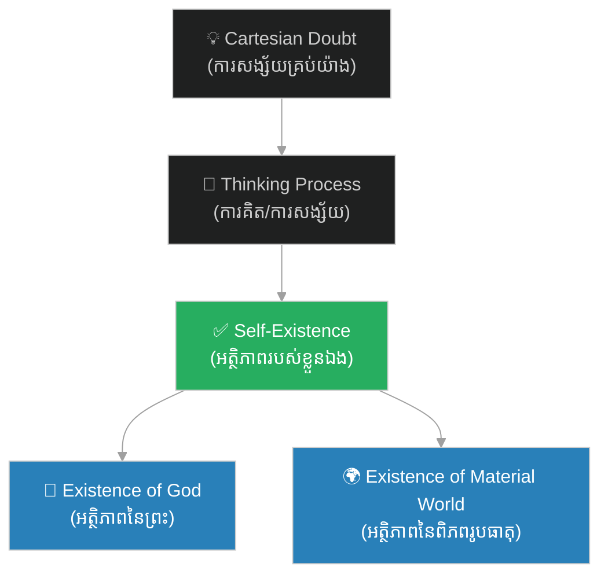

# អត្ថិភាព៖ Existence (Being)

**Author:** ichamrong  
**Date:** 2026-06-06  
**Tags:** #philosophy #existence #ontology #metaphysics #descartes #being  
**Category:** Keywords  
**Read Time:** ~4 min

---

## 📌 មាតិកា (Table of Contents)
- [សង្ខេបពាក្យគន្លឹះ (Keyword Overview)](#0)
- [១. តើ «អត្ថិភាព» ជាអ្វី? (What is Existence?)](#1)
- [២. អត្ថិភាព ក្នុងទស្សនវិជ្ជាដេកាត (Existence in Cartesian Philosophy)](#2)
- [៣. សត្តវិទ្យា និងទស្សនវិជ្ជាអត្ថិភាពនិយម (Ontology & Existentialism)](#3)
- [សេចក្តីសន្និដ្ឋាន (Conclusion)](#4)
- [ឯកសារយោង (References)](#5)

---

## សង្ខេបពាក្យគន្លឹះ (Keyword Overview)

ពាក្យ​​ថា​​ **«អត្ថិភាព»**​​ (អានថា៖ អ៊ាត់-ថិ-ភាប)​​ គឺ​​ជា​​ពាក្យ​​បច្ចេកសព្ទ​​ទស្សនវិជ្ជា​​ដែល​​បកប្រែ​​មក​​ពី​​ភាសា​​ឡាតាំង​​ *Existentia*​​ ឬ​​ភាសា​​អង់គ្លេស​​ **Existence**​​ (ឬ​​ Being)។​​ វា​​មាន​​ន័យ​​សាមញ្ញ​​ថា​​ **«ការមានរូបរាង, ការមានជីវិតរស់នៅ, ឬការមានពិតប្រាកដ»**​​ នៅ​​ក្នុង​​លោក​​ ផ្ទុយ​​ពី​​ «ភាពមិនមាន (Non-existence)»​​ ឬ​​ «សូន្យភាព (Nothingness)»។

The term **«អត្ថិភាព»** (Existence / Being) is a philosophical concept derived from the Latin *Existentia*. It simply means "the state of having life, being real, or existing" in the world, as opposed to "non-existence" or "nothingness".

---

## ១. តើ «អត្ថិភាព» ជាអ្វី? (What is Existence?)

នៅ​​ក្នុង​​ភាសាខ្មែរ​​ ពាក្យ​​នេះ​​ផ្សំ​​ឡើង​​ពី៖
*   **អត្ថិ** (មក​​ពី​​ភាសាបាលី​​ មាន​​ន័យ​​ថា​​ «មាន»​​ ឬ​​ «ស្ថិតនៅ»)
*   **ភាព** (មាន​​ន័យ​​ថា​​ «ស្ថានភាព»​​ ឬ​​ «សភាព»)
*   **អត្ថិភាព** = **«ស្ថានភាពនៃការមាន ឬការមានវត្តមានពិតប្រាកដ»**។

In Khmer, the word is a compound of **"អត្ថិ"** (Pali: to be / to exist) and **"ភាព"** (state / condition), translating to **"the state of being/existing"**.

---

## ២. អត្ថិភាព ក្នុងទស្សនវិជ្ជាដេកាត (Existence in Cartesian Philosophy)

លោក​​ René Descartes​​ បាន​​យក​​បញ្ហា​​អត្ថិភាព​​មក​​ធ្វើ​​ជា​​ចំណុច​​ចាប់ផ្តើម​​នៃ​​ទស្សនវិជ្ជា​​របស់​​គាត់។​​ ក្នុង​​កំឡុង​​ពេល​​ដែល​​គាត់​​សង្ស័យ​​លើ​​អ្វីៗ​​គ្រប់យ៉ាង​​ គាត់​​បាន​​ចោទ​​សួរ​​ថា​​ «តើ​​រូបគាត់​​ផ្ទាល់​​ពិត​​ជា​​មាន​​អត្ថិភាព​​មែន​​ឬ​​ទេ?»​​ (Does he himself exist?)។

គាត់​​បាន​​រកឃើញ​​ថា​​ ការ​​សង្ស័យ​​របស់​​គាត់​​ គឺ​​ជា​​ភស្តុតាង​​ដែល​​បញ្ជាក់​​ថា​​គាត់​​កំពុង​​គិត​​ ហេតុនេះ​​គាត់​​ត្រូវ​​តែ​​មាន​​អត្ថិភាព​​ពិតប្រាកដ។​​ នេះ​​ជា​​មូលដ្ឋាន​​នៃ​​ឃ្លា៖
> **«ខ្ញុំគិត ហេតុនេះទើបខ្ញុំមាន [អត្ថិភាព]»**​​ (*Cogito, ergo sum*)

បន្ត​​មក​​ទៀត​​ គាត់​​ក៏​​បាន​​ប្រើ​​តក្កវិជ្ជា​​ដើម្បី​​បញ្ជាក់​​ពី​​ **«អត្ថិភាពនៃព្រះ (Existence of God)»**​​ ផង​​ដែរ។

---

## ៣. សត្តវិទ្យា និងទស្សនវិជ្ជាអត្ថិភាពនិយម (Ontology & Existentialism)

*   **សត្តវិទ្យា (Ontology / Metaphysics)**: ជា​​មែកធាង​​នៃ​​ទស្សនវិជ្ជា​​ដែល​​សិក្សា​​អំពី​​ធម្មជាតិ​​នៃ​​អត្ថិភាព​​ (The study of the nature of being and existence)។
*   **អត្ថិភាពនិយម (Existentialism)**: ជា​​ចលនា​​ទស្សនវិជ្ជា​​នៅ​​សតវត្ស​​ទី​​ ២០​​ (ដឹកនាំ​​ដោយ​​ Jean-Paul Sartre, Albert Camus)​​ ដែល​​ជឿ​​ថា​​ **«អត្ថិភាព មកមុនសារៈសំខាន់ (Existence precedes essence)»**។​​ គំនិត​​នេះ​​មាន​​ន័យ​​ថា​​ មនុស្ស​​កើត​​មក​​ (មាន​​អត្ថិភាព)​​ ជា​​មុន​​សិន​​ រួច​​ទើប​​ពួកគេ​​កំណត់​​អត្ថន័យ​​ និង​​គោលបំណង​​នៃ​​ជីវិត​​របស់​​ខ្លួន​​ជា​​ក្រោយ​​ តាម​​រយៈ​​សកម្មភាព​​របស់​​ពួកគេ។

---

## សេចក្តីសន្និដ្ឋាន (Conclusion)

ការ​​ស្វែងយល់​​ពី​​ពាក្យ​​ **«អត្ថិភាព»**​​ ជួយ​​ឱ្យ​​យើង​​យល់​​ដឹង​​កាន់​​តែ​​ច្បាស់​​អំពី​​សំនួរ​​ជា​​មូលដ្ឋាន​​នៃ​​ជីវិត​​ និង​​សកលលោក៖​​ *«តើ​​អ្វី​​ខ្លះ​​ដែល​​ពិត​​ជា​​មាន​​វត្តមាន​​ពិតប្រាកដ​​ ហើយ​​តើ​​យើង​​អាច​​ដឹង​​ពី​​វត្តមាន​​របស់​​វា​​ដោយ​​របៀប​​ណា?»*

---

## ឯកសារយោង (References)

* **Heidegger, M.** (1927). *Being and Time*.
* **Sartre, J. P.** (1943). *Being and Nothingness*.
