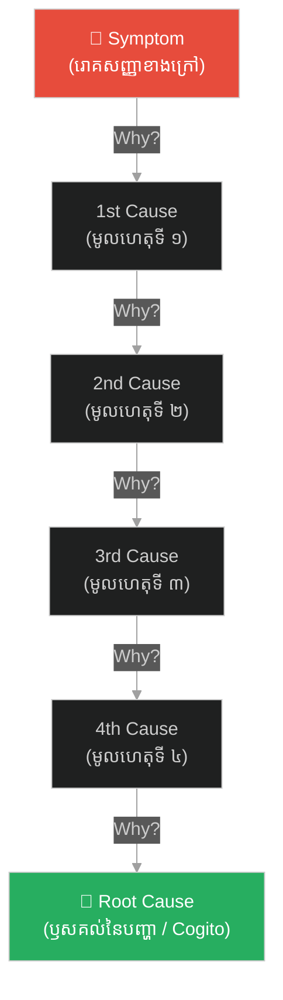

# វិធានសួរហេតុអ្វី ៥ ដង៖ Five Whys Technique

**Author:** ichamrong  
**Date:** 2026-06-06  
**Tags:** #problem-solving #methodology #five-whys #descartes #root-cause #logic  
**Category:** Keywords  
**Read Time:** ~5 min

---

## 📌 មាតិកា (Table of Contents)
- [សង្ខេបពាក្យគន្លឹះ (Keyword Overview)](#0)
- [១. តើវិធាន «ហេតុអ្វី ៥ ដង» ជាអ្វី? (What is the 5 Whys?)](#1)
- [២. ទំនាក់ទំនងជាមួយទស្សនវិជ្ជាដេកាត (Connection to Cartesian Doubt)](#2)
- [៣. របៀបដែល ៥ Whys ទទួលបានអត្ថប្រយោជន៍ពី Cogito (How 5 Whys Benefits from Cogito)](#3)
- [សេចក្តីសន្និដ្ឋាន (Conclusion)](#4)
- [ឯកសារយោង (References)](#5)

---

## សង្ខេបពាក្យគន្លឹះ (Keyword Overview)

**«វិធានសួរហេតុអ្វី ៥ ដង»**​​ (**Five Whys Technique**)​​ គឺ​​ជា​​វិធីសាស្ត្រ​​ដោះស្រាយ​​បញ្ហា​​បែប​​សួរ​​ដេញដោល​​ ដើម្បី​​ស្វែងរក​​ **«ឫសគល់នៃបញ្ហា (Root Cause)»**​​ ដែល​​បង្កើត​​ឡើង​​ដោយ​​លោក​​ Sakichi Toyoda​​ (ស្ថាបនិក​​ក្រុមហ៊ុន​​តូយ៉ូតា)។​​ វិធីសាស្ត្រ​​វិភាគ​​បែប​​ជម្រៅ​​នេះ​​ ទទួល​​បាន​​ឥទ្ធិពល​​ និង​​អត្ថប្រយោជន៍​​យ៉ាង​​ខ្លាំង​​ពី​​គោលការណ៍​​ **«ការសង្ស័យជាប្រព័ន្ធ (Cartesian Doubt)»**​​ របស់​​ដេកាត​​ ដោយ​​បដិសេធ​​មិន​​ទទួល​​យក​​ចម្លើយ​​លើ​​ផ្ទៃ​​ក្រៅ​​ រហូត​​ដល់​​រក​​ឃើញ​​ការពិត​​ច្បាស់លាស់​​បំផុត។

The **5 Whys Technique** is an iterative interrogative technique used to explore the cause-and-effect relationships underlying a particular problem. Developed by Sakichi Toyoda (founder of Toyota), this root cause analysis method strongly benefits from Descartes' **Cartesian Doubt** by refusing to accept surface-level answers until the absolute foundational truth (root cause) is reached.

---

## ១. តើវិធាន «ហេតុអ្វី ៥ ដង» ជាអ្វី? (What is the 5 Whys?)

នៅ​​ពេល​​ជួប​​ប្រទះ​​បញ្ហា​​មួយ​​ យើង​​មិន​​ត្រូវ​​ដោះស្រាយ​​តែ​​លើ​​រោគសញ្ញា​​ខាងក្រៅ​​ (Symptom)​​ នោះ​​ទេ។​​ វិធាន​​នេះ​​តម្រូវ​​ឱ្យ​​យើង​​សួរ​​ពាក្យ​​ថា​​ **«ហេតុអ្វី?»**​​ ជា​​បន្តបន្ទាប់​​គ្នា​​ចំនួន​​ ៥​​ ដង​​ (ឬ​​ច្រើន​​ជាង​​នេះ)​​ ដើម្បី​​ខួង​​ចុះ​​ទៅ​​រក​​មូលហេតុ​​ពិតប្រាកដ។

*   **បញ្ហា**: ម៉ាស៊ីន​​ឈប់​​ដំណើរការ។
    1.  *ហេតុអ្វី?*​​ ->​​ ដោយសារ​​លើស​​ចំណុះ​​ ហើយ​​ហ្វុយស៊ីប​​ដាច់។
    2.  *ហេតុអ្វី?*​​ ->​​ ដោយសារ​​ទ្រនាប់​​កកិត​​មិន​​បាន​​រអិល​​ល្អ។
    3.  *ហេតុអ្វី?*​​ ->​​ ដោយសារ​​បូម​​ប្រេង​​រំអិល​​ខូច។
    4.  *ហេតុអ្វី?*​​ ->​​ ដោយសារ​​អ័ក្ស​​ខាងក្នុង​​របស់​​បូម​​សឹករិចរឹល។
    5.  *ហេតុអ្វី?*​​ ->​​ ដោយសារ​​គ្មាន​​តម្រង​​ការពារ​​កម្ទេចកំទី​​ចូល​​ក្នុង​​បូម​​ (**ឫសគល់នៃបញ្ហា - Root Cause**)。

---

## ២. ទំនាក់ទំនងជាមួយទស្សនវិជ្ជាដេកាត (Connection to Cartesian Doubt)

ទស្សនវិជ្ជា​​ដេកាត​​ចាប់ផ្ដើម​​ដោយ​​សម្មតិកម្ម​​ថា​​ **«រាល់ចំណេះដឹងដំបូង ឬការយល់ឃើញដំបូង គឺអាចបោកប្រាស់យើងបាន»**។​​ ដូចគ្នា​​នេះ​​ដែរ​​ ក្នុង​​វិស្វកម្ម​​ និង​​ការ​​ដោះស្រាយ​​បញ្ហា​​ មូលហេតុ​​ដំបូង​​ដែល​​យើង​​ឃើញ​​ ភាគច្រើន​​គឺ​​ជា​​ការ​​យល់​​ច្រឡំ​​ ឬ​​ជា​​បាតុភូត​​បោកប្រាស់​​ភ្នែក​​ប៉ុណ្ណោះ។

ដេកាត​​បាន​​សួរ​​ដេញដោល​​ខ្លួនឯង​​ជា​​ដំណាក់កាល​​ (សង្ស័យ​​លើ​​អារម្មណ៍​​ ->​​ សង្ស័យ​​លើ​​ការ​​យល់សប្តិ​​ ->​​ សង្ស័យ​​លើ​​បិសាច​​បោកប្រាស់)​​ រហូត​​ដល់​​គាត់​​រក​​ឃើញ​​ចំណុច​​ដែល​​មិន​​អាច​​សង្ស័យ​​បាន​​គឺ​​ *Cogito*។​​ វិធាន​​ ៥​​ Whys​​ ដំណើរការ​​ដូចគ្នា​​បេះបិទ​​ ដោយ​​បក​​ស្រទាប់​​នៃ​​បញ្ហា​​ជា​​ជំហានៗ។

---

## ៣. របៀបដែល ៥ Whys ទទួលបានអត្ថប្រយោជន៍ពី Cogito (How 5 Whys Benefits from Cogito)

ការ​​យល់​​ដឹង​​ពី​​គំនិត​​ *Cogito, ergo sum*​​ ផ្តល់​​អត្ថប្រយោជន៍​​ ៣​​ យ៉ាង​​ដល់​​ការ​​អនុវត្ត​​ ៥​​ Whys៖

1.  **ការបដិសេធជំនឿលំអៀង (Combating Confirmation Bias)**: ដេកាត​​បង្រៀន​​កុំ​​ឱ្យ​​ជឿ​​លើ​​ការ​​សន្និដ្ឋាន​​លឿន​​ពេក។​​ ក្នុង​​បញ្ហា​​ការងារ​​ វិន័យ​​នេះ​​ជួយ​​ការពារ​​យើង​​ពី​​ការ​​ចាប់​​យក​​ចម្លើយ​​ងាយៗ​​ដែល​​យើង​​ចង់​​ឮ​​ (Convenient answers)។
2.  **ការបំបែកបញ្ហា (Cartesian Rule of Analysis)**: វិធាន​​ទី​​ ២​​ របស់​​ដេកាត​​គឺ​​ការ​​បំបែក​​បញ្ហា​​ធំ​​ជា​​ចំណែក​​តូចៗ។​​ ការ​​សួរ​​ «ហេតុអ្វី»​​ នីមួយៗ​​ គឺ​​ជា​​ការ​​បំបែក​​ខ្សែ​​សង្វាក់​​ហេតុផល​​ស្មុគស្មាញ​​ ឱ្យ​​ទៅ​​ជា​​ព្រឹត្តិការណ៍​​សាមញ្ញៗ​​ដាច់​​ដោយ​​ឡែក​​ពី​​គ្នា។
3.  **ការស្វែងរកគ្រឹះការពិតដែលមិនអាចប្រកែកបាន (Searching for the Indubitable)**: ឫសគល់​​នៃ​​បញ្ហា​​ (Root Cause)​​ គឺ​​ជា​​ *Cogito*​​ នៃ​​បញ្ហា​​នោះ។​​ នៅ​​ពេល​​យើង​​រក​​ឃើញ​​ឫសគល់​​ពិតប្រាកដ​​ យើង​​នឹង​​ដឹង​​ច្បាស់​​ថា​​ ការ​​ដោះស្រាយ​​ត្រង់​​ចំណុច​​នេះ​​ នឹង​​លុបបំបាត់​​បញ្ហា​​ទាំងអស់​​ខាងលើ​​ជា​​ស្វ័យប្រវត្ត។

---

## សេចក្តីសន្និដ្ឋាន (Conclusion)

ទស្សនវិជ្ជា​​ *Cogito, ergo sum*​​ មិន​​មែន​​គ្រាន់តែ​​ជា​​ការ​​គិត​​បែប​​ទ្រឹស្តី​​ប៉ុណ្ណោះ​​ទេ​​ ប៉ុន្តែ​​វា​​ជា​​ឥរិយាបថ​​នៃ​​ការ​​គិត​​បែប​​ស៊ីជម្រៅ។​​ ការ​​អនុវត្ត​​វិធាន​​ ៥​​ Whys​​ ដោយ​​មាន​​ស្មារតី​​សង្ស័យ​​បែប​​ដេកាត​​ ជួយ​​ឱ្យ​​យើង​​ក្លាយ​​ជា​​អ្នក​​ដោះស្រាយ​​បញ្ហា​​ដ៏​​មាន​​ប្រសិទ្ធភាព​​បំផុត​​ ក្នុង​​ការងារ​​ និង​​ជីវិត។

---

## ឯកសារយោង (References)

* **Ohno, T.** (1988). *Toyota Production System: Beyond Large-Scale Production*.
* **Descartes, R.** (1637). *Discourse on the Method* (Part II: Rules of Analysis & Synthesis).
