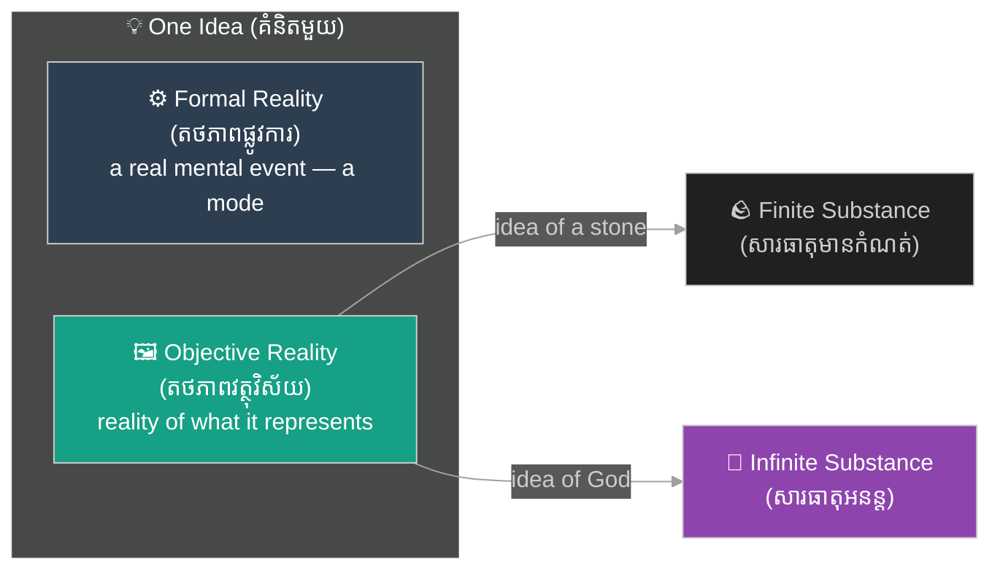
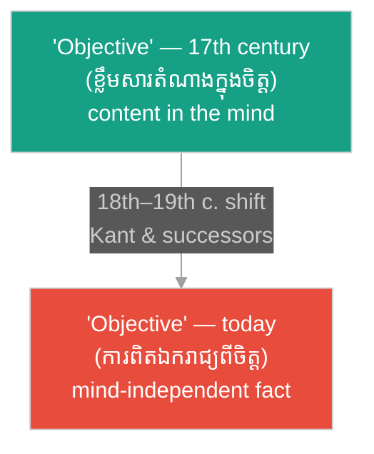

# តថភាពផ្លូវការ និងតថភាពវត្ថុវិស័យ៖ Formal vs Objective Reality

**Author:** ichamrong  
**Date:** 2026-06-12  
**Tags:** #philosophy #descartes #scholasticism #intentionality #epistemology #meditation-3  
**Category:** Keywords  
**Read Time:** ~5 min

---

## 📌 មាតិកា (Table of Contents)
- [សង្ខេបពាក្យគន្លឹះ (Keyword Overview)](#0)
- [១. តើតថភាពផ្លូវការ និងតថភាពវត្ថុវិស័យជាអ្វី? (What are Formal and Objective Reality?)](#1)
- [២. ប្រវត្តិ និងដើមកំណើតពីទស្សនវិជ្ជាយុគសម័យកណ្តាល (Scholastic History & Origin)](#2)
- [៣. អន្ទាក់នៃពាក្យ «Objective»៖ អត្ថន័យដែលត្រឡប់ចុះឡើង (The "Objective" Trap: A Meaning That Flipped)](#3)
- [៤. តួនាទីក្នុងការសញ្ជឹងគិតទី ៣ របស់ដេកាត (The Role in Descartes' Meditation III)](#4)
- [៥. សំឡេងរំពងក្នុងទស្សនវិជ្ជាចិត្តសម័យទំនើប (Echoes in Modern Philosophy of Mind)](#5)
- [សេចក្តីសន្និដ្ឋាន (Conclusion)](#6)
- [ឯកសារយោង (References)](#7)

---

## សង្ខេបពាក្យគន្លឹះ (Keyword Overview)

**«តថភាពផ្លូវការ (Formal Reality)»**​ និង​ **«តថភាពវត្ថុវិស័យ (Objective Reality)»**​ គឺ​ជា​ការ​បែងចែក​បច្ចេកទេស​មួយ​ ដែល​ René Descartes​ បាន​ខ្ចី​ពី​ទស្សនវិជ្ជា​សកលវិទ្យាល័យ​យុគសម័យកណ្តាល​ (Scholasticism)​ ដើម្បី​មើល​គំនិត​មួយ​ពី​ពីរ​ជ្រុង​ខុស​គ្នា៖​ ជា​ «ព្រឹត្តិការណ៍​ពិត​ក្នុង​ចិត្ត»​ (តថភាពផ្លូវការ)​ និង​ជា​ «រូបភាព​តំណាង​ឱ្យ​អ្វី​មួយ»​ (តថភាពវត្ថុវិស័យ)។​ ការ​បែងចែក​ដ៏​ស្ងប់ស្ងាត់​នេះ​ គឺ​ជា​គ្រឹះ​ទាំងមូល​នៃ​អំណះអំណាង​បញ្ជាក់​អត្ថិភាព​នៃ​ព្រះ​ ក្នុង​ការសញ្ជឹងគិត​ទី​ ៣​ ហើយ​ក៏​ជា​បុព្វបុរស​នៃ​គោលគំនិត​ «ភាពអំពី (Aboutness)»​ ក្នុង​ទស្សនវិជ្ជា​ចិត្ត​សម័យ​ទំនើប​ផង​ដែរ។

**Formal Reality** and **Objective Reality** form a technical distinction that René Descartes borrowed from medieval Scholastic philosophy, allowing him to view any idea from two different angles: as a real "mental event" (its formal reality) and as a "representation" that depicts something (its objective reality). This quiet distinction is the entire foundation of the proof of God's existence in Meditation III, and it is also the ancestor of the modern concept of "aboutness" in contemporary philosophy of mind.

---

## ១. តើតថភាពផ្លូវការ និងតថភាពវត្ថុវិស័យជាអ្វី? (What are Formal and Objective Reality?)

**តថភាពផ្លូវការ**​ គឺ​ជា​តថភាព​ដែល​វត្ថុ​មួយ​មាន​ ដោយសារ​វា​មាន​អត្ថិភាព​ពិតប្រាកដ​ — មិន​ថា​ជា​វត្ថុ​ក្នុង​ពិភពលោក​ ឬ​ជា​សភាព​មួយ​ក្នុង​ចិត្ត​ឡើយ។​ **តថភាពវត្ថុវិស័យ**​ វិញ​ គឺ​ជា​តថភាព​ដែល​មាន​តែ​នៅ​ក្នុង​គំនិត​ប៉ុណ្ណោះ៖​ វា​ជា​កម្រិត​តថភាព​នៃ​វត្ថុ​ដែល​គំនិត​នោះ​ *តំណាង*​ តាម​បែប​ដែល​វា​ស្ថិត​នៅ​ក្នុង​ខ្លឹមសារ​នៃ​គំនិត។​ ដើម្បី​វាស់​កម្រិត​ទាំង​នេះ​ ដេកាត​ប្រើ​ឋានានុក្រម​ ៣​ ថ្នាក់៖​ **«ម៉ូដ (Mode)»**​ (លក្ខណៈ​ដែល​អាស្រ័យ​លើ​សារធាតុ)​ < **«សារធាតុមានកំណត់ (Finite Substance)»**​ < **«សារធាតុអនន្ត (Infinite Substance)»**។

Formal reality is the reality something has simply by actually existing — whether as a thing in the world or as a state of a mind. Objective reality, by contrast, exists only inside ideas: it is the degree of reality of the thing an idea *represents*, as contained in the idea's content. To measure these degrees, Descartes uses a 3-level hierarchy: **modes** (features depending on a substance) < **finite substances** < **infinite substance**.

ករណី​បុរាណ​ ៣​ ធ្វើ​ឱ្យ​វា​ច្បាស់៖

Three classic cases make it clear:

* **ដុំថ្ម**៖​ មាន​តថភាពផ្លូវការ​ជា​សារធាតុមានកំណត់​ ប៉ុន្តែ​គ្មាន​តថភាពវត្ថុវិស័យ​ទេ​ ព្រោះ​វា​មិន​តំណាង​ឱ្យ​អ្វី​ឡើយ។  
  *A stone: formal reality as a finite substance, but zero objective reality — it represents nothing.*
* **គំនិតអំពីដុំថ្ម**៖​ មាន​តថភាពផ្លូវការ​ត្រឹម​ម៉ូដ​ (ជា​សភាព​មួយ​នៃ​ចិត្ត)​ ប៉ុន្តែ​មាន​តថភាពវត្ថុវិស័យ​កម្រិត​សារធាតុមានកំណត់​ ព្រោះ​អ្វី​ដែល​វា​បង្ហាញ​ គឺ​សារធាតុ​មួយ។  
  *The idea of a stone: formal reality of a mere mode (a state of mind), but objective reality at the level of a finite substance, since what it depicts is a substance.*
* **គំនិតអំពីព្រះ**៖​ ក្នុង​ឋានៈ​ជា​ព្រឹត្តិការណ៍​ក្នុង​ចិត្ត​ វា​ក៏​គ្រាន់​តែ​ជា​ម៉ូដ​ដែរ​ ប៉ុន្តែ​តថភាពវត្ថុវិស័យ​របស់​វា​ ស្ថិត​ក្នុង​កម្រិត​សារធាតុអនន្ត​ — ខ្ពស់​បំផុត​ក្នុង​ចំណោម​គំនិត​ទាំងអស់។  
  *The idea of God: as a mental event it too is only a mode, but its objective reality is at the level of infinite substance — the highest of any idea.*

---

## ២. ប្រវត្តិ និងដើមកំណើតពីទស្សនវិជ្ជាយុគសម័យកណ្តាល (Scholastic History & Origin)

ការ​បែងចែក​នេះ​ មិន​មែន​ជា​ការ​បង្កើត​ថ្មី​របស់​ដេកាត​ទេ។​ វា​ជា​មរតក​ពី​ប្រពៃណី​ Scholasticism​ — ទស្សនវិជ្ជា​សកលវិទ្យាល័យ​យុគសម័យកណ្តាល​ ដែល​មាន​ឫសគល់​ពី​ Thomas Aquinas​ និង​ត្រូវ​បាន​អភិវឌ្ឍ​ជា​ប្រព័ន្ធ​ដោយ​ Francisco Suárez​ (១៥៤៨–១៦១៧)​ ក្នុង​ស្នាដៃ​ *Disputationes Metaphysicae*។​ អ្នក​ប្រាជ្ញ​យុគសម័យកណ្តាល​និយាយ​ពី​ «អត្ថិភាពវត្ថុវិស័យ​ (esse obiectivum)»​ — របៀប​ដែល​វត្ថុ​មួយ​មាន​អត្ថិភាព​ *ក្នុង​ឋានៈ​ជា​កម្មវត្ថុ​នៃ​ការគិត*​ — ផ្ទុយ​នឹង​ «អត្ថិភាពផ្លូវការ​ (esse formale)»​ ដែល​ជា​អត្ថិភាព​ពិត​ក្នុង​ធម្មជាតិ។​ ដេកាត​ ដែល​បាន​រៀន​នៅ​សាលា​ Jesuit​ នៃ​ La Flèche​ បាន​ស្គាល់​ភាសា​បច្ចេកទេស​នេះ​យ៉ាង​ច្បាស់​ ហើយ​បាន​យក​វា​មក​ប្រើ​ឡើងវិញ​ ក្នុង​គម្រោង​ថ្មី​ទាំងស្រុង​របស់​គាត់។

This distinction was not Descartes' invention. It is an inheritance from the Scholastic tradition — the university philosophy of the Middle Ages, rooted in Thomas Aquinas and systematized by Francisco Suárez (1548–1617) in his *Disputationes Metaphysicae*. The medieval scholars spoke of "objective being (esse obiectivum)" — the way a thing exists *as an object of thought* — in contrast to "formal being (esse formale)," real existence in nature. Descartes, trained at the Jesuit college of La Flèche, knew this technical vocabulary intimately and redeployed it inside his radically new project.

អ្វី​ដែល​គួរ​ឱ្យ​ចាប់អារម្មណ៍​ គឺ​ភាព​ហួសចិត្ត​ប្រវត្តិសាស្ត្រ៖​ ដេកាត​ ដែល​គេ​ស្គាល់​ថា​ជា​អ្នក​បះបោរ​ប្រឆាំង​នឹង​ Scholasticism​ បែរ​ជា​សាងសង់​អំណះអំណាង​កណ្តាល​បំផុត​របស់​គាត់​ លើ​ឧបករណ៍​ដែល​ខ្ចី​ពី​សត្រូវ​គំនិត​របស់​គាត់​ផ្ទាល់។

The historical irony is striking: Descartes, famous as a rebel against Scholasticism, builds his most central argument on a tool borrowed from his own intellectual adversaries.

---

## ៣. អន្ទាក់នៃពាក្យ «Objective»៖ អត្ថន័យដែលត្រឡប់ចុះឡើង (The "Objective" Trap: A Meaning That Flipped)

នេះ​គឺ​ជា​អន្ទាក់​ធំ​បំផុត​សម្រាប់​អ្នកអាន​សម័យ​ទំនើប៖​ ក្នុង​សតវត្សរ៍​ទី​ ១៧​ ពាក្យ​ «objective»​ មាន​ន័យ​ស្ទើរ​តែ​ *ផ្ទុយ​ស្រឡះ*​ ពី​ការ​ប្រើប្រាស់​បច្ចុប្បន្ន។​ សព្វថ្ងៃ​ «objective»​ មាន​ន័យ​ថា​ ការពិត​ឯករាជ្យ​ពី​ចិត្ត​ — អ្វី​ដែល​ពិត​ «នៅ​ខាងក្រៅ»។​ ប៉ុន្តែ​ សម្រាប់​ដេកាត​ និង​អ្នកប្រាជ្ញ​យុគសម័យកណ្តាល​ «objective»​ សំដៅ​លើ​អ្វី​ដែល​ស្ថិត​ *ក្នុង​ចិត្ត​ ក្នុង​ឋានៈ​ជា​កម្មវត្ថុ​ (object)​ នៃ​ការគិត*​ — ពោល​គឺ​ ខ្លឹមសារ​តំណាង​នៃ​គំនិត។​ ផ្ទុយ​ទៅ​វិញ​ អ្វី​ដែល​យើង​សព្វថ្ងៃ​ហៅ​ថា​ «ការពិត​វត្ថុវិស័យ»​ (ការពិត​ក្នុង​ពិភពលោក)​ ជិត​នឹង​អ្វី​ដែល​ដេកាត​ហៅ​ថា​ «ផ្លូវការ​ (formal)»​ ទៅ​វិញ​ទេ។

This is the single biggest trap for modern readers: in the 17th century, "objective" meant nearly the *opposite* of its current usage. Today "objective" means mind-independent fact — what is true "out there." But for Descartes and the medievals, "objective" referred to what exists *in the mind, as the object of thought* — that is, the representational content of an idea. Conversely, what we now call "objective reality" (reality in the world) is actually closer to what Descartes called "formal."

ការ​ត្រឡប់​អត្ថន័យ​នេះ​ បាន​កើតឡើង​បន្តិចម្តង ៗ ក្នុង​សតវត្សរ៍​ទី​ ១៨–១៩​ — ជា​ពិសេស​ តាមរយៈ​ Kant​ និង​អ្នក​បន្តវេន​របស់​គាត់​ — នៅ​ពេល​ដែល​ «object»​ ផ្លាស់​ពី​ន័យ​ «កម្មវត្ថុ​នៃ​ការគិត»​ ទៅ​ជា​ «វត្ថុ​ខាងក្រៅ​ឯករាជ្យ​ពី​ចិត្ត»។​ ដូច្នេះ​ ពេល​អាន​ដេកាត​ ចូរ​បកប្រែ​ក្នុង​ចិត្ត​ជានិច្ច៖​ «objective reality»​ =​ តថភាព​នៃ​អ្វី​ដែល​គំនិត​តំណាង​ —​ មិន​មែន​ «ការពិត​មិន​លម្អៀង»​ ឡើយ។

The flip happened gradually through the 18th–19th centuries — especially through Kant and his successors — as "object" shifted from "object of thought" to "external, mind-independent thing." So when reading Descartes, always translate in your head: "objective reality" = the reality of what an idea represents — never "unbiased fact."

---

## ៤. តួនាទីក្នុងការសញ្ជឹងគិតទី ៣ របស់ដេកាត (The Role in Descartes' Meditation III)

ហេតុអ្វី​ដេកាត​ត្រូវការ​ការ​បែងចែក​នេះ?​ ព្រោះ​នៅ​ដើម​ការសញ្ជឹងគិត​ទី​ ៣​ គាត់​ជាប់​នៅ​ក្នុង​ចិត្ត​ខ្លួនឯង​ — មាន​តែ​កូហ្គីតូ​ និង​គំនិត​ទាំងឡាយ​របស់​គាត់​ប៉ុណ្ណោះ​ដែល​ប្រាកដ។​ ការ​បែងចែក​នេះ​ ផ្តល់​ឱ្យ​គំនិត​នីមួយ ៗ នូវ​ «ទម្ងន់​ដែល​អាច​វាស់​បាន»៖​ តថភាពវត្ថុវិស័យ។​ បន្ទាប់​មក​ **«គោលការណ៍ភាពគ្រប់គ្រាន់នៃបុព្វហេតុ (Causal Adequacy Principle)»**​ ភ្ជាប់​ទម្ងន់​នោះ​ ទៅ​នឹង​ពិភព​ខាងក្រៅ៖​ បុព្វហេតុ​នៃ​គំនិត​មួយ​ ត្រូវ​តែ​មាន​តថភាពផ្លូវការ​ យ៉ាង​តិច​ស្មើ​នឹង​តថភាពវត្ថុវិស័យ​របស់​គំនិត​នោះ។​ ដោយសារ​គំនិត​អំពី​ព្រះ​មាន​តថភាពវត្ថុវិស័យ​កម្រិត​អនន្ត​ ហើយ​ខ្ញុំ​ជា​សារធាតុ​មានកំណត់​ មិន​អាច​ជា​បុព្វហេតុ​គ្រប់គ្រាន់​បាន​ នោះ​ត្រូវ​តែ​មាន​សភាវៈ​អនន្ត​ពិតប្រាកដ​ ជា​អ្នក​ដាក់​គំនិត​នោះ​ក្នុង​ខ្ញុំ​ — នេះ​ហើយ​ជា​ **«អំណះអំណាងស្លាកសញ្ញា (Trademark Argument)»**។​ បើ​គ្មាន​ការ​បែងចែក​ផ្លូវការ/វត្ថុវិស័យ​ទេ​ អំណះអំណាង​នេះ​មិន​អាច​ចាប់ផ្តើម​បាន​ឡើយ។

Why does Descartes need this distinction? Because at the start of Meditation III he is locked inside his own mind — only the Cogito and his ideas are certain. The distinction gives every idea a "measurable weight": its objective reality. The **Causal Adequacy Principle** then connects that weight to the world outside: the cause of an idea must have at least as much formal reality as the idea has objective reality. Since the idea of God has infinite objective reality, and I — a finite substance — cannot be its adequate cause, a really existing infinite being must have placed that idea in me. This is the **Trademark Argument**. Without the formal/objective distinction, the argument cannot even begin.

---

## ៥. សំឡេងរំពងក្នុងទស្សនវិជ្ជាចិត្តសម័យទំនើប (Echoes in Modern Philosophy of Mind)

គោលគំនិត​ដែល​នៅ​ពីក្រោយ​តថភាពវត្ថុវិស័យ​ — ថា​គំនិត​មាន​លក្ខណៈ​ «អំពី​អ្វី​មួយ»​ — មិន​បាន​រលត់​ទៅ​ជាមួយ​ Scholasticism​ ទេ។​ នៅ​ឆ្នាំ​ ១៨៧៤​ Franz Brentano​ បាន​រស់​វា​ឡើងវិញ​ ក្រោម​ឈ្មោះ​ **«ចេតនាភាព (Intentionality)»**​ — ដោយ​ហៅ​វា​ដោយ​ចំហ​ថា​ «អត្ថិភាព​ក្នុង​ចិត្ត​បែប​ចេតនា​ (intentional inexistence)»​ ដែល​ជា​ពាក្យ​ខ្ចី​ផ្ទាល់​ពី​អ្នកប្រាជ្ញ​យុគសម័យកណ្តាល។​ Brentano​ អះអាង​ថា​ ចេតនាភាព​ — **«ភាពអំពី (Aboutness)»**​ — គឺ​ជា​សញ្ញាសម្គាល់​នៃ​បាតុភូត​ផ្លូវចិត្ត​ទាំងអស់៖​ រាល់​ការគិត​ គឺ​ការគិត​ *អំពី*​ អ្វី​មួយ។​ សំណួរ​ដែល​ដេកាត​បាន​បន្សល់​ទុក​ — តើ​ខ្លឹមសារ​តំណាង​មក​ពី​ណា​ ហើយ​ត្រូវការ​បុព្វហេតុ​បែប​ណា​ —​ នៅ​តែ​ជា​សំណួរ​កណ្តាល​នៃ​ទស្សនវិជ្ជា​ចិត្ត​សព្វថ្ងៃ​ ក្នុង​ទ្រឹស្តី​អំពី​ខ្លឹមសារ​ផ្លូវចិត្ត​ (theories of mental content)​ និង​ការ​ពិភាក្សា​អំពី​មនសិការ។

The idea behind objective reality — that thoughts are "about something" — did not die with Scholasticism. In 1874, Franz Brentano revived it under the name **intentionality**, openly calling it "intentional inexistence," a phrase borrowed directly from the medieval scholars. Brentano claimed that intentionality — **aboutness** — is the mark of all mental phenomena: every thought is a thought *about* something. The question Descartes left behind — where representational content comes from and what kind of cause it requires — remains a central question in philosophy of mind today, in theories of mental content and debates about consciousness.

---

## សេចក្តីសន្និដ្ឋាន (Conclusion)

តថភាពផ្លូវការ​ និង​តថភាពវត្ថុវិស័យ​ គឺ​ជា​ឧទាហរណ៍​ដ៏​ល្អ​មួយ​ ដែល​បង្ហាញ​ថា​ ពាក្យ​បច្ចេកទេស​មួយ​ម៉ាត់​ អាច​ផ្ទុក​ប្រវត្តិសាស្ត្រ​គំនិត​ទាំងមូល៖​ ពី​ Aquinas​ និង​ Suárez​ ឆ្លង​មក​ដេកាត​ រហូត​ដល់​ Brentano​ និង​ទស្សនវិជ្ជា​ចិត្ត​សម័យ​ទំនើប។​ សម្រាប់​អ្នកអាន​ មេរៀន​ជាក់ស្តែង​មាន​ពីរ៖​ ទី​មួយ​ ចូរ​ប្រយ័ត្ន​នឹង​ពាក្យ​ដែល​អត្ថន័យ​ប្រែប្រួល​តាម​សម័យកាល​ — «objective»​ របស់​ដេកាត​ មិន​មែន​ជា​ «objective»​ របស់​យើង​ទេ។​ ទី​ពីរ​ ចូរ​ចងចាំ​ថា​ រាល់​គំនិត​ក្នុង​ចិត្ត​ មាន​ពីរ​មុខ​ជានិច្ច​ — ជា​ព្រឹត្តិការណ៍​ពិត​ និង​ជា​រូបភាព​តំណាង​ — ហើយ​ការ​បែងចែក​មុខ​ទាំង​ពីរ​នេះ​ឱ្យ​ច្បាស់​ គឺ​ជា​ជំហាន​ដំបូង​នៃ​ការ​គិត​ឱ្យ​បាន​ម៉ត់ចត់​ អំពី​ចិត្ត​ និង​ការពិត។

Formal vs objective reality is a perfect example of how one technical term can carry an entire history of ideas: from Aquinas and Suárez through Descartes to Brentano and modern philosophy of mind. Two practical lessons for readers: first, beware of words whose meanings drift across eras — Descartes' "objective" is not our "objective." Second, remember that every idea in the mind always has two faces — a real event and a representation — and keeping those two faces distinct is the first step toward thinking rigorously about mind and reality.

---

## ឯកសារយោង (References)

* [ជំពូកស៊ីជម្រៅ៖ គំនិត និងកម្រិតនៃតថភាព (Deep dive: Ideas and Degrees of Reality)](../books/philosophy/meditations-on-first-philosophy/04-meditation-3-ideas-and-reality.md)
* **Descartes, R.** (1641). *Meditations on First Philosophy*, Meditation III.
* **Suárez, F.** (1597). *Disputationes Metaphysicae*.
* **Brentano, F.** (1874). *Psychology from an Empirical Standpoint*.
* [ស្វ័យប្រធានភាពមនុស្ស (Human Subjectivity)](human-subjectivity.md)
