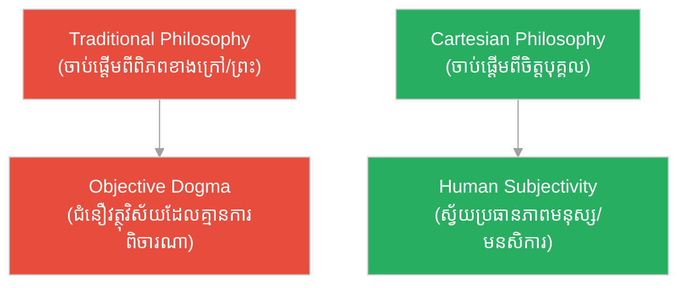

# ស្វ័យប្រធានភាពមនុស្ស៖ Human Subjectivity

**Author:** ichamrong  
**Date:** 2026-06-06  
**Tags:** #philosophy #subjectivity #descartes #epistemology #consciousness #humanism  
**Category:** Keywords  
**Read Time:** ~4 min

---

## 📌 មាតិកា (Table of Contents)
- [សង្ខេបពាក្យគន្លឹះ (Keyword Overview)](#0)
- [១. តើ «ស្វ័យប្រធានភាព» ឬ «សត្វវិស័យភាព» ជាអ្វី? (What is Subjectivity?)](#1)
- [២. របត់ដេកាត និងស្វ័យប្រធានភាពមនុស្ស (The Cartesian Shift to Subjectivity)](#2)
- [៣. ស្វ័យប្រធានភាព ធៀបនឹង វត្ថុវិស័យភាព (Subjectivity vs. Objectivity)](#3)
- [សេចក្តីសន្និដ្ឋាន (Conclusion)](#4)
- [ឯកសារយោង (References)](#5)

---

## សង្ខេបពាក្យគន្លឹះ (Keyword Overview)

**«ស្វ័យប្រធានភាពមនុស្ស»**​ ឬ​ **«សត្វវិស័យភាពមនុស្ស»**​ (**Human Subjectivity**)​ គឺ​ជា​គោលគំនិត​ទស្សនវិជ្ជា​ដែល​ផ្ដោត​លើ​តួនាទី​នៃ​ការ​យល់ដឹង​ មនសិការ​ (Consciousness)​ និង​បទពិសោធន៍​ខាងក្នុង​របស់​បុគ្គល​ម្នាក់ ៗ ក្នុង​នាម​ជា​ប្រធាន​ (Subject)​ ដែល​មើល​ទៅ​កាន់​ពិភពលោក។​ នៅ​ក្នុង​ផ្នែក​ប្រវត្តិសាស្ត្រ​គំនិត​ វា​សំដៅ​លើ​ការ​យក​ «ចិត្ត​ ឬ​មនសិការ​របស់​មនុស្ស»​ ធ្វើ​ជា​ចំណុច​ចាប់ផ្ដើម​ និង​ជា​គ្រឹះ​សម្រេច​នូវ​ចំណេះដឹង​ និង​ការពិត។

**Human Subjectivity** is a philosophical concept emphasizing the role of individual consciousness, perception, and internal experience as the subject looking at the world. In the history of ideas, it refers to using the "human mind/consciousness" as the absolute starting point and foundation of knowledge and truth.

---

## ១. តើ «ស្វ័យប្រធានភាព» ឬ «សត្វវិស័យភាព» ជាអ្វី? (What is Subjectivity?)

ពាក្យ​នេះ​មាន​ការ​បកប្រែ​ជា​ភាសាខ្មែរ​ច្រើន​បែប​ទៅ​តាម​សាលា​ទស្សនវិជ្ជា៖
*   **ស្វ័យប្រធានភាព**: សំដៅ​លើ​ភាព​ជា​ «ប្រធាន»​ (Subject)​ ដែល​មាន​សេរីភាព​ និង​ស្វ័យភាព​ក្នុង​ការ​គិត​ និង​បទពិសោធន៍​ដោយ​ខ្លួនឯង។
*   **សត្វវិស័យភាព**: ជា​ពាក្យ​បច្ចេកសព្ទ​ផ្លូវការ​ដែល​ផ្ទុយ​ពី​ «វត្ថុវិស័យភាព (Objectivity)»។​ វា​សំដៅ​លើ​អ្វី ៗ ដែល​ទាក់ទង​នឹង​ប្រធាន​គិត​ (ចិត្ត​ ឬ​បុគ្គល)​ ជា​ជាង​វត្ថុ​ខាងក្រៅ។

In philosophy, subjectivity refers to the quality of being a subject—an entity that possesses conscious experiences, perspectives, feelings, and beliefs, as opposed to inanimate objects.

---

## ២. របត់ដេកាត និងស្វ័យប្រធានភាពមនុស្ស (The Cartesian Shift to Subjectivity)

មុន​សម័យ​លោក​ René Descartes​ ទស្សនវិជ្ជា​អឺរ៉ុប​ភាគច្រើន​ចាប់ផ្ដើម​ដោយ​ការ​សិក្សា​ពី​ «វត្ថុវិស័យ»​ ខាងក្រៅ​ ដូចជា​ ការ​ពិត​នៃ​ធម្មជាតិ​ អត្ថិភាព​នៃ​ចក្រវាល​ ឬ​សិទ្ធិ​អំណាច​របស់​ព្រះជាម្ចាស់​ (Theocentric/Cosmocentric)។

ប៉ុន្តែ​ ដេកាត​បាន​ធ្វើ​បដិវត្តន៍​គំនិត​ (Cartesian Revolution)​ ដោយ​បង្វែរ​មក​ចាប់ផ្ដើម​ពី​ **«ចិត្តដែលកំពុងគិតរបស់បុគ្គល»**​ វិញ៖
1.  គាត់​បាន​បង្ហាញ​ថា​ អ្វី ៗ ខាងក្រៅ​អាច​ត្រូវ​បាន​គេ​សង្ស័យ​ទាំង​អស់។
2.  អ្វី​ដែល​មិន​អាច​សង្ស័យ​បាន​ គឺ​ «មនសិការ​របស់​អ្នក​កំពុង​គិត»​ (Cogito)。
3.  ហេតុនេះ​ **ស្វ័យប្រធានភាពមនុស្ស (Subjectivity)**​ បាន​ក្លាយ​ជា​ចំណុច​ចាប់ផ្ដើម​ និង​ជា​តម្រង​នៃ​រាល់​ចំណេះដឹង​វិទ្យាសាស្ត្រ​ និង​ការពិត​ទាំងឡាយ។

---

## ៣. ស្វ័យប្រធានភាព ធៀបនឹង វត្ថុវិស័យភាព (Subjectivity vs. Objectivity)

*   **ស្វ័យប្រធានភាព / សត្វវិស័យភាព (Subjectivity)**: ផ្អែក​លើ​គំនិត​ អារម្មណ៍​ ជំនឿ​ និង​ការ​បកស្រាយ​ខាងក្នុង​របស់​បុគ្គល​ម្នាក់ ៗ។​ ឧទាហរណ៍៖​ រសជាតិ​នៃ​អាហារ​ សោភណភាព​សិល្បៈ​ ឬ​ការ​សង្ស័យ​ Cartesian។
*   **វត្ថុវិស័យភាព (Objectivity)**: ផ្អែក​លើ​ការពិត​ស្ដែង​ខាងក្រៅ​ដែល​មិន​ប្រែប្រួល​ទៅ​តាម​អារម្មណ៍​របស់​បុគ្គល​ឡើយ។​ ឧទាហរណ៍៖​ រូបមន្ត​គណិតវិទ្យា​ ច្បាប់​ទំនាញ​ផែនដី​ ឬ​ប្រវែង​វត្ថុ។

---

## សេចក្តីសន្និដ្ឋាន (Conclusion)

ការ​ទទួល​ស្គាល់​នូវ​ **«ស្វ័យប្រធានភាពមនុស្ស»**​ គឺ​ជា​កម្លាំង​ជម្រុញ​ដ៏​ខ្លាំងក្លា​ដល់​ចលនា​មនុស្សធម៌​ (Humanism)​ និង​សេរីភាព​នៃការគិត។​ វា​ជួយ​ឱ្យ​មនុស្ស​ម្នាក់ ៗ យល់​ដឹង​ពី​តម្លៃ​នៃ​មនសិការ​ សេរីភាព​សម្រេចចិត្ត​ និង​ទំនួលខុសត្រូវ​លើ​ការ​បង្កើត​អត្ថន័យ​ជីវិត​របស់​ខ្លួន។

---

## ឯកសារយោង (References)

* **Descartes, R.** (1637). *Discourse on the Method*.
* **Kant, I.** (1781). *Critique of Pure Reason*.
