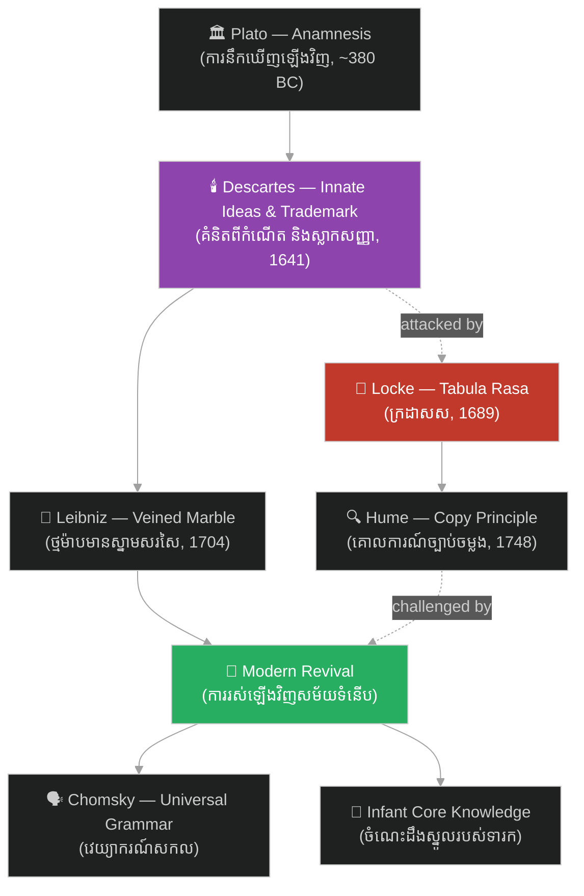

# គំនិតពីកំណើត៖ Innate Ideas

**Author:** ichamrong  
**Date:** 2026-06-12  
**Tags:** #philosophy #innate-ideas #descartes #rationalism #empiricism #epistemology  
**Category:** Keywords  
**Read Time:** ~5 min

---

## 📌 មាតិកា (Table of Contents)
- [សង្ខេបពាក្យគន្លឹះ (Keyword Overview)](#0)
- [១. តើគំនិតពីកំណើតជាអ្វី? (What are Innate Ideas?)](#1)
- [២. ប្រវត្តិ និងដើមកំណើត (History & Origin)](#2)
  - [២.១ ផ្លាតុង និងការនឹកឃើញឡើងវិញ (Plato & Anamnesis)](#2-1)
  - [២.២ ដេកាត និងគំនិតអំពីព្រះ (Descartes & the Idea of God)](#2-2)
  - [២.៣ ឡាយប្និតស៍ និងថ្មម៉ាបមានស្នាមសរសៃ (Leibniz & the Veined Marble)](#2-3)
- [៣. ការវាយប្រហារពីពិសោធន៍និយម (The Empiricist Attack)](#3)
- [៤. ការរស់ឡើងវិញក្នុងវិទ្យាសាស្ត្រសម័យទំនើប (The Modern Revival)](#4)
- [៥. ធម្មជាតិ ឬការចិញ្ចឹមបីបាច់? (Nature vs Nurture Today)](#5)
- [សេចក្តីសន្និដ្ឋាន (Conclusion)](#6)
- [ឯកសារយោង (References)](#7)

---

## សង្ខេបពាក្យគន្លឹះ (Keyword Overview)

**«គំនិតពីកំណើត (Innate Ideas)»**​ គឺ​ជា​គំនិត​ ឬ​ចំណេះដឹង​ដែល​ត្រូវ​បាន​អះអាង​ថា​ មាន​ស្រាប់​ក្នុង​ចិត្ត​មនុស្ស​តាំង​ពី​កំណើត​ — មិន​មែន​បាន​មក​ពី​បទពិសោធន៍​ ឬ​ការ​រៀនសូត្រ​ឡើយ។​ វា​ជា​សសរស្តម្ភ​មួយ​នៃ​ **«ហេតុផលនិយម (Rationalism)»**​ ដែល​មាន​ Plato, René Descartes​ និង​ Gottfried Leibniz​ ជា​អ្នក​ការពារ​ល្បី ៗ ហើយ​ត្រូវ​បាន​វាយប្រហារ​យ៉ាង​ខ្លាំង​ដោយ​ **«ពិសោធន៍និយម (Empiricism)»**​ របស់​ John Locke​ និង​ David Hume។​ គួរ​ឱ្យ​ភ្ញាក់ផ្អើល​ ជម្លោះ​ដែល​មាន​អាយុ​ជាង​ ២០០០​ ឆ្នាំ​នេះ​ បាន​រស់​ឡើង​វិញ​ក្នុង​សតវត្ស​ទី​ ២០​ តាម​រយៈ​ភាសាវិទ្យា​របស់​ Noam Chomsky​ និង​ការ​ស្រាវជ្រាវ​លើ​ទារក​ក្នុង​វិទ្យាសាស្ត្រ​ការយល់ដឹង។

**Innate ideas** are ideas or knowledge claimed to be present in the human mind from birth — not derived from experience or learning. The concept is a pillar of **Rationalism**, defended famously by Plato, René Descartes, and Gottfried Leibniz, and fiercely attacked by the **Empiricism** of John Locke and David Hume. Remarkably, this 2,000-year-old dispute came back to life in the 20th century through Noam Chomsky's linguistics and infant research in cognitive science.

---

## ១. តើគំនិតពីកំណើតជាអ្វី? (What are Innate Ideas?)

សំណួរ​ស្នូល​គឺ​សាមញ្ញ៖​ នៅ​ពេល​ទារក​ម្នាក់​កើត​មក​ តើ​ចិត្ត​របស់​គេ​ទទេ​ស្អាត​ ឬ​ក៏​មាន​ «ឧបករណ៍»​ ខ្លះ​ភ្ជាប់​មក​ជា​ស្រាប់?​ អ្នក​ការពារ​គំនិតពីកំណើត​ អះអាង​ថា​ ចំណេះដឹង​មួយ​ចំនួន​ — ដូចជា​ គោលការណ៍​តក្កវិជ្ជា​ គំនិត​គណិតវិទ្យា​ (ត្រីកោណ​ ចំនួន)​ គំនិត​អំពី​ភាព​ល្អឥតខ្ចោះ​ ឬ​អំពី​ព្រះ​ — មិន​អាច​ត្រូវ​បាន​ពន្យល់​ដោយ​បទពិសោធន៍​បាន​ទេ​ ព្រោះ​បទពិសោធន៍​មិន​ដែល​ផ្តល់​ឱ្យ​យើង​នូវ​ភាព​ល្អឥតខ្ចោះ​ ឬ​ភាព​អនន្ត​ណា​មួយ​ឡើយ​ — យើង​ឃើញ​តែ​បន្ទាត់​កោង ៗ មិន​ដែល​ឃើញ​បន្ទាត់​ត្រង់​ឥតខ្ចោះ​ទេ។

The core question is simple: when a baby is born, is its mind completely empty, or does it come with some "equipment" pre-installed? Defenders of innate ideas argue that certain knowledge — logical principles, mathematical ideas (triangle, number), the idea of perfection or of God — cannot be explained by experience, because experience never actually shows us anything perfect or infinite: we see only roughly curved lines, never a perfectly straight one.

ត្រូវ​ប្រយ័ត្ន​នូវ​ការ​យល់​ច្រឡំ​មួយ៖​ «ពីកំណើត»​ មិន​មាន​ន័យ​ថា​ ទារក​ដឹង​អ្វី ៗ ទាំងអស់​ភ្លាម ៗ នោះ​ទេ។​ អ្នក​ហេតុផលនិយម​ភាគច្រើន​ និយាយ​ត្រឹម​ថា​ ចិត្ត​មាន​ **សក្តានុពល​ ឬ​រចនាសម្ព័ន្ធ​ពីកំណើត**​ ដែល​បទពិសោធន៍​គ្រាន់​តែ​ជា​អ្នក​ដាស់​ឱ្យ​ភ្ញាក់​ប៉ុណ្ណោះ​ — ដូច​គ្រាប់ពូជ​ដែល​ត្រូវការ​ទឹក​ភ្លៀង​ ដើម្បី​ដុះ​ ប៉ុន្តែ​ទឹក​ភ្លៀង​មិន​មែន​ជា​អ្នក​បង្កើត​គ្រាប់ពូជ​ឡើយ។

Beware of a common misunderstanding: "innate" does not mean babies know everything instantly. Most rationalists claim only that the mind has an **innate potential or structure** which experience merely awakens — like a seed that needs rain to grow, though the rain does not create the seed.

---

## ២. ប្រវត្តិ និងដើមកំណើត (History & Origin)

### ២.១ ផ្លាតុង និងការនឹកឃើញឡើងវិញ (Plato & Anamnesis)

ទម្រង់​ដំបូង​បំផុត​នៃ​ទ្រឹស្តី​នេះ​ មាន​ក្នុង​កិច្ចសន្ទនា​ *Meno*​ របស់​ Plato​ (ប្រមាណ​ ៣៨០​ ឆ្នាំ​មុន​គ្រិស្តសករាជ)។​ Socrates​ បាន​សួរ​សំណួរ​ធរណីមាត្រ​ជា​បន្តបន្ទាប់​ ទៅ​កាន់​ក្មេង​បម្រើ​ម្នាក់​ដែល​មិន​ដែល​រៀន​គណិតវិទ្យា​សោះ​ ហើយ​ក្មេង​នោះ​បាន​ «រកឃើញ»​ ដោយ​ខ្លួនឯង​ នូវ​ដំណោះស្រាយ​ចំពោះ​ចំណោទ​ការ៉េ​ទ្វេ​ផ្ទៃក្រឡា។​ Plato​ សន្និដ្ឋាន​ថា​ ការ​រៀន​ពិត​ប្រាកដ​ គឺ​ជា​ **«ការនឹកឃើញឡើងវិញ (Anamnesis)»**​ — ព្រលឹង​ធ្លាប់​ស្គាល់​ការពិត​ទាំង​នេះ​រួច​ហើយ​ មុន​ពេល​កើត​ ហើយ​សំណួរ​ល្អ​ គ្រាន់​តែ​ជួយ​ឱ្យ​វា​នឹក​ឃើញ​វិញ​ប៉ុណ្ណោះ។

The earliest form of the theory appears in Plato's dialogue *Meno* (c. 380 BC). Socrates asks a series of geometry questions to an uneducated slave boy, who then "discovers" by himself the solution to doubling the area of a square. Plato concludes that real learning is **anamnesis** (recollection) — the soul already knew these truths before birth, and good questions merely help it remember.

### ២.២ ដេកាត និងគំនិតអំពីព្រះ (Descartes & the Idea of God)

ក្នុង​ការសញ្ជឹងគិត​ទី​ ៣​ នៃ​ *Meditations on First Philosophy*​ (១៦៤១)​ ដេកាត​បាន​បែងចែក​គំនិត​ទាំងអស់​ជា​ ៣​ ប្រភេទ៖​ **«គំនិតពីកំណើត (Innate Ideas)»**​ ដែល​មាន​ស្រាប់​ក្នុង​ធម្មជាតិ​នៃ​ចិត្ត​ **«គំនិតមកពីខាងក្រៅ (Adventitious Ideas)»**​ ដែល​ហាក់​ដូចជា​មក​ពី​ពិភព​ខាងក្រៅ​ (កំដៅ​ភ្លើង​ សំឡេង)​ និង​ **«គំនិតប្រឌិត (Factitious Ideas)»**​ ដែល​ខ្ញុំ​ផ្សំ​បង្កើត​ដោយ​ខ្លួនឯង​ (ទេពអប្សរសមុទ្រ​ ហ៊ីប៉ូហ្គ្រីហ្វ)។​ ក្នុង​ចំណោម​គំនិតពីកំណើត​ទាំងអស់​ មាន​មួយ​ដែល​ពិសេស​ជាង​គេ៖​ គំនិត​អំពី​សភាវៈ​អនន្ត​ និង​ល្អឥតខ្ចោះ​ — ព្រះ។​ ដោយសារ​ខ្ញុំ​ជា​សភាវៈ​មានកំណត់​ មិន​អាច​ជា​ប្រភព​នៃ​គំនិត​អនន្ត​បែប​នេះ​បាន​ ដេកាត​សន្និដ្ឋាន​ថា​ ព្រះ​ផ្ទាល់​ជា​អ្នក​ដាក់​វា​ក្នុង​ចិត្ត​ខ្ញុំ​ «ដូច​ស្លាកសញ្ញា​ដែល​ជាង​សិប្បកម្ម​ចារ​លើ​ស្នាដៃ​របស់​ខ្លួន»​ — នេះ​ហើយ​ជា​ **«អំណះអំណាងស្លាកសញ្ញា (Trademark Argument)»**​ ដ៏​ល្បីល្បាញ។

In Meditation III of the *Meditations on First Philosophy* (1641), Descartes divides all ideas into 3 kinds: **innate ideas**, present in the very nature of the mind; **adventitious ideas**, which seem to come from the external world (the heat of a fire, sounds); and **factitious ideas**, which I compose myself (sirens, hippogriffs). Among the innate ideas, one is special: the idea of an infinite, perfect being — God. Since I am a finite being and cannot be the source of such an infinite idea, Descartes concludes that God himself placed it in my mind "like the mark a craftsman stamps on his work" — the famous **Trademark Argument**.

### ២.៣ ឡាយប្និតស៍ និងថ្មម៉ាបមានស្នាមសរសៃ (Leibniz & the Veined Marble)

ក្នុង​សៀវភៅ​ *New Essays on Human Understanding*​ (សរសេរ​ ១៧០៤)​ Gottfried Leibniz​ បាន​ផ្តល់​ឧបមា​ដ៏​ស្រស់ស្អាត​បំផុត​មួយ​ ដើម្បី​ឆ្លើយ​តប​នឹង​ Locke៖​ ចិត្ត​មិន​មែន​ជា​ថ្មម៉ាប​រលោង​ស្មើ​ ដែល​អាច​ឆ្លាក់​ជា​រូប​អ្វី​ក៏​បាន​នោះ​ទេ​ ប៉ុន្តែ​ជា​ **ថ្មម៉ាប​ដែល​មាន​ស្នាមសរសៃ​ពី​ធម្មជាតិ​ស្រាប់**​ — ស្នាមសរសៃ​ដែល​គូស​បង្ហាញ​រូបរាង​របស់​ Hercules​ រួច​ជា​ស្រេច។​ ជាង​ឆ្លាក់​ (បទពិសោធន៍)​ នៅ​តែ​ត្រូវ​ខំ​ដាប់​ ខំ​ខាត់​ ដើម្បី​ឱ្យ​រូប​នោះ​លេច​ចេញ​ ប៉ុន្តែ​រូបរាង​នោះ​ មាន​ក្នុង​ថ្ម​ជា​មុន​រួច​ទៅ​ហើយ។​ ដូច្នេះ​ ចំណេះដឹង​គឺ​ពីកំណើត​ ក្នុង​ន័យ​ជា​ **ទំនោរ​ និង​រចនាសម្ព័ន្ធ**​ មិន​មែន​ជា​រូបភាព​ស្រេច​បាច់​ឡើយ។

In his *New Essays on Human Understanding* (written 1704), Gottfried Leibniz offered one of the most beautiful analogies in reply to Locke: the mind is not a uniform block of marble that can be carved into any shape, but **marble already veined by nature** — veins that already trace the figure of Hercules. The sculptor (experience) must still labor to bring the figure out, but the shape was in the stone beforehand. Knowledge is thus innate as **disposition and structure**, not as ready-made pictures.

---

## ៣. ការវាយប្រហារពីពិសោធន៍និយម (The Empiricist Attack)

ការ​វាយប្រហារ​ដ៏​ធ្ងន់​បំផុត​ មក​ពី​ John Locke​ ក្នុង​សៀវភៅ​ *An Essay Concerning Human Understanding*​ (១៦៨៩)។​ Locke​ អះអាង​ថា​ ចិត្ត​ពេល​កើត​ គឺ​ដូច​ **«ក្រដាសស (White Paper / Tabula Rasa)»**​ — គ្មាន​អក្សរ​ គ្មាន​គំនិត​អ្វី​ទាំងអស់​ — ហើយ​បទពិសោធន៍​ទាំង​ពីរ​ប្រភេទ​ (វិញ្ញាណ​ខាងក្រៅ​ និង​ការ​ឆ្លុះបញ្ចាំង​ខាងក្នុង)​ ជា​អ្នក​សរសេរ​អ្វី ៗ គ្រប់យ៉ាង​លើ​វា។​ អំណះអំណាង​សំខាន់​របស់​គាត់៖​ បើ​គំនិត​ណា​មួយ​ពិត​ជា​មាន​ពីកំណើត​មែន​ មនុស្ស​គ្រប់​រូប​ត្រូវ​តែ​ដឹង​វា​ — ប៉ុន្តែ​ក្មេង​តូច ៗ និង​មនុស្ស​ខ្សោយ​ប្រាជ្ញា​ មិន​ស្គាល់​សូម្បី​តែ​គោលការណ៍​តក្កវិជ្ជា​មូលដ្ឋាន​ផង​ ដូច្នេះ​ «ការ​យល់ព្រម​ជា​សកល»​ ដែល​អ្នក​ហេតុផលនិយម​អាង​ គឺ​មិន​មាន​ពិត​ឡើយ។

The heaviest attack came from John Locke in *An Essay Concerning Human Understanding* (1689). Locke argued that the mind at birth is **white paper (tabula rasa)** — void of all characters and ideas — and that experience in its two forms (outer sensation and inner reflection) writes everything upon it. His key argument: if any idea were truly innate, everyone would have to know it — yet young children and the mentally impaired do not know even basic logical principles, so the "universal assent" rationalists appeal to simply does not exist.

David Hume​ បាន​បន្ត​វាយ​ឱ្យ​កាន់​តែ​ជ្រៅ​ ដោយ​ **«គោលការណ៍ច្បាប់ចម្លង (Copy Principle)»**​ របស់​គាត់៖​ គំនិត​ (Ideas)​ ទាំងអស់​ គឺ​ជា​ច្បាប់​ចម្លង​ស្រអាប់​ នៃ​ការ​ចាប់អារម្មណ៍​ (Impressions)​ ដែល​រស់រវើក​ជាង។​ ចង់​ដឹង​ថា​ គំនិត​ណា​មួយ​ពិត​ឬ​ទទេ?​ ចូរ​សួរ​ថា៖​ «តើ​វា​ចម្លង​ពី​ការ​ចាប់អារម្មណ៍​ណា?»​ បើ​រក​ប្រភព​មិន​ឃើញ​ គំនិត​នោះ​គួរ​ត្រូវ​បាន​សង្ស័យ។​ ចំពោះ​ Hume​ សូម្បី​តែ​គំនិត​អំពី​ព្រះ​ ក៏​គ្រាន់​តែ​ជា​ការ​ពង្រីក​គ្មាន​ដែន​កំណត់​ នូវ​គុណសម្បត្តិ​ល្អ ៗ ដែល​យើង​ធ្លាប់​ឃើញ​ក្នុង​មនុស្ស​ប៉ុណ្ណោះ​ — ពោល​គឺ​ជា​គំនិតប្រឌិត​ មិន​មែន​គំនិតពីកំណើត​ឡើយ។

David Hume pressed the attack deeper with his **Copy Principle**: all ideas are faint copies of more vivid impressions. Want to know whether an idea is genuine or empty? Ask: "From which impression is it copied?" If no source can be found, the idea deserves suspicion. For Hume, even the idea of God is merely an unlimited amplification of good qualities we have observed in humans — a factitious idea, not an innate one.

---

## ៤. ការរស់ឡើងវិញក្នុងវិទ្យាសាស្ត្រសម័យទំនើប (The Modern Revival)

នៅ​ទសវត្សរ៍​ ១៩៥០–៦០​ Noam Chomsky​ បាន​ធ្វើ​ឱ្យ​ជម្លោះ​នេះ​រស់​ឡើង​វិញ​ ក្នុង​វិស័យ​ភាសាវិទ្យា។​ គាត់​សង្កេត​ឃើញ​ថា​ ក្មេង​គ្រប់​រូប​រៀន​ភាសា​កំណើត​បាន​យ៉ាង​លឿន​ ទាំង​ដែល​ឃ្លា​ដែល​ពួកគេ​ឮ​ មាន​ចំនួន​តិច​ មិន​ពេញលេញ​ និង​ច្រើន​តែ​មាន​កំហុស​ — បាតុភូត​ដែល​គេ​ហៅ​ថា​ **«ភាពក្រខ្សត់នៃទិន្នន័យបញ្ចូល (Poverty of the Stimulus)»**។​ ទិន្នន័យ​តិចតួច​បែប​នេះ​ មិន​អាច​ពន្យល់​ពី​សមត្ថភាព​បង្កើត​ឃ្លា​ថ្មី ៗ រាប់​មិន​អស់​ បាន​ទេ​ — លុះត្រា​តែ​ខួរក្បាល​មនុស្ស​ មាន​ **«វេយ្យាករណ៍សកល (Universal Grammar)»**​ ជា​រចនាសម្ព័ន្ធ​ភ្ជាប់​មក​ពី​កំណើត​ស្រាប់។​ នេះ​គឺ​ជា​ទម្រង់​វិទ្យាសាស្ត្រ​ នៃ​ថ្មម៉ាប​មាន​ស្នាមសរសៃ​របស់​ Leibniz។

In the 1950s–60s, Noam Chomsky revived the dispute within linguistics. He observed that every child learns its native language remarkably fast, even though the sentences it hears are few, fragmentary, and often flawed — the phenomenon called the **poverty of the stimulus**. Such meager input cannot explain the ability to produce endlessly many new sentences — unless the human brain comes pre-wired with a **Universal Grammar**. This is a scientific descendant of Leibniz's veined marble.

ការ​ស្រាវជ្រាវ​លើ​ទារក​ ក៏​បាន​បន្ថែម​ភស្តុតាង​ដែរ។​ អ្នក​វិទ្យាសាស្ត្រ​ដូចជា​ Elizabeth Spelke​ និង​ Stanislas Dehaene​ បាន​បង្ហាញ​ថា​ ទារក​អាយុ​ប៉ុន្មាន​ខែ​ — សូម្បី​អាយុ​ប៉ុន្មាន​ថ្ងៃ​ — មាន​ **«ចំណេះដឹងស្នូល (Core Knowledge)»**​ មួយ​ចំនួន​រួច​ហើយ៖​ ពួកគេ​ភ្ញាក់ផ្អើល​ ពេល​វត្ថុ​មួយ​ដើរ​ធ្លុះ​វត្ថុ​មួយ​ទៀត​ (ការ​យល់​ពី​វត្ថុ​រឹង)​ ហើយ​មាន​ **«ញាណចំនួន (Number Sense)»**​ ដែល​អាច​បែងចែក​បរិមាណ​ ២​ ពី​ ៣​ បាន​ មុន​ពេល​ចេះ​និយាយ​ទៅ​ទៀត។​ ប៉ុន្តែ​ ត្រូវ​កត់សម្គាល់​ថា​ អ្វី​ដែល​វិទ្យាសាស្ត្រ​រកឃើញ​ គឺ​ជា​ «យន្តការ​ពីកំណើត»​ — មិន​មែន​ជា​គំនិត​អំពី​ព្រះ​ ឬ​ការពិត​អនន្ត​ ដូច​ដែល​ដេកាត​អះអាង​នោះ​ឡើយ។

Infant research has added further evidence. Scientists such as Elizabeth Spelke and Stanislas Dehaene have shown that babies only months — even days — old already possess certain **core knowledge**: they show surprise when one object passes through another (an understanding of solid objects), and they have a **number sense** that distinguishes quantities of 2 from 3 before they can speak. Note, however, that what science has found are "innate mechanisms" — not the idea of God or infinite truths that Descartes claimed.

---

## ៥. ធម្មជាតិ ឬការចិញ្ចឹមបីបាច់? (Nature vs Nurture Today)

តើ​នរណា​ឈ្នះ?​ ចម្លើយ​សម័យ​ទំនើប​ គឺ​ «ទាំង​ពីរ​ — ហើយ​ក៏​មិន​មែន​ទាំង​ពីរ»។​ ភាគី​ហេតុផលនិយម​និយាយ​ត្រូវ​ថា​ ចិត្ត​មិន​មែន​ជា​ក្រដាស​ទទេ​ស្អាត​ទេ៖​ ខួរក្បាល​មក​ជាមួយ​រចនាសម្ព័ន្ធ​ ទំនោរ​ និង​យន្តការ​រៀនសូត្រ​ឯកទេស​ជា​ច្រើន។​ ភាគី​ពិសោធន៍និយម​ក៏​និយាយ​ត្រូវ​ដែរ​ថា​ គ្មាន​ចំណេះដឹង​ណា​មួយ​លូតលាស់​បាន​ ដោយ​គ្មាន​បទពិសោធន៍​ឡើយ៖​ ក្មេង​ដែល​មិន​ដែល​ឮ​ភាសា​ នឹង​មិន​និយាយ​ភាសា​ណា​មួយ​ឡើយ​ ទោះ​មាន​វេយ្យាករណ៍សកល​ក៏​ដោយ។​ សំណួរ​ដែល​នៅ​រស់​សព្វថ្ងៃ​ មិន​មែន​ «ធម្មជាតិ​ ឬ​ការចិញ្ចឹមបីបាច់?»​ ទេ​ ប៉ុន្តែ​ «តើ​ធម្មជាតិ​ និង​ការចិញ្ចឹមបីបាច់​ **ធ្វើការ​ជាមួយ​គ្នា​យ៉ាង​ដូចម្តេច**?»

So who won? The modern answer is "both — and neither." The rationalists were right that the mind is no blank sheet: the brain comes with structures, biases, and specialized learning mechanisms. The empiricists were right that no knowledge develops without experience: a child who never hears language will speak none, Universal Grammar or not. The living question today is not "nature or nurture?" but "**how exactly do nature and nurture work together?**"

មេរៀន​ជាក់ស្តែង​សម្រាប់​យើង៖​ ពេល​បង្រៀន​កូន​ ឬ​បណ្តុះបណ្តាល​បុគ្គលិក​ កុំ​គិត​ថា​ អ្នក​កំពុង​សរសេរ​លើ​ក្រដាស​ទទេ​ — អ្នក​កំពុង​ដាប់​ថ្មម៉ាប​ដែល​មាន​ស្នាមសរសៃ​ស្រាប់។​ ការ​បង្រៀន​ល្អ​បំផុត​ គឺ​ដូច​សំណួរ​របស់​ Socrates​ ក្នុង​ *Meno*៖​ ស្វែងរក​សក្តានុពល​ដែល​មាន​ស្រាប់​ ហើយ​ដាស់​វា​ឱ្យ​ភ្ញាក់​ — មិន​មែន​ចាក់​បញ្ចូល​ទិន្នន័យ​ទទេ ៗ ឡើយ។

A practical lesson for us: when teaching a child or training a colleague, do not assume you are writing on blank paper — you are sculpting marble that already has veins. The best teaching is like Socrates' questions in the *Meno*: find the potential already there and awaken it, rather than pouring in raw data.

---

## សេចក្តីសន្និដ្ឋាន (Conclusion)

**«គំនិតពីកំណើត (Innate Ideas)»**​ គឺ​ជា​សមរភូមិ​កណ្តាល​មួយ​ នៃ​ជម្លោះ​រវាង​ហេតុផលនិយម​ និង​ពិសោធន៍និយម​ អស់​រយៈពេល​ជាង​ ២០០០​ ឆ្នាំ៖​ ពី​ការនឹកឃើញឡើងវិញ​របស់​ Plato​ ដល់​ស្លាកសញ្ញា​របស់​ដេកាត​ ដល់​ក្រដាសស​របស់​ Locke​ រហូត​ដល់​វេយ្យាករណ៍សកល​របស់​ Chomsky។​ អ្វី​ដែល​ផ្លាស់ប្តូរ​ គឺ​ឧបករណ៍​ — ពី​អំណះអំណាង​ទស្សនវិជ្ជា​ ទៅ​ការ​ពិសោធន៍​លើ​ទារក​ — ប៉ុន្តែ​សំណួរ​ស្នូល​នៅ​ដដែល៖​ តើ​ចិត្ត​មនុស្ស​ យក​អ្វី​មក​ជាមួយ​ ពេល​វា​មក​ដល់​ពិភពលោក​នេះ?

**Innate ideas** have been a central battlefield in the 2,000-year war between rationalism and empiricism: from Plato's recollection, to Descartes' trademark, to Locke's blank paper, to Chomsky's Universal Grammar. The tools have changed — from philosophical argument to infant experiments — but the core question remains: what does the human mind bring with it when it arrives in the world?

---

## ឯកសារយោង (References)

* **Plato.** *Meno* (c. 380 BC) — the slave-boy geometry demonstration and the theory of anamnesis.
* **Descartes, R.** (1641). *Meditations on First Philosophy*, Meditation III.
* **Locke, J.** (1689). *An Essay Concerning Human Understanding*, Book I.
* **Leibniz, G. W.** (1704/1765). *New Essays on Human Understanding*, Preface.
* **Chomsky, N.** (1965). *Aspects of the Theory of Syntax*; (1959) review of Skinner's *Verbal Behavior*.
* **Dehaene, S.** (1997). *The Number Sense*; **Spelke, E.** — core knowledge research.
* [ជំពូកស៊ីជម្រៅ៖ គំនិត និងកម្រិតនៃតថភាព (Deep dive: Ideas and Degrees of Reality)](../books/philosophy/meditations-on-first-philosophy/04-meditation-3-ideas-and-reality.md)
* [ជំពូកស៊ីជម្រៅ៖ រង្វង់ដេកាត និងការរិះគន់ (Deep dive: The Cartesian Circle & Critiques)](../books/philosophy/meditations-on-first-philosophy/06-meditation-3-circle-and-critiques.md)
