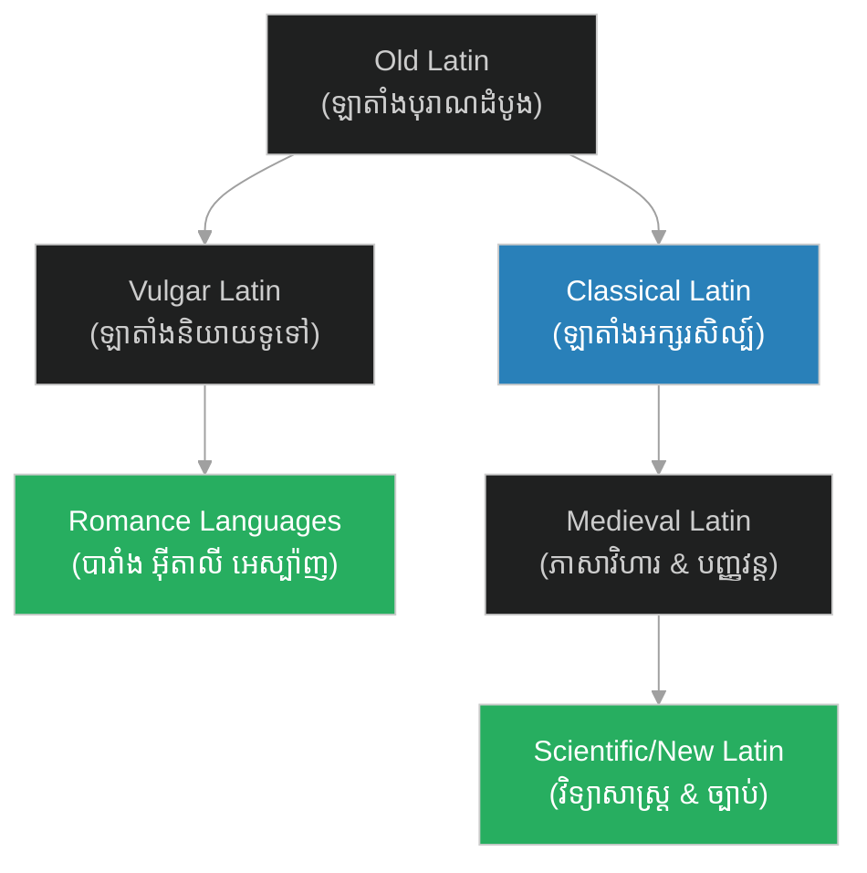

# ភាសាឡាតាំង៖ Latin Language

**Author:** ichamrong  
**Date:** 2026-06-06  
**Tags:** #language #latin #history #philosophy #science #lingua-franca  
**Category:** Keywords  
**Read Time:** ~4 min

---

## 📌 មាតិកា (Table of Contents)
- [សង្ខេបពាក្យគន្លឹះ (Keyword Overview)](#0)
- [១. តើភាសាឡាតាំងជាអ្វី? (What is Latin?)](#1)
- [២. ប្រវត្តិសង្ខេបនៃភាសាឡាតាំង (Brief History of Latin)](#2)
- [៣. ឥទ្ធិពលក្នុងវិទ្យាសាស្ត្រ និងទស្សនវិជ្ជា (Influence in Science & Philosophy)](#3)
- [សេចក្តីសន្និដ្ឋាន (Conclusion)](#4)
- [ឯកសារយោង (References)](#5)

---

## សង្ខេបពាក្យគន្លឹះ (Keyword Overview)

ភាសាឡាតាំង​​ (**Latin**)​​ គឺ​​ជា​​ភាសា​​បុរាណ​​មួយ​​ដែល​​មាន​​ដើម​​កំណើត​​នៅ​​តំបន់​​ឡាត្យូម​​ (Latium)​​ នៃ​​ប្រទេស​​អ៊ីតាលី​​បុរាណ​​ និង​​បាន​​ក្លាយ​​ជា​​ភាសា​​ផ្លូវការ​​របស់​​អាណាចក្រ​​រ៉ូម​​ (Roman Empire)។​​ ទោះបី​​ជា​​បច្ចុប្បន្ន​​វា​​ត្រូវ​​បាន​​ចាត់ទុក​​ថា​​ជា​​ «ភាសាងាប់ (Dead Language)»​​ (ព្រោះ​​គ្មាន​​អ្នក​​ប្រើ​​ជា​​ភាសាកំណើត​​ប្រចាំថ្ងៃ)​​ ក៏ដោយ​​ ក៏​​វា​​នៅ​​តែ​​មាន​​ឥទ្ធិពល​​យ៉ាង​​ជ្រាលជ្រៅ​​លើ​​ភាសា​​អឺរ៉ុប​​ វិទ្យាសាស្ត្រ​​ ច្បាប់​​ និង​​ទស្សនវិជ្ជា។

Latin is a classical language originally spoken in Latium, Italy. It became the official language of the Roman Empire. Although considered a "dead language" today because it lacks native speakers, it remains highly influential in European languages, science, law, and philosophy.

---

## ១. តើភាសាឡាតាំងជាអ្វី? (What is Latin?)

ភាសាឡាតាំង​​ គឺ​​ជា​​សមាជិក​​នៃ​​ក្រុម​​ភាសា​​ឥណ្ឌូ-អឺរ៉ុប​​ (Indo-European languages)។​​ អក្សរ​​ឡាតាំង​​ (Latin Alphabet)​​ ដែល​​បាន​​អភិវឌ្ឍ​​ចេញ​​ពី​​អក្សរ​​ក្រិក​​បុរាណ​​ បាន​​ក្លាយ​​ជា​​ប្រព័ន្ធ​​សរសេរ​​ដែល​​ត្រូវ​​បាន​​ប្រើប្រាស់​​ច្រើន​​ជាង​​គេ​​បំផុត​​នៅ​​លើ​​ពិភពលោក​​នា​​ពេល​​បច្ចុប្បន្ន​​ (រួម​​ទាំង​​ភាសា​​អង់គ្លេស​​ បារាំង​​ អេស្ប៉ាញ​​ វៀតណាម​​ ជាដើម)។

Latin belongs to the Indo-European language family. The Latin alphabet, derived from the Greek alphabet, is now the most widely used writing system globally.

---

## ២. ប្រវត្តិសង្ខេបនៃភាសាឡាតាំង (Brief History of Latin)

ប្រវត្តិ​​របស់​​ភាសាឡាតាំង​​អាច​​បែងចែក​​ជា​​ដំណាក់កាល​​ធំៗ​​ដូច​​ខាងក្រោម៖

*   **ឡាតាំងបុរាណ (Classical Latin)**: ប្រើប្រាស់​​ក្នុង​​សម័យ​​អាណាចក្រ​​រ៉ូម​​ (សតវត្ស​​ទី​​ ១​​ មុន​​គ.ស​​ ដល់​​សតវត្ស​​ទី​​ ៦​​ នៃ​​គ.ស)។​​ វា​​គឺ​​ជា​​ភាសា​​របស់​​អ្នក​​នយោបាយ​​ អ្នក​​និពន្ធ​​ និង​​ទស្សនវិទូ​​ល្បីៗ​​ដូចជា​​ Cicero, Julius Caesar, និង​​ Virgil។
*   **ឡាតាំងសាមញ្ញ (Vulgar Latin)**: ភាសា​​និយាយ​​ប្រចាំថ្ងៃ​​របស់​​ប្រជាជន​​រ៉ូម៉ាំង​​ទូទៅ។​​ ក្រោយ​​ការ​​ដួលរលំ​​នៃ​​អាណាចក្រ​​រ៉ូម​​ ភាសា​​នេះ​​បាន​​វិវត្ត​​ទៅ​​ជា​​ **«ភាសាក្រុមរ៉ូម៉ាំង (Romance Languages)»**​​ ដូចជា​​ ភាសាបារាំង​​ អ៊ីតាលី​​ អេស្ប៉ាញ​​ ព័រទុយហ្គាល់​​ និង​​រ៉ូម៉ានី។
*   **ឡាតាំងមជ្ឈិមសម័យ និងក្រុមហ៊ុនបញ្ញវន្ត (Medieval & Renaissance Latin)**: ប្រើប្រាស់​​ជា​​ភាសា​​សកល​​ (Lingua Franca)​​ សម្រាប់​​ការ​​អប់រំ​​ វិទ្យាសាស្ត្រ​​ និង​​សាសនាកាតូលិក​​នៅ​​ទូទាំង​​អឺរ៉ុប​​រហូត​​ដល់​​សតវត្ស​​ទី​​ ១៧។

---

## ៣. ឥទ្ធិពលក្នុងវិទ្យាសាស្ត្រ និងទស្សនវិជ្ជា (Influence in Science & Philosophy)

ទោះបី​​ជា​​ដេកាត​​បាន​​សរសេរ​​សៀវភៅ​​ *Discourse on the Method*​​ ជា​​ភាសាបារាំង​​ក្តី​​ ក៏​​ឃ្លា​​ដ៏​​ល្បី​​របស់​​គាត់​​ត្រូវ​​បាន​​ស្គាល់​​ជា​​សកល​​តាម​​រយៈ​​ភាសាឡាតាំង៖​​ **«Cogito, ergo sum»**​​ (I think, therefore I am)។​​ នា​​សម័យ​​នោះ​​ រាល់​​ស្នាដៃ​​វិទ្យាសាស្ត្រ​​ធំៗ​​ដូចជា​​ *Principia Mathematica*​​ របស់​​លោក​​ Isaac Newton​​ ក៏​​សរសេរ​​ជា​​ភាសាឡាតាំង​​ដែរ។

មូលហេតុ​​ដែល​​ភាសាឡាតាំង​​ត្រូវ​​បាន​​ប្រើ​​ក្នុង​​វិទ្យាសាស្ត្រ៖
1.  **ភាសាសកល (Lingua Franca)**: ជួយ​​ឱ្យ​​អ្នក​​វិទ្យាសាស្ត្រ​​មក​​ពី​​ប្រទេស​​ផ្សេងៗ​​ (បារាំង​​ អង់គ្លេស​​ អាល្លឺម៉ង់)​​ អាច​​អាន​​ និង​​យល់​​គំនិត​​គ្នា​​ទៅវិញទៅមក​​បាន។
2.  **វាក្យសព្ទវិទ្យាសាស្ត្រ (Scientific Nomenclature)**: ឈ្មោះ​​ប្រភេទ​​សត្វ​​ និង​​រុក្ខជាតិ​​ (Binomial Nomenclature)​​ ព្រមទាំង​​ធាតុគីមី​​ និង​​ពាក្យ​​ច្បាប់​​ ត្រូវ​​បាន​​កំណត់​​ជា​​ភាសាឡាតាំង​​ដើម្បី​​ធានា​​ភាព​​ឯកសណ្ឋាន​​ទូទាំង​​សកលលោក។

---

## សេចក្តីសន្និដ្ឋាន (Conclusion)

ទោះបី​​ជា​​គ្មាន​​ប្រទេស​​ណា​​ប្រើប្រាស់​​ភាសាឡាតាំង​​ជា​​ផ្លូវការ​​ក្នុង​​ពេល​​បច្ចុប្បន្ន​​ (លើកលែង​​តែ​​បុរីវ៉ាទីកង់)​​ ក៏ដោយ​​ ក៏​​កេរដំណែល​​របស់​​វា​​នៅ​​តែ​​ដក់​​ជាប់​​ក្នុង​​គ្រប់​​វិស័យ​​ ទាំង​​វប្បធម៌​​ ភាសា​​ និង​​ការ​​គិត​​បែប​​វិទ្យាសាស្ត្រ​​របស់​​មនុស្ស​​លោក។

---

## ឯកសារយោង (References)

* **Clackson, J.** (2011). *A Companion to the Latin Language*.
* **Ostler, N.** (2007). *Ad Infinitum: A Biography of Latin*.
