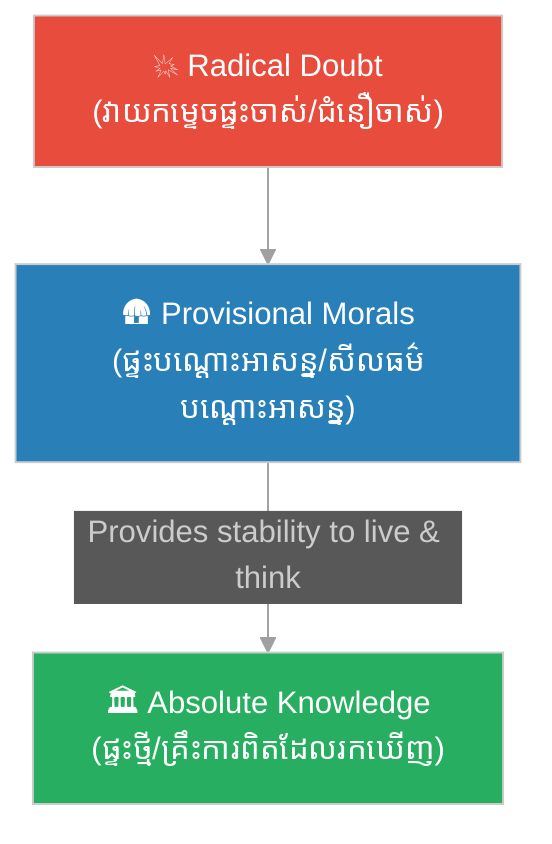

# ក្រមសីលធម៌បណ្តោះអាសន្ន៖ Provisional Moral Code

**Author:** ichamrong  
**Date:** 2026-06-06  
**Tags:** #philosophy #ethics #descartes #morality #decision-making #stoicism  
**Category:** Keywords  
**Read Time:** ~5 min

---

## 📌 មាតិកា (Table of Contents)
- [សង្ខេបពាក្យគន្លឹះ (Keyword Overview)](#0)
- [១. មេកានិចនៃបញ្ហា៖ វិបត្តិផ្អាកសកម្មភាព (The Dilemma of Inaction)](#1)
- [២. ឧបមាទកថា «ផ្ទះបណ្ដោះអាសន្ន» (The Temporary House Analogy)](#2)
- [៣. វិភាគលើវិធានទាំង ៤ និងរបៀបដែលវាជួយ (The 4 Maxims & How They Help)](#3)
- [សេចក្តីសន្និដ្ឋាន (Conclusion)](#4)
- [ឯកសារយោង (References)](#5)

---

## សង្ខេបពាក្យគន្លឹះ (Keyword Overview)

**«ក្រមសីលធម៌បណ្តោះអាសន្ន»**​​ (**Provisional Moral Code**​​ ឬ​​ ភាសាបារាំង៖​​ *Une morale par provision*)​​ គឺ​​ជា​​សំណុំ​​វិន័យ​​រស់នៅ​​បណ្ដោះអាសន្ន​​ដែល​​លោក​​ René Descartes​​ បង្កើត​​ឡើង​​សម្រាប់​​ខ្លួនគាត់។​​ វា​​គឺ​​ជា​​ឧបករណ៍​​យុទ្ធសាស្ត្រ​​មួយ​​ ដើម្បី​​ជួយ​​ឱ្យ​​គាត់​​អាច​​បន្ត​​រស់នៅ​​ សម្រេចចិត្ត​​ និង​​ធ្វើ​​សកម្មភាព​​ប្រចាំថ្ងៃ​​បាន​​ដោយ​​សន្តិភាព​​ផ្លូវចិត្ត​​ ក្នុង​​កំឡុង​​ពេល​​ដែល​​គាត់​​កំពុង​​ «សង្ស័យ​​លើ​​អ្វីៗ​​គ្រប់យ៉ាង»​​ ដើម្បី​​ស្វែងរក​​ការពិត។

The **Provisional Moral Code** is a set of temporary rules for daily life that René Descartes created for himself. It served as a strategic tool to allow him to continue living, deciding, and acting with peace of mind while undergoing radical doubt in search of absolute truth.

---

## ១. មេកានិចនៃបញ្ហា៖ វិបត្តិផ្អាកសកម្មភាព (The Dilemma of Inaction)

នៅ​​ពេល​​ដេកាត​​សម្រេចចិត្ត​​ប្រើ​​ **«ការសង្ស័យជាប្រព័ន្ធ (Methodological Doubt)»**​​ គាត់​​ត្រូវ​​សង្ស័យ​​លើ​​ច្បាប់​​ ទំនៀមទម្លាប់​​ សាសនា​​ សូម្បី​​តែ​​សីលធម៌​​ល្អ-អាក្រក់​​ និង​​អត្ថិភាព​​នៃ​​ពិភពលោក។

ប៉ុន្តែ​​ ជីវិត​​ពិត​​មិន​​អាច​​រង់ចាំ​​បាន​​ឡើយ៖
*   យើង​​មិន​​អាច​​ផ្អាក​​ការ​​ហូបចុក​​ សម្រាក​​ ឬ​​ការ​​ប្រាស្រ័យ​​ទាក់ទង​​ជាមួយ​​មនុស្ស​​ជុំវិញ​​ខ្លួន​​ ដើម្បី​​រង់ចាំ​​ទស្សនវិទូ​​រក​​ឃើញ​​ការពិត​​ជា​​មុន​​សិន​​នោះ​​ទេ។
*   ការ​​សង្ស័យ​​ហួសហេតុ​​ដោយ​​គ្មាន​​ក្រមសីលធម៌​​ អាច​​នាំ​​ឱ្យ​​កើត​​ **«វិបត្តិផ្អាកសកម្មភាព (Decision Paralysis)»**​​ ឬ​​ការ​​ធ្វើ​​សកម្មភាព​​ល្មើសច្បាប់​​សង្គម​​ ដែល​​អាច​​បង្ក​​គ្រោះថ្នាក់​​ដល់​​ជីវិត។

---

## ២. ឧបមាទកថា «ផ្ទះបណ្ដោះអាសន្ន» (The Temporary House Analogy)

ដេកាត​​បាន​​ពន្យល់​​ពី​​តម្រូវការ​​នេះ​​តាម​​រយៈ​​ការ​​ប្រៀបធៀប​​ដ៏​​ល្បីល្បាញ៖
> *«មុន​​នឹង​​យើង​​វាយកម្ទេច​​ផ្ទះ​​ចាស់​​ចោល​​ដើម្បី​​សង់​​ផ្ទះ​​ថ្មី​​ឱ្យ​​ស្អាត​​ និង​​រឹងមាំ​​ជាង​​មុន​​ យើង​​មិន​​ត្រូវ​​ទៅ​​ដេក​​ហាលខ្យល់​​ហាលភ្លៀង​​នោះ​​ទេ។​​ យើង​​ត្រូវ​​រក​​ ឬ​​សង់​​ 'ផ្ទះបណ្ដោះអាសន្ន'​​ មួយ​​ជា​​មុន​​សិន​​ ដើម្បី​​ជ្រកកោន​​ក្នុង​​អំឡុង​​ពេល​​សាងសង់»*

*   **ផ្ទះចាស់**: ជំនឿ​​ចាស់ៗ​​ដែល​​គ្មាន​​ហេតុផល​​ផ្ទៀងផ្ទាត់ (ត្រូវ​​កម្ទេច​​ចោល)។
*   **ផ្ទះថ្មី**: ចំណេះដឹង​​ពិតប្រាកដ​​ដែល​​សាងសង់​​ចេញ​​ពី​​គ្រឹះ​​ *Cogito*។
*   **ផ្ទះបណ្ដោះអាសន្ន**: ក្រមសីលធម៌​​បណ្ដោះអាសន្ន​​ (ដើម្បី​​ជ្រកកោន​​រស់នៅ)។

---

## ៣. វិភាគលើវិធានទាំង ៤ និងរបៀបដែលវាជួយ (The 4 Maxims & How They Help)

| វិធាន (Maxims) | ខ្លឹមសារពន្យល់ | របៀបដែលវាជួយសម្រួលការគិត |
| :--- | :--- | :--- |
| **១. គោរពច្បាប់ និងទំនៀមទម្លាប់** (Obey Laws & Customs) | ធ្វើ​​តាម​​ច្បាប់​​ប្រទេស​​ជាតិ​​ និង​​សាសនា​​ដែល​​ខ្លួន​​មាន​​តាំង​​ពី​​ក្មេង។ | **ការពារសុវត្ថិភាព**: ជៀសវាង​​ជម្លោះ​​ជាមួយ​​សង្គម​​ និង​​ច្បាប់​​រដ្ឋ​​ ដែល​​អាច​​រំខាន​​ដល់​​ការ​​ធ្វើ​​ការងារ​​គិត​​របស់​​គាត់។ |
| **២. ម៉ឺងម៉ាត់ក្នុងការសម្រេចចិត្ត** (Be Firm & Resolute) | ទោះ​​សម្រេចចិត្ត​​លើ​​រឿង​​ដែល​​មិន​​ទាន់​​ប្រាកដ​​ ក៏​​ត្រូវ​​បន្ត​​ធ្វើ​​វា​​ឱ្យ​​ចប់​​ ដូច​​ដើរ​​ត្រង់​​ផ្លូវ​​ក្នុង​​ព្រៃ។ | **ជៀសវាងការស្ទាក់ស្ទើរ**: ការ​​ស្ទាក់ស្ទើរ​​នាំ​​ឱ្យ​​ខាត​​ពេល​​ និង​​មិន​​អាច​​ទៅ​​មុខ​​រួច។​​ សកម្មភាព​​ម៉ឺងម៉ាត់​​ជួយ​​ឱ្យ​​ជីវិត​​មាន​​វឌ្ឍនភាព។ |
| **៣. ឈ្នះខ្លួនឯងជាជាងព្រហ្មលិខិត** (Master Self Over Fortune) | ផ្តោត​​កែប្រែ​​តែ​​បំណង​​ប្រាថ្នា​​ខ្លួនឯង​​ មិន​​មែន​​ពិភពលោក​​ខាងក្រៅ​​ឡើយ​​ (គំនិត​​ Stoicism)។ | **រក្សាសន្តិភាពផ្លូវចិត្ត**: ការ​​ព្រមទទួល​​ការពិត​​ដែល​​មិន​​អាច​​កែ​​បាន​​ និង​​គ្រប់គ្រង​​ចិត្ត​​ខ្លួនឯង​​ ជួយ​​មិន​​ឱ្យ​​ខ្វល់ខ្វាយ​​ឥត​​ប្រយោជន៍។ |
| **៤. អភិវឌ្ឍហេតុផលរកការពិត** (Cultivate Reason & Truth) | ឧទ្ទិស​​ជីវិត​​ស្វែងរក​​ការពិត​​តាម​​រយៈ​​វិធីសាស្ត្រ​​គិត​​ត្រឹមត្រូវ។ | **រក្សាគោលដៅចុងក្រោយ**: ធានា​​ថា​​ក្រមសីលធម៌​​នេះ​​គ្រាន់តែ​​ជា​​ «បណ្ដោះអាសន្ន»​​ ប៉ុណ្ណោះ​​ ហើយ​​គោលដៅ​​ពិត​​គឺ​​ការ​​រក​​ការពិត។ |

---

## សេចក្តីសន្និដ្ឋាន (Conclusion)

ក្រមសីលធម៌​​បណ្ដោះអាសន្ន​​ មិន​​មែន​​ជា​​ការ​​បោះបង់​​ការ​​សង្ស័យ​​ ឬ​​ការ​​ចុះចាញ់​​ទំនៀមទម្លាប់​​ឡើយ​​ ប៉ុន្តែ​​វា​​គឺ​​ជា​​ **«ភាពជាក់ស្ដែងនិយម (Pragmatism)»**។​​ វា​​បង្ហាញ​​ថា​​ ទស្សនវិជ្ជា​​មិន​​ត្រូវ​​ឃ្លាត​​ឆ្ងាយ​​ពី​​ការ​​រស់នៅ​​ប្រចាំថ្ងៃ​​ឡើយ​​ ហើយ​​សកម្មភាព​​រស់នៅ​​ត្រូវ​​តែ​​ដើរ​​ទន្ទឹម​​គ្នា​​នឹង​​ការ​​ស្វែងរក​​ប្រាជ្ញា។

---

## ឯកសារយោង (References)

* **Descartes, R.** (1637). *Discourse on the Method* (Part III).
* **Marshall, J.** (1998). *Descartes's Moral Theory*.
