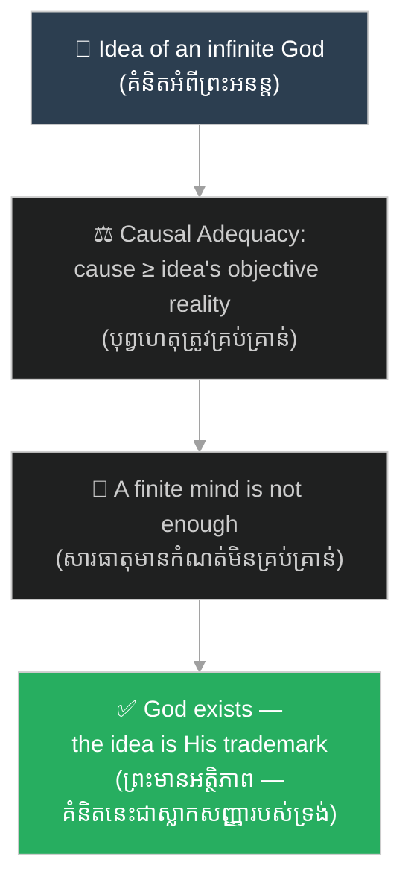

# អំណះអំណាងស្លាកសញ្ញា៖ The Trademark Argument

**Author:** ichamrong  
**Date:** 2026-06-12  
**Tags:** #philosophy #descartes #trademark-argument #meditation-3 #god #epistemology  
**Category:** Keywords  
**Read Time:** ~5 min

---

## 📌 មាតិកា (Table of Contents)
- [សង្ខេបពាក្យគន្លឹះ (Keyword Overview)](#0)
- [១. តើអំណះអំណាងស្លាកសញ្ញាជាអ្វី? (What is the Trademark Argument?)](#1)
- [២. ប្រវត្តិ និងដើមកំណើត (History & Origin)](#2)
- [៣. ភាពខុសគ្នាពីអំណះអំណាងអត្ថិភាពវិទ្យា (Difference from the Ontological Argument)](#3)
- [៤. ការរិះគន់សំខាន់ ៗ (Main Critiques)](#4)
- [៥. ហេតុអ្វីវានៅតែសំខាន់? (Why It Still Matters)](#5)
- [សេចក្តីសន្និដ្ឋាន (Conclusion)](#6)
- [ឯកសារយោង (References)](#7)

---

## សង្ខេបពាក្យគន្លឹះ (Keyword Overview)

**«អំណះអំណាងស្លាកសញ្ញា (Trademark Argument)»**​ គឺ​ជា​អំណះអំណាង​បញ្ជាក់​អត្ថិភាព​នៃ​ព្រះ​ ដែល​ René Descartes​ បាន​បង្ហាញ​ក្នុង​ការ​សញ្ជឹងគិត​ទី​ ៣​ នៃ​សៀវភៅ​ *Meditations on First Philosophy*​ (១៦៤១)។​ ខ្លឹមសារ​សំខាន់​គឺ៖​ ខ្ញុំ​ជា​សភាវៈ​មាន​ដែន​កំណត់​ ប៉ុន្តែ​ខ្ញុំ​មាន​គំនិត​អំពី​ព្រះ​ដ៏​គ្មាន​ដែន​កំណត់​នៅ​ក្នុង​ចិត្ត​ — គំនិត​បែប​នេះ​មិន​អាច​កើត​ចេញ​ពី​ខ្ញុំ​ខ្លួនឯង​បាន​ទេ​ ដូច្នេះ​ប្រភព​របស់​វា​ត្រូវ​តែ​ជា​ព្រះ​ពិតប្រាកដ។​ គំនិត​នេះ​ប្រៀប​ដូច​ជា​ស្លាកសញ្ញា​ ឬ​ម៉ាក​ ដែល​អ្នក​បង្កើត​បាន​ផ្ដិត​ទុក​លើ​ស្នាដៃ​របស់​ខ្លួន​ — ហេតុ​នេះ​ហើយ​បាន​ជា​គេ​ហៅ​វា​ថា​ «អំណះអំណាងស្លាកសញ្ញា»។

The **Trademark Argument** is Descartes' proof of God's existence from Meditation 3 of *Meditations on First Philosophy* (1641). Its core claim: I am a finite being, yet I carry the idea of an infinite God in my mind — such an idea could not have originated from me, so its source must be an actually existing God. The idea is like a trademark the maker stamped on his product, hence the name.

---

## ១. តើអំណះអំណាងស្លាកសញ្ញាជាអ្វី? (What is the Trademark Argument?)

អំណះអំណាង​នេះ​ដំណើរការ​ដោយ​ឧបករណ៍​ទស្សនវិជ្ជា​ បី​ យ៉ាង។​ ទីមួយ​ ដេកាត​បែងចែក​ភាពពិត​ជា​ពីរ​ប្រភេទ៖​ **«តថភាពផ្លូវការ (Formal Reality)»**​ — ភាពពិត​ដែល​វត្ថុ​មួយ​មាន​ដោយ​ខ្លួនឯង​ — និង​ **«តថភាពវត្ថុវិស័យ (Objective Reality)»**​ — ភាពពិត​ដែល​គំនិត​មួយ​មាន​ តាម​រយៈ​អ្វី​ដែល​វា​តំណាង។​ ទីពីរ​ **«គោលការណ៍ភាពគ្រប់គ្រាន់នៃបុព្វហេតុ (Causal Adequacy Principle)»**​ ចែង​ថា​ បុព្វហេតុ​នៃ​គំនិត​ណាមួយ​ ត្រូវ​តែ​មាន​តថភាពផ្លូវការ​យ៉ាង​ហោច​ណាស់​ស្មើ​នឹង​តថភាពវត្ថុវិស័យ​នៃ​គំនិត​នោះ​ — អ្វី​ដែល​តិច​ មិន​អាច​បង្កើត​អ្វី​ដែល​ច្រើន​ជាង​បាន​ឡើយ។

The argument runs on three philosophical tools. First, Descartes distinguishes **formal reality** — the reality a thing has in itself — from **objective reality** — the reality an idea has by virtue of what it represents. Second, the **causal adequacy principle** states that the cause of an idea must possess at least as much formal reality as the idea contains objective reality — the lesser cannot produce the greater.

ទីបី​ ដេកាត​អនុវត្ត​ឧបករណ៍​ទាំង​នេះ​ទៅ​លើ​គំនិត​មួយ​ដ៏​ពិសេស៖​ គំនិត​អំពី​ព្រះ​ជា​ **«សារធាតុអនន្ត (Infinite Substance)»**​ — អស់កល្ប​ ឯករាជ្យ​ ដឹង​គ្រប់​ និង​មាន​អំណាច​គ្រប់។​ គំនិត​នេះ​មាន​តថភាពវត្ថុវិស័យ​ខ្ពស់​បំផុត​ ខណៈ​ខ្ញុំ​ខ្លួនឯង​គ្រាន់តែ​ជា​ **«សារធាតុមានកំណត់ (Finite Substance)»**​ — ខ្ញុំ​សង្ស័យ​ ខ្ញុំ​ខ្វះខាត។​ ដូច្នេះ​ ខ្ញុំ​មិន​អាច​ជា​បុព្វហេតុ​នៃ​គំនិត​នេះ​បាន​ទេ​ — មាន​តែ​សភាវៈ​គ្មាន​ដែន​កំណត់​ពិតប្រាកដ​ប៉ុណ្ណោះ​ ទើប​គ្រប់គ្រាន់​ — ហេតុ​នេះ​ ព្រះ​ពិត​ជា​មាន​អត្ថិភាព​មែន។

Third, Descartes applies these tools to one extraordinary idea: the idea of God as an **infinite substance** — eternal, independent, omniscient, omnipotent. This idea carries the highest objective reality, while I am merely a **finite substance** — I doubt, I lack. Therefore I cannot be its cause; only an actually infinite being is adequate — and so God exists.

---

## ២. ប្រវត្តិ និងដើមកំណើត (History & Origin)

អំណះអំណាង​នេះ​លេចឡើង​ក្នុង​ការ​សញ្ជឹងគិត​ទី​ ៣​ នៃ​ *Meditations on First Philosophy*​ ដែល​បាន​បោះពុម្ព​ឆ្នាំ​ ១៦៤១។​ នៅ​ដំណាក់កាល​នោះ​ ដេកាត​ទើប​តែ​រួច​ផុត​ពី​ការ​សង្ស័យ​ជា​សកល​ ដោយ​នៅ​សល់​តែ​ភាព​ប្រាកដ​មួយ​គត់​គឺ​ *Cogito*​ («ខ្ញុំ​គិត​ ដូច្នេះ​ខ្ញុំ​មាន»)​ — គាត់​ត្រូវការ​ស្ពាន​ចេញ​ពី​ចិត្ត​ខ្លួនឯង​ ទៅ​រក​ពិភពលោក​ខាង​ក្រៅ​វិញ​ ហើយ​ជំហាន​ដំបូង​នៃ​ស្ពាន​នោះ​គឺ​ការ​បញ្ជាក់​អត្ថិភាព​នៃ​ព្រះ។

The argument appears in Meditation 3 of *Meditations on First Philosophy*, published in 1641. At that point Descartes has survived universal doubt with only one certainty left — the *Cogito* ("I think, therefore I am") — and he needs a bridge from his own mind back to the external world. Proving God's existence is the first plank of that bridge.

ឈ្មោះ​ «ស្លាកសញ្ញា»​ កើត​ចេញ​ពី​ពាក្យប្រៀបធៀប​ផ្ទាល់​របស់​ដេកាត៖​ គំនិត​អំពី​ព្រះ​គឺ​ដូច​ជា​ «ស្លាកសញ្ញា​របស់​ជាង​សិប្បករ​ ដែល​បាន​ផ្ដិត​លើ​ស្នាដៃ​របស់​គាត់»​ (the mark of the craftsman impressed on his work)។​ ដោយសារ​វា​ជា​ **«គំនិតពីកំណើត (Innate Ideas)»**​ — មិន​មែន​មក​ពី​បទពិសោធន៍​ ឬ​ការ​ប្រឌិត​របស់​យើង​ទេ​ — វា​ដើរតួ​ដូច​ម៉ាក​ពាណិជ្ជកម្ម​លើ​ផលិតផល​ ដែល​បញ្ជាក់​ពី​អត្តសញ្ញាណ​អ្នក​ផលិត។

The "trademark" name comes from Descartes' own metaphor: the idea of God is like "the mark of the craftsman impressed on his work." Because it is an **innate idea** — neither drawn from experience nor invented by us — it functions like a manufacturer's trademark on a product, identifying its maker.

---

## ៣. ភាពខុសគ្នាពីអំណះអំណាងអត្ថិភាពវិទ្យា (Difference from the Ontological Argument)

ដេកាត​មាន​អំណះអំណាង​អំពី​ព្រះ​ ពីរ​ ផ្សេង​គ្នា​ ហើយ​អ្នក​អាន​ច្រើន​តែ​ច្រឡំ​គ្នា។​ អំណះអំណាងស្លាកសញ្ញា​ (ការ​សញ្ជឹងគិត​ទី​ ៣)​ គឺ​ជា​អំណះអំណាង​បែប​**បុព្វហេតុ**​ (Causal)៖​ វា​ចាប់ផ្ដើម​ពី​អង្គហេតុ​មួយ​ — ខ្ញុំ​មាន​គំនិត​អំពី​ភាព​អនន្ត​ — ហើយ​សួរ​ថា​ តើ​អ្វី​អាច​ជា​បុព្វហេតុ​នៃ​គំនិត​នេះ?​ ផ្ទុយ​ទៅ​វិញ​ **«អំណះអំណាងអត្ថិភាពវិទ្យា (Ontological Argument)»**​ (ការ​សញ្ជឹងគិត​ទី​ ៥)​ គឺ​ជា​អំណះអំណាង​បែប​**និយមន័យ**៖​ វា​អះអាង​ថា​ អត្ថិភាព​ជា​ផ្នែក​មួយ​នៃ​សារជាតិ​របស់​សភាវៈ​ល្អ​ឥតខ្ចោះ​ ដូច​មុំ​ក្នុង​ត្រីកោណ​បូក​បាន​ ១៨០​ ដឺក្រេ​ជា​ផ្នែក​នៃ​សារជាតិ​ត្រីកោណ​ដែរ​ — ដោយ​មិន​ត្រូវការ​គោលការណ៍​បុព្វហេតុ​អ្វី​ឡើយ។

Descartes actually offers two distinct proofs of God, and readers often confuse them. The Trademark Argument (Meditation 3) is **causal**: it starts from a fact — I have an idea of the infinite — and asks what could have caused it. The **Ontological Argument** (Meditation 5) is **definitional**: it claims existence belongs to the very essence of a supremely perfect being, just as having angles summing to 180 degrees belongs to the essence of a triangle — no causal principle required.

និយាយ​ឱ្យ​ខ្លី៖​ អំណះអំណាងស្លាកសញ្ញា​ឈរ​លើ​សំណួរ​ «តើ​គំនិត​នេះ​**មក​ពី​ណា**?»​ ចំណែក​អំណះអំណាងអត្ថិភាពវិទ្យា​ឈរ​លើ​សំណួរ​ «តើ​គំនិត​នេះ​**មាន​ន័យ​ថា​អ្វី**?»។

In short: the Trademark Argument asks "where does this idea *come from*?", while the Ontological Argument asks "what does this idea *mean*?"

---

## ៤. ការរិះគន់សំខាន់ ៗ (Main Critiques)

ការ​រិះគន់​ដ៏​ល្បី​បំផុត​គឺ​ **«រង្វង់ដេកាត (Cartesian Circle)»**​ ដែល​លោក​ Antoine Arnauld​ បាន​លើកឡើង៖​ ដេកាត​ប្រើ​ការ​យល់​ឃើញ​ច្បាស់លាស់​ ដើម្បី​បញ្ជាក់​ថា​ព្រះ​មាន​ ប៉ុន្តែ​គាត់​ក៏​ប្រើ​ព្រះ​ ដើម្បី​ធានា​ថា​ការ​យល់​ឃើញ​ច្បាស់លាស់​គឺ​ពិត​ — ហេតុផល​វិល​ជា​រង្វង់​ គ្មាន​ចំណុច​ចាប់ផ្ដើម​ឯករាជ្យ។​ ម្យ៉ាងទៀត​ ទស្សនវិទូ​បែប​ **«បទពិសោធន៍និយម (Empiricism)»**​ ដូចជា​ John Locke​ និង​ David Hume​ បដិសេធ​គំនិតពីកំណើត​ទាំងស្រុង៖​ យើង​អាច​សង់​គំនិត​អំពី​ «ភាព​អនន្ត»​ ដោយ​គ្រាន់តែ​យក​លក្ខណៈ​មាន​កំណត់​ដែល​យើង​ស្គាល់​ មក​ពង្រីក​ និង​ដក​ដែន​កំណត់​ចេញ​ប៉ុណ្ណោះ​ — បើ​ដូច្នេះ​មែន​ សារធាតុមានកំណត់​ក៏​អាច​ជា​បុព្វហេតុ​នៃ​គំនិត​នេះ​បាន​ដែរ។​ អ្នក​រិះគន់​សម័យ​ក្រោយ​ក៏​ចោទ​សួរ​លើ​គោលការណ៍​ភាពគ្រប់គ្រាន់​នៃ​បុព្វហេតុ​ខ្លួនឯង​ផង​ដែរ​ ថា​ជា​សំណល់​នៃ​ទស្សនវិជ្ជា​បុរាណ​ ដែល​មិន​ច្បាស់​ថា​ត្រូវ​សម្រាប់​ករណី​គំនិត។

The most famous critique is the **Cartesian Circle**, raised by Antoine Arnauld: Descartes uses clear and distinct perception to prove God exists, yet uses God to guarantee that clear and distinct perception is true — circular reasoning with no independent starting point. Empiricists like John Locke and David Hume reject innate ideas altogether: we can build the idea of "the infinite" simply by extrapolating familiar finite qualities and removing their limits — in which case a finite substance could cause the idea after all. Later critics also question the causal adequacy principle itself as a scholastic leftover whose application to ideas is far from obvious.

---

## ៥. ហេតុអ្វីវានៅតែសំខាន់? (Why It Still Matters)

ទោះ​បី​មាន​ការ​រិះគន់​ច្រើន​ក៏​ដោយ​ អំណះអំណាងស្លាកសញ្ញា​នៅ​តែ​ជា​មេរៀន​ដ៏​មាន​តម្លៃ​ ៣​ យ៉ាង។​ ទីមួយ​ វា​ជា​គំរូ​បុរាណ​នៃ​ការ​សួរ​ថា​ «តើ​ខ្លឹមសារ​ក្នុង​ចិត្ត​យើង​ មាន​ប្រភព​ពី​ណា?»​ — សំណួរ​ដែល​នៅ​តែ​រស់​ក្នុង​ចិត្តវិទ្យា​ ភាសាវិទ្យា​ (ការ​ជជែក​អំពី​ចំណេះដឹង​ពី​កំណើត​របស់​ Chomsky)​ និង​វិទ្យាសាស្ត្រ​ការ​យល់ដឹង​សព្វថ្ងៃ។​ ទីពីរ​ វា​បង្ហាញ​ពី​របៀប​សាងសង់​អំណះអំណាង​ពី​ធនធាន​តិច​បំផុត​ — ដេកាត​ប្រើ​តែ​អ្វី​ដែល​អ្នក​សង្ស័យ​មិន​អាច​បដិសេធ​បាន។​ ទីបី​ ការ​បរាជ័យ​របស់​វា​ (បើ​វា​បរាជ័យ​មែន)​ ក៏​ជា​មេរៀន​ដែរ៖​ រង្វង់ដេកាត​បង្រៀន​យើង​ឱ្យ​ពិនិត្យ​មើល​ថា​ តើ​ភស្តុតាង​របស់​យើង​ពឹង​លើ​សេចក្ដី​សន្និដ្ឋាន​ដែល​ខ្លួន​ចង់​បញ្ជាក់​ ដោយ​មិន​ដឹង​ខ្លួន​ឬ​អត់​ — កំហុស​ដែល​នៅ​តែ​កើត​ឡើង​ញឹកញាប់​ក្នុង​ការ​វែកញែក​ប្រចាំ​ថ្ងៃ។

Despite the critiques, the Trademark Argument still teaches three lasting lessons. First, it is the classic model of asking "where do the contents of my mind come from?" — a question alive today in psychology, linguistics (Chomsky's debates on innate knowledge), and cognitive science. Second, it shows how to build an argument from minimal resources — Descartes uses only what the skeptic cannot deny. Third, even its failure (if it fails) instructs: the Cartesian Circle trains us to check whether our proofs quietly assume the very conclusion they aim to establish — a mistake still common in everyday reasoning.

---

## សេចក្តីសន្និដ្ឋាន (Conclusion)

អំណះអំណាងស្លាកសញ្ញា​គឺ​ជា​ការ​ប៉ុនប៉ង​ដ៏​ក្លាហាន​មួយ​ ក្នុង​ការ​ឆ្លង​ពី​ «ខ្ញុំ​មាន»​ ទៅ​ «ព្រះ​មាន»​ ដោយ​ប្រើ​តែ​គំនិត​មួយ​ក្នុង​ចិត្ត​ និង​គោលការណ៍​បុព្វហេតុ​មួយ​ប៉ុណ្ណោះ។​ វា​ប្រហែល​ជា​មិន​អាច​បញ្ចុះបញ្ចូល​អ្នក​អាន​សម័យ​ទំនើប​បាន​ទាំងស្រុង​ទេ​ ប៉ុន្តែ​សំណួរ​ដែល​វា​បាន​បើក​ — ប្រភព​នៃ​គំនិត​ ដែន​កំណត់​នៃ​ចិត្ត​មាន​ព្រំដែន​ និង​គ្រោះថ្នាក់​នៃ​ហេតុផល​វិល​ជុំ​ — នៅ​តែ​ជា​បេះដូង​នៃ​ទស្សនវិជ្ជា​ និង​វិទ្យាសាស្ត្រ​នៃ​ចិត្ត​រហូត​មក​ដល់​សព្វថ្ងៃ។

The Trademark Argument is a bold attempt to cross from "I exist" to "God exists" using nothing but one idea in the mind and one causal principle. It may not fully convince a modern reader, but the questions it opened — the origin of our ideas, the limits of a finite mind, and the danger of circular justification — remain at the heart of philosophy and the science of mind today.

---

## ឯកសារយោង (References)

* **Descartes, R.** (1641). *Meditations on First Philosophy* (Meditation III). Trans. J. Cottingham (Cambridge University Press, 1984).
* [ជំពូកស៊ីជម្រៅ៖ អំណះអំណាងស្លាកសញ្ញា (Deep dive: The Trademark Argument)](../books/philosophy/meditations-on-first-philosophy/05-meditation-3-trademark-argument.md)
* [សៀវភៅ៖ Meditations on First Philosophy (Book README)](../books/philosophy/meditations-on-first-philosophy/README.md)
